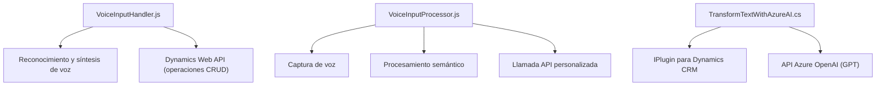

### Breve resumen técnico
Este repositorio implementa una solución orientada a la interacción entre frontend (Dynamic Forms) y servicios de inteligencia artificial de Azure (Speech SDK y OpenAI). Los archivos analizados muestran una integración sólida con tecnologías como Dynamics CRM y servicios cognitivos de Azure, con capacidades de reconocimiento de voz, síntesis de texto en voz, y transformación avanzada de texto.

---

### Descripción de arquitectura
La arquitectura empleada adopta un enfoque modular que segmenta el sistema en diferentes componentes funcionales. Aunque no es estrictamente microservicios ni n-capas, usa una aproximación distribuida:

- **Frontend modular en JavaScript**:
  - Resuelve tareas específicas vinculadas al reconocimiento de voz y procesamiento de comandos hablados en formularios.
  - Utiliza patrones procedimentales y de integración con SDKs externos.
- **Backend (plugin)**:
  - Implementado como un plugin extensible de Dynamics CRM siguiendo el patrón típico de extensibilidad basado en `IPlugin`.
  - Integra servicios externos de OpenAI para transformación de texto.

La arquitectura general puede clasificarse como híbrida con elementos distribuidos (integración de SDKs y servicios API) en un entorno extensible (Dynamics CRM).

---

### Tecnologías usadas
#### **Frontend**
- **Azure Speech SDK**:
  - Reconocimiento y síntesis de voz.
  - Se carga dinámicamente desde un CDN.
- **JavaScript**:
  - Modularidad procedimental para encapsular tareas específicas.
  - Manipulación de DOM y carga dinámica de dependencias.
- **Dynamics CRM Web API**:
  - Operaciones CRUD en formularios de Dynamics.

#### **Backend (Plugin en C#)**
- **Microsoft.Xrm.Sdk**:
  - Extensión de CRM utilizando el patrón `IPlugin`.
- **Azure OpenAI**:
  - Inteligencia artificial para transformación avanzada de texto.
- **Newtonsoft.Json / System.Text.Json**:
  - Serialización y deserialización de JSON.
- **HTTPClient**:
  - Integración con API Rest.

---

### Diagrama Mermaid válido para GitHub Markdown

---

### Conclusión final
El repositorio utiliza una estructura modular bien organizada, donde cada archivo implementa una funcionalidad específica en torno al procesamiento de datos (front) y la interacción con servicios externos (backend). La elección de tecnologías como Azure Speech SDK, OpenAI API, y la estructura extensible de Dynamics CRM asegura una solución robusta y escalable.

Sin embargo, en su diseño actual:
1. **Frontend**: Diseño procedimental simplificado, sin patrones avanzados como MVC. Si se escala con más componentes, podría beneficiarse del uso de frameworks como React o Angular.
2. **Backend**: Implementación estricta al patrón Plugin. Podría integrarse con un enfoque más microservicio si el sistema crece.

La solución es perfecta para aplicaciones empresariales que requieran integración con Cognitive Services y CRM, pero tiene potencial de modernización en algunos aspectos estructurales.