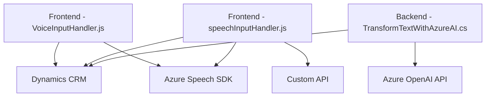

### Breve resumen técnico
El repositorio describe la arquitectura y funcionalidad de una solución que integra entrada de voz y procesamiento avanzado en Microsoft Dynamics CRM utilizando Azure Speech SDK y Azure OpenAI. Está dividido en tres componentes principales: frontend (JavaScript para formularios), backend (C# en Dynamics plugins), y servicios externos (Azure Speech y OpenAI). 

---

### Descripción de arquitectura
La solución sigue el patrón de arquitectura **n capas** con un enfoque dirigido a servicios que interactúan entre sí:
1. **Frontend:** Integra formularios en Dynamics CRM con lógica para interpretar voz y convertirla en acciones de formulario.
2. **Backend:** Extiende la funcionalidad de Dynamics CRM mediante plugins que procesan texto con Azure OpenAI.
3. **Servicios externos:** Utiliza Azure Speech SDK para entrada/salida de voz y Azure OpenAI para transformar texto según normas.

Además, la solución emplea modulación explícita (dentro de frontend y backend) y promueve separación de responsabilidades.

---

### Tecnologías usadas
1. **Frontend:**
   - **Azure Speech SDK:** Para reconocimiento de voz y generación de voz.
   - `JavaScript`: Como lenguaje para integrar el SDK en Dynamics CRM.
   - Dynamics CRM APIs (`Xrm.WebApi`) para manipulación de datos de formularios.
   
2. **Backend:**
   - **C# (.NET):** Para implementar plugins que actúan como extensiones dentro de Dynamics CRM.
   - **Azure OpenAI GPT-4:** Para transformar texto según reglas específicas.

3. **Servicios externos:**
   - Azure Speech y OpenAI, utilizados para el procesamiento de voz y texto.
   - Conexión vía `HttpClient` (para APIs externas).

---

### Diagrama Mermaid válido para GitHub

---

### Conclusión final
La solución es un sistema integrado para manejar entrada de voz y transformación de texto en formularios de Dynamics CRM, combinando un frontend funcional con servicios externos y extensiones backend. Su estructura **n capas** permite modularidad y escalabilidad, mientras que las dependencias en servicios externos centralizan capacidades avanzadas como reconocimiento de voz y procesamiento de lenguaje natural.

**Mejoras sugeridas:**
- Eliminar claves API hardcodeadas y almacenarlas en forma segura (por ejemplo, Azure Key Vault).
- Agregar abstracción para las llamadas a APIs externas en clases de servicio específicas.
- Evaluar la aplicabilidad de pruebas unitarias en la estructura actual e implementar mock para servicios externos.