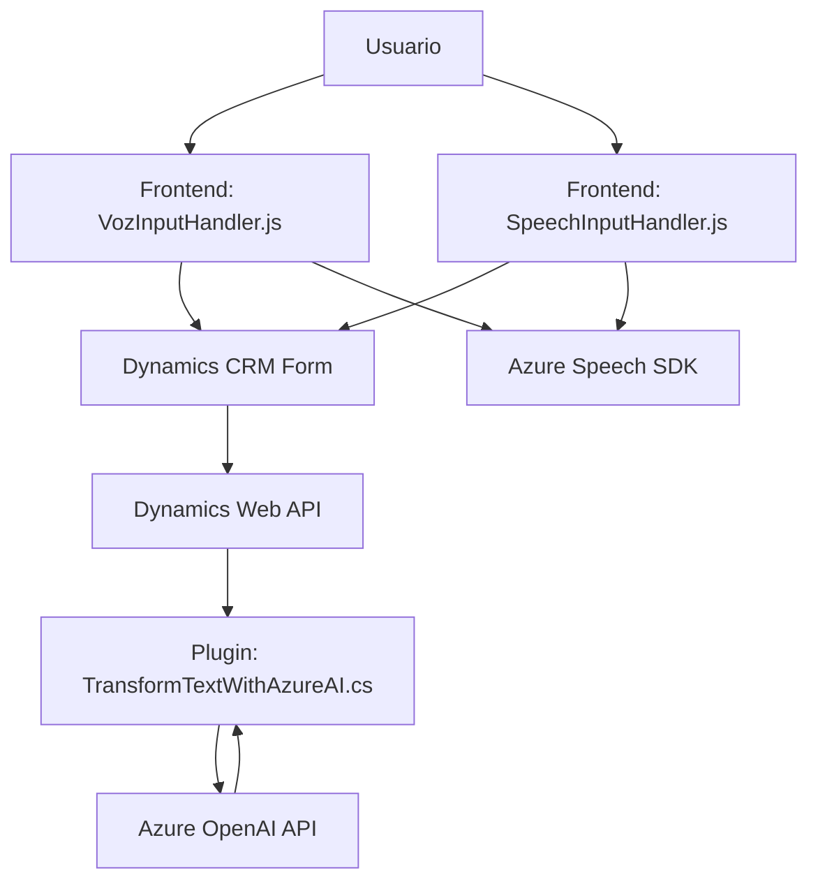

### Breve Resumen Técnico
Los archivos del repositorio representan una solución que habilita la interacción entre formularios y comandos de voz en la plataforma Microsoft Dynamics CRM. Utilizan **Azure Speech SDK** para conversión texto-voz y reconocimiento de voz, junto con un plugin .NET para transformar texto con Azure OpenAI.

---

### Descripción de Arquitectura
La solución implementa una arquitectura de integración con sistemas externos, específicamente basada en integración con los servicios de Azure (como Speech SDK y OpenAI) y Dynamics CRM. En términos de arquitectura:
1. **Monolítica distribuida**: Cada componente está diseñado con dependencias específicas para interacción CRUD y procesamiento de datos en Dynamics CRM.
2. **Frameworks externos como fachada**: Azure Speech SDK y Azure OpenAI actúan como "black-box services", mientras los scripts organizan funcionalidades específicas como extracciones, transformaciones o entrada de datos basada en voz.

El diseño también sigue un patrón **cliente-servidor**: los archivos de frontend interactúan con el usuario (navegador) y la lógica en backend resuelve procesamiento más avanzado mediante herramientas integradas a Dynamics CRM.

---

### Tecnologías Usadas
1. **Frontend**:
   - Lenguaje: JavaScript.
   - Framework: Azure Speech SDK para síntesis y reconocimiento de texto-voz.
   - Servicios: Integración con Dynamics CRM Web API (Xrm.WebApi.online).

2. **Backend**:
   - Lenguaje: .NET/C#.
   - Framework: SDK de Dynamics CRM para desarrollo de plugins.
   - Servicios: Azure OpenAI API para transformación inteligente de texto (modo GPT).

3. **Patrones Usados**:
   - Carga dinámica de dependencias (Speech SDK).
   - Patrón de fachada para simplificar interacción con servicios externos.
   - Modularidad funcional y integración API-first (OpenAI y Speech SDK).

---

### Diagrama Mermaid Válido para GitHub Markdown

### Conclusión Final
La solución está diseñada para integrar procesamiento basado en voz y transformación inteligente de datos dentro de una aplicación CRM en Dynamics 365. Utiliza tecnologías de frontend para capturar y procesar la voz del usuario de manera dinámica, mientras el backend maneja Inteligencia Artificial con Azure OpenAI mediante un plugin. La arquitectura está orientada a la modularidad, garantizando que cada componente maneje una función específica. La implementación de patrones como fachada y carga dinámica muestra un nivel de madurez técnica adecuado para sistemas complejos y distribuidos.

Esta solución puede ser útil para empresas que necesitan automatización inteligente en sus flujos de trabajo CRM mediante comandos de voz o procesamiento avanzado.