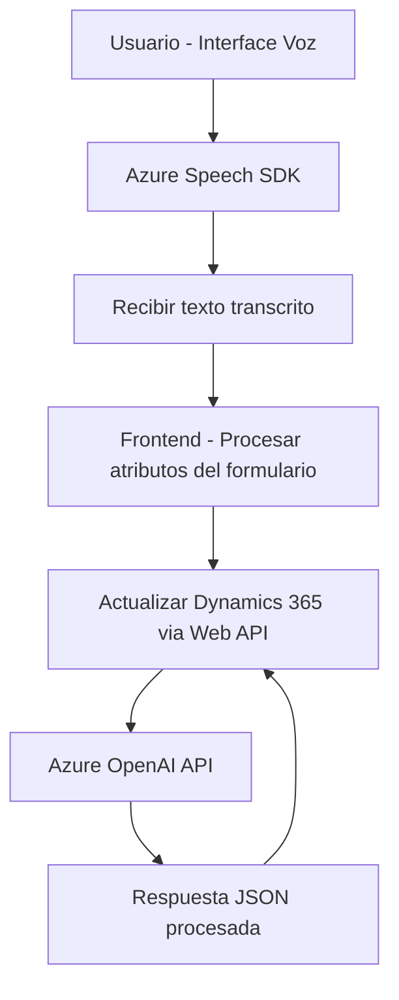

### Breve resumen técnico
La solución parece ser un sistema relacionado con Microsoft Dynamics 365 que permite la interacción con los formularios mediante dos métodos destacados: entrada de voz y procesamiento de texto basado en inteligencia artificial. La solución incluye un **frontend en JavaScript** para capturar y procesar voz, **plugins en C#** que interactúan con Dynamics CRM, y servicios externos como **Azure Speech SDK** y **Azure OpenAI API**. 

---

### Descripción de la arquitectura
La arquitectura del sistema se alinea con un enfoque **n-capas** al separar claramente las responsabilidades en diferentes componentes:
1. **Capa de presentación (Frontend)**: El acceso del usuario se realiza por medio de JavaScript, donde se capturan datos de voz del usuario, se extraen y procesan dinámicamente.
2. **Capa de negocio y servicio (Dynamics 365 Plugins)**: Se integra el procesamiento de datos del formulario con el reconocimiento de voz y servicios de IA.
3. **Capa de integración**: Comunicación con servicios externos como Azure Speech SDK y Azure OpenAI para realizar tareas de síntesis y transformación.

El uso de patrones como *Facade* y *Wrapper API* dentro de los archivos de front-end y back-end refuerzan la modularidad y reutilización de las funcionalidades.

---

### Tecnologías usadas
1. **Lenguajes**:
   - **JavaScript**: Para el desarrollo de las funciones del frontend.
   - **C#:** Implementación del plugin para Dynamics CRM.

2. **Frameworks**:
   - **Dynamics 365 SDK**: Para desarrollo de plugins y manipulación de datos del sistema CRM.
   
3. **Servicios externos**:
   - **Azure Speech SDK**: Reconocimiento y síntesis de voz.
   - **Azure OpenAI API**: Procesamiento de lenguaje natural y generación de texto estructurado.

4. **Patrones**:
   - *Facade Pattern*: Simplificación de las llamadas y ejecución de múltiples funciones desde el frontend.
   - *Command Pattern*: Implementación típica de un plugin como un comando del sistema para Dynamics CRM.
   - *Wrapper Pattern*: Encapsulación y abstracción de las operaciones de comunicación con Azure OpenAI.

5. **Dependencias externas**:
   - **Microsoft.Xrm.Sdk**: Interfaces y servicios necesarios para trabajar en Dynamics CRM.
   - **System.Net.Http**: Comunicación HTTP con servicios de terceros.
   - **JSON Libraries (Newtonsoft.Json, System.Text.Json)**: Serialización y deserialización de respuestas API.

---

### Diagrama Mermaid válido

---

### Conclusión final
La solución combina herramientas modernas orientadas a generar una interfaz de usuario accesible mediante voz y lenguaje natural, utilizando servicios externos de Azure para facilitar estas capacidades. La arquitectura basada en **n-capas** asegura la separación de responsabilidades, mientras que la interacción con servicios externos como **Azure Speech SDK** y **Azure OpenAI** aporta capacidades avanzadas de IA. Es un diseño modular, escalable y bien alineado con el marco tecnológico de Microsoft Dynamics 365.