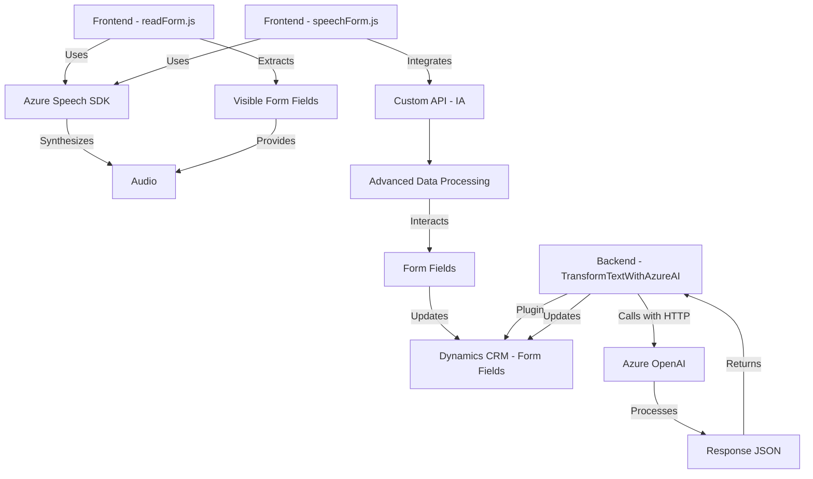

### Breve resumen técnico

El repositorio contiene tres archivos clave que reflejan una solución orientada al reconocimiento de voz, síntesis de texto y procesamiento avanzado usando servicios de Microsoft Azure:
1. **Frontend**: Dos archivos en JavaScript (`readForm.js` y `speechForm.js`) gestionan la interacción del usuario con formularios y el uso del **Azure Speech SDK**.
2. **Backend**: Un archivo (`TransformTextWithAzureAI.cs`) implementa un plugin para Dynamics CRM que utiliza **Azure OpenAI** para transformar datos mediante una API.

### Descripción de la arquitectura

Se emplea un diseño **modular** y una arquitectura **híbrida**, donde varias capas interactúan en un entorno distribuido:
1. **Cliente (Frontend)**:
   - Manejo de formularios y entrada/salida de voz con `Azure Speech SDK`.
   - Interacción con API personalizada y funciones avanzadas como interpretación por IA.
   - Divide funcionalidades en funciones modulares para garantizar extensibilidad y claridad.
   
2. **Backend (Dynamics Plugin)**:
   - Procesamiento de texto con **Azure OpenAI**, implementado como un plugin CRM (`IPlugin`) en una arquitectura orientada a eventos.
   - Usa un **restful pattern** para comunicarse con **Azure OpenAI** y facilitar extensibilidad.

La arquitectura global sigue un esquema de **n capas**:
- **Capa de cliente** interactúa con usuarios y emite solicitudes de procesos de voz a servicios en la nube (Azure Speech).
- **Capa de integración/API** conecta con servicios distribuidos en la nube (Azure Speech/AI).
- **Capa de datos** central en Dynamics CRM integra los formularios con lógica de negocio.

### Tecnologías usadas
1. **Frontend**:
   - **Azure Speech SDK**: Procesamiento de voz.
   - **JavaScript**: Manipulación dinámica de formularios.
2. **Backend**:
   - **C# (.NET)**: Implementación de plugins.
   - **Azure OpenAI**: Procesamiento de texto avanzado.
   - **Dynamics CRM SDK**: Interacción con el contexto CRM.
3. **Otros Frameworks**:
   - **Newtonsoft.Json** y **System.Text.Json** para manipulación JSON.
   - **System.Net.Http** para peticiones HTTP.

### Dependencias o componentes externos
1. **Azure Speech SDK**: Voz a texto, texto a voz.
2. **Azure OpenAI**: Conversión y transformación de texto.
3. **Dynamics CRM**: Administración de campos y atributos de formularios.
4. **Xrm.WebApi** (Dynamics API): Interacción con registros CRM.
5. **Microsoft.Cognitive API**: Integración de servicios en la nube.
6. **Newtonsoft.Json** para manipulación de objetos JSON.

### Diagrama Mermaid

### Conclusión final

Este repositorio implementa una solución **híbrida** basada en servicios en la nube (Azure), centrada en la interacción fluida del usuario con formularios mediante voz y procesamiento de texto avanzado. El diseño utiliza arquitectura de **n capas** con un frontend modular y un backend orientado a eventos.

Aunque la solución está bien estructurada, existen puntos a mejorar:
1. **Seguridad**: Almacenamiento de credenciales en código es un riesgo que debe resolverse mediante mecanismos seguros como **Azure Key Vault**.
2. **Configuración externa**: Los parámetros dependientes de plataformas (API keys, endpoint, etc.) no deben ser "hardcoded"; se recomienda moverlos a archivos de configuración o servicios gestionados.
3. **Validación robusta**: Se requiere mayor enfoque en la validación de datos ingresados por usuarios y respuestas API para mitigar riesgos de seguridad y errores operativos. 

En general, la solución es potente para una integración basada en servicios en la nube y personalizaciones requeridas en contextos CRM avanzados.