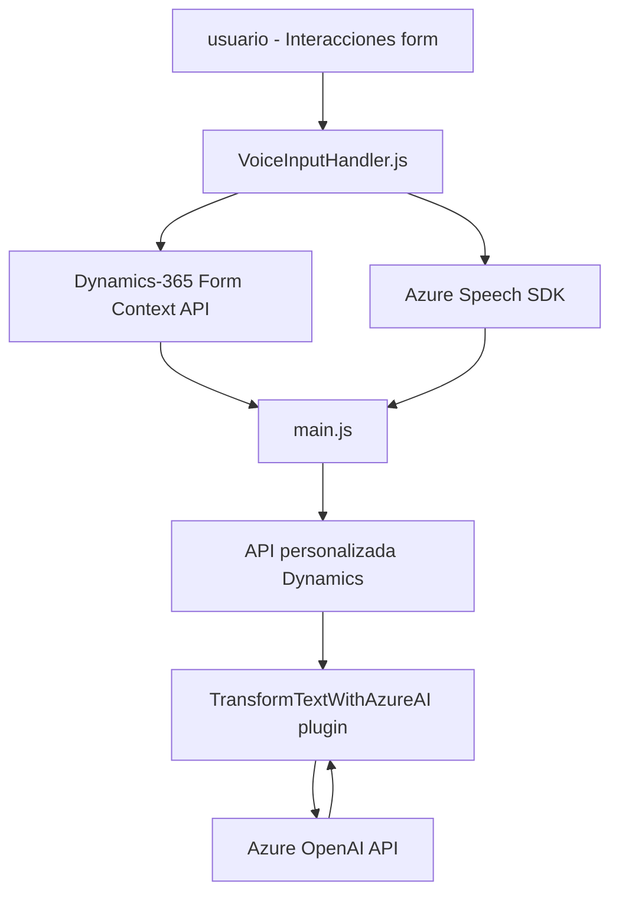

### Resumen Técnico
Este proyecto consiste en una solución para integrar la entrada de voz y el procesamiento de texto mediante servicios en la nube, específicamente Azure Speech SDK y Azure OpenAI, en el ecosistema de Dynamics 365. La solución está formada por tres componentes separados:
1. **Frontend JavaScript**: Manejo de formularios y entrada de voz.
2. **Backend API**: Plugin para Dynamics CRM que se encarga del procesamiento avanzado del texto utilizando Azure OpenAI.
3. **Módulo de reconociendo de voz**: Carga dinámica y configuración del Azure Speech SDK para reconocimiento y síntesis de voz.

---

### Descripción de Arquitectura:
La solución sigue una arquitectura **n capas**, con una clara separación entre la capa de presentación (Frontend), el servicio (Azure SDK), y la lógica en el backend (Plugin Dynamics 365). Además, también utiliza principios de la arquitectura extensible de Dynamics 365 para integrar servicios externos como Azure Speech SDK y OpenAI. La arquitectura tiene los siguientes componentes clave:
- **Frontend**: Proporciona interacción con el usuario en el contexto de Dynamics 365 y usa JavaScript para leer y actualizar formularios.
- **Backend Plugin**: Ejecuta lógica avanzada en el CRM, invocando una API de Azure OpenAI con un payload basado en reglas dinámicas.
- **Integración con SDK externos**: Uso de SDKs de Azure Speech y OpenAI para el reconocimiento de voz y transformación de texto.

---

### Tecnologías, Frameworks y Patrones Usados:
1. **Tecnologías**:
   - **Frontend**: JavaScript, Dynamics 365 API.
   - **Backend**: C#, .NET Framework, Dynamics CRM SDK.
   - **APIs/SaaS**: Azure Speech SDK, Azure OpenAI.
2. **Patrones**:
   - **N capas**: Separación de responsabilidades en presentación (JavaScript), servicio de voz (Azure) y lógica de negocio (Dynamics 365 Plugin).
   - **Cargar dinámicamente dependencias**: `ensureSpeechSDKLoaded(callback)`.
   - **Integración de Servicios Externos**: Uso de Azure Speech para reconocimiento de voz y síntesis, así como Azure OpenAI para procesamiento textual avanzado.
   - **Builder Pattern**: Mapas de atributos y funcionalidad de ajuste usada en la presentación para mapear etiquetas visibles.
   - **Plugin Pattern**: El backend implementa lógica como eventos dentro de Dynamics CRM.

---

### Dependencias y Componentes Externos:
1. **Azure Speech SDK**:
   - Usado para entrada de voz (SpeechRecognizer) y texto a voz (Text-To-Speech).
   - Configurado mediante URL de carga dinámica con clave.
2. **Azure OpenAI**:
   - Utilizado para la transformación de texto mediante solicitud HTTP POST a un API REST usando la clave y el endpoint de OpenAI.
3. **Dynamics 365 API**:
   - Para la gestión de formularios y atributos a través de la API nativa de Dynamics (Xrm.WebApi).
4. **Microsoft Dynamics CRM SDK (backend)**:
   - SDK para plugins personalizados y manejo de eventos en el servidor.
5. **API personalizada de Dynamics**:
   - Una API customizada (e.g., `trial_TransformTextWithAzureAI`) aparece en el código para transformar texto.

---

### Diagrama Mermaid válido para GitHub:

---

### Conclusión Final:
La solución parece estar diseñada para automatizar la interacción entre el usuario y los formularios de Microsoft Dynamics 365 mediante el uso de tecnologías avanzadas como el reconocimiento de voz y transformación de texto. La arquitectura basada en n capas permite mantener una buena separación de responsabilidades entre la presentación, el cliente, el servicio externo y las reglas de negocio en la capa de plugins. Sin embargo, hay áreas clave de mejora:
- **Gestión de configuraciones sensibles**: Las claves API deben estar mejor protegidas, a través de herramientas como Azure Key Vault en lugar de estar hardcodeadas.
- **Manejo de dependencias externas**: Depender fuertemente de dos servicios de Azure (Speech y OpenAI) puede generar complicaciones de mantenimiento, especialmente si las APIs evolucionan o cambian.
- **Documentación funcional más detallada**: Aunque el código está bien estructurado, sería mejor complementar con documentación para facilitar la extensibilidad y el mantenimiento, particularmente en los mapeos de reglas.

El diagrama proporciona una visión del flujo básico de interacciones, mostrando cómo el proyecto combina múltiples tecnologías en una pila integrada para resolver un problema específico.