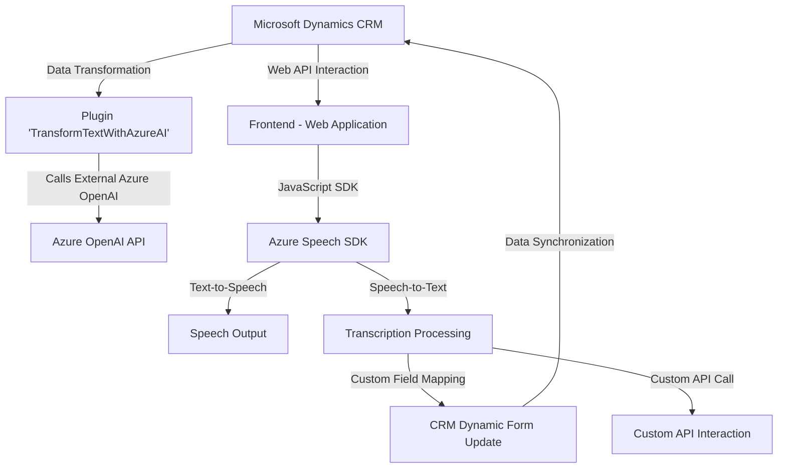

### Breve resumen técnico
El repositorio presentado es parte de un **solución orientada a mejorar la experiencia de usuario** en plataformas basadas en Microsoft Dynamics CRM. Se concentra en dos funcionalidades clave: síntesis y reconocimiento de voz (Speech-to-Text y Text-to-Speech) con Azure Speech SDK, y transformación de texto mediante la integración con Azure OpenAI. Los archivos presentan capacidades que complementan el flujo de trabajo interactivo entre usuario y sistemas de frontend-web, así como en el backend de Dynamics CRM.

### Descripción de arquitectura
La solución parece estar orientada a una arquitectura **híbrida**:
- La parte del frontend (con JavaScript) sigue un diseño modular, basado en funciones y clases, con integración de APIs externas.
- La parte del backend (Plugins/TransformTextWithAzureAI) sigue una arquitectura basada en **microservicios en la nube**, donde un plugin actúa como un servicio integrado capaz de consumir otras APIs (Azure OpenAI) y proporcionar respuesta JSON.

En esencia, se presenta una **arquitectura distribuida**: el frontend invoca componentes del SDK y servicios externos, mientras que el backend plugin opera como una extensión personalizada del CRM.

### Tecnologías usadas
1. **Frontend**:
   - **Vanilla JavaScript**: Para el procesamiento de formularios y la integración con el servicio de reconocimiento y síntesis de voz.
   - **Azure Speech SDK**: Servicio externo para análisis y generación de texto hablado (Text-to-Speech) y reconocimiento de voz (Speech-to-Text).
   - **Microsoft Dynamics Web API** (`Xrm.WebApi`): Para interactuar con formularios de CRM.

2. **Backend**:
   - **C# y .NET Framework**: Usados para implementar un plugin en Dynamics CRM.
   - **Microsoft.Xrm.Sdk**: Librería nativa para manejar eventos y registros en CRM.
   - **Azure OpenAI Service API**: Servicio para transformar texto mediante IA.
   - **Newtonsoft.Json.Linq**: Librería de manipulación de JSON avanzada en C#.

### Dependencias o componentes externos
1. **Azure Speech SDK**: Se carga dinámicamente para realizar síntesis y reconocimiento de voz.
2. **Azure OpenAI API**: Procesamiento externo para transformación avanzada de texto.
3. **Microsoft Dynamics Web API (frontend)**: Accede al contexto y datos internos del CRM en la web para operaciones formularios.
4. **Microsoft Dynamics CRM plugin framework (backend)**: Amplía las capacidades del CRM con procesamiento adicional.
5. **Newtonsoft.Json.Linq:** Popular librería para trabajar con JSON en aplicaciones C#.

### Diagrama Mermaid
El siguiente diagrama representa los módulos y la interacción entre componentes y sistemas:

### Conclusión final
La solución es una híbrida que integra web client-side JavaScript con backend API (Dynamics CRM plugin) y external cloud-based services (Azure Speech SDK and OpenAI API). Por medio de patrones bien definidos, como ETL (Extract-Transform-Load) en el frontend y extensibilidad basada en plugins en CRM, se aborda la interacción entre usuarios y datos del negocio de forma flexible y dinámica.