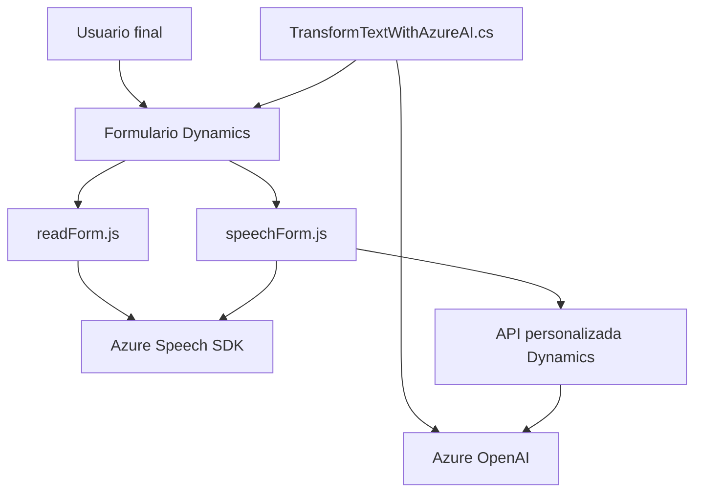

### Breve resumen técnico
El repositorio contiene tres archivos principales, cada uno aportando una funcionalidad diferente al sistema:
1. **readForm.js**: Extrae datos visibles de formularios en Dynamics y los sintetiza en audio usando Azure Speech SDK.
2. **speechForm.js**: Implementa el reconocimiento de voz con Azure Speech SDK, mapea los datos transcritos al formulario y llama a APIs personalizadas para enriquecer el procesamiento.
3. **TransformTextWithAzureAI.cs**: Plugin para Dynamics CRM que utiliza Azure OpenAI para transformar texto en estructuras JSON según directrices predefinidas.

Estos módulos trabajan juntos para integrar capacidades de reconocimiento y síntesis de voz con formularios interactivos en Dynamics CRM.

---

### Descripción de arquitectura
La solución tiene características propias de una arquitectura de **n capas** combinada con **integración de servicios externos**:
- **Frontend**: Los archivos JavaScript manejan interacción en el navegador con SDKs y APIs, implementando lógica directa de usuario.
- **Backend**: El plugin en C# orquesta el procesamiento de texto en Dynamics mediante servicios de Microsoft y Azure.
- **Servicios externos**:
  - **Speech SDK**: Procesamiento de voz.
  - **OpenAI API**: Transformación avanzada de texto.
  - **Dynamics SDK**: Extensión del CRM.

Aunque modular, utiliza dependencias externas y funciones específicas del contexto CRM, lo que lo hace cercano a un proyecto de integración monolítica con capacidad para extenderse.

---

### Tecnologías y patrones usados
**Tecnologías:**
- **Frontend**: JavaScript, Azure Speech SDK.
- **Backend**: C# (.NET Framework), Dynamics CRM SDK, Azure OpenAI API.
- **API externas**: Azure Speech para procesamiento de voz; Azure OpenAI para procesamiento de texto.

**Patrones de diseño:**
1. **Encapsulación**: Modularización clara de funciones con responsabilidades individuales.
2. **Callback y Promises**: Usados en el frontend para manejo de eventos asincrónicos.
3. **Plugin pattern**: En el backend para extender la funcionalidad de Dynamics CRM.
4. **Service orchestration**: Comunicación ordenada con servicios externos (Speak SDK y OpenAI API).
5. **Declarative payload**: Construcción estructurada de cuerpo y headers en las solicitudes HTTP del backend.

---

### Diagrama Mermaid válido para GitHub

---

### Conclusión final
Este proyecto es una solución centrada en la **automatización de procesos de voz** y **transformación de texto**, orientada a mejorar formularios interactivos en Dynamics CRM. Utiliza una arquitectura de **n capas**, donde los módulos frontend interactúan directamente con servicios externos (Azure SDK) y el backend aprovecha APIs avanzadas como OpenAI y plugins extensibles de Dynamics. Aunque modular y escalable, su dependencia en un contexto CRM específico limita su reutilización fuera de Dynamics.

