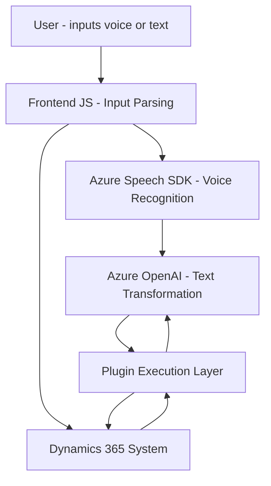

### Breve resumen técnico:
El repositorio implementa una solución para integración de accesibilidad por voz en formularios basados en Dynamics 365 y texto procesado por IA (Azure OpenAI). Incluye módulos frontend y plugins dentro de Dynamics que interactúan con servicios de Azure Speech SDK y OpenAI. La funcionalidad principal es facilitar la entrada y salida de datos mediante comandos de voz, transformación de texto, e integración con sistemas externos.

---

### Descripción de arquitectura:
La arquitectura principal está orientada a un diseño **n-capas**:
1. **Frontend:** Contiene scripts construidos en **JavaScript** para interacción directa con formularios en Dynamics 365. Estos gestionan tanto la entrada por voz (Azure Speech SDK) como la síntesis de resultados en audio.
2. **Back-end (Plugin):** Implementa el patrón de **Plugin Architecture** de Dynamics 365 mediante la definición de un método `Execute` que lee el contexto, procesa datos con Azure OpenAI y devuelve un JSON estructurado.
3. **Dependencias externas:** El sistema está diseñado para interactuar con APIs externas de Azure (Speech SDK y OpenAI GPT-4), lo que habilita el procesamiento avanzado de datos de texto y accesibilidad por voz.

La solución conecta dos capas principales (Frontend y Back-end), mientras externaliza la inteligencia y potencia de computación a servicios en la nube como **Azure OpenAI**.

---

### Tecnologías usadas:
- **JavaScript:** Desarrollo de soluciones frontend integradas con Dynamics 365.
- **Microsoft Dynamics 365:** Framework CRM para ejecutar productos empresariales personalizados con soporte de plugins y Web API.
- **Azure Speech SDK:** Para síntesis y reconocimiento de voz.
- **Azure OpenAI GPT-4 API:** Procesamiento avanzado de texto utilizando modelos de lenguaje.
- **Newtonsoft.Json / System.Text.Json:** Manejo y procesamiento de estructuras JSON.
- **Microsoft.Xrm.Sdk:** SDK usado para interacción con Dynamics CRM en el plugin.

---

### Diagrama Mermaid válido para GitHub:

---

### Conclusión final:
La solución del repositorio busca integrar funcionalidades avanzadas de accesibilidad (voz y audio) con capacidades inteligentes de procesamiento y transformación de texto, para mejorar la experiencia del usuario con formularios y sistemas CRM como Dynamics 365. La arquitectura conectada por n-capas utiliza dependencias externas (Azure SDKs y APIs) para potenciar características de accesibilidad y automatización.