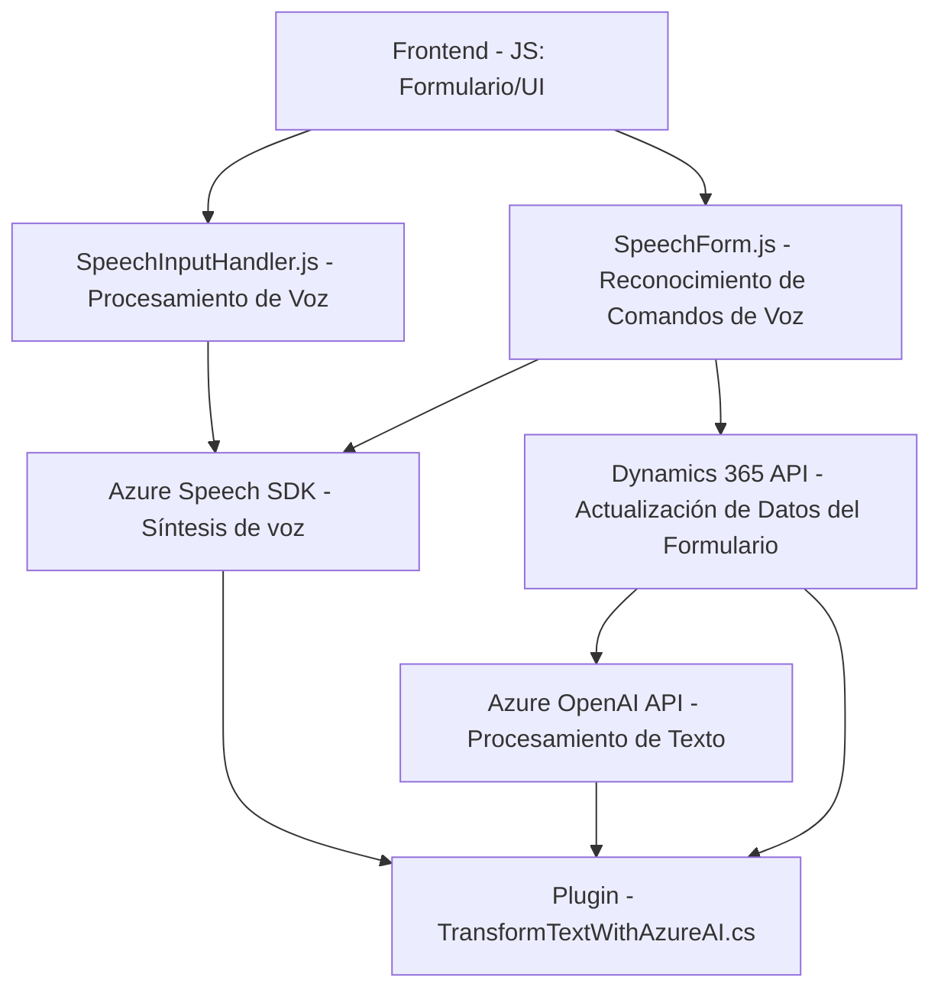

### Análisis técnico del repositorio

#### Breve resumen técnico:
El repositorio presenta una solución enfocada en **procesamiento de entradas de voz y texto asociado a formularios dinámicos en Microsoft Dynamics 365**, utilizando el SDK de Azure Speech y Azure OpenAI para la correspondencia de datos, transformación de texto y síntesis de voz. También incluye la integración de plugins en Dynamics para extender funcionalidad mediante el procesamiento de datos en el backend.

#### Descripción de arquitectura:
- **Tipo de solución:** Se trata de una **API backend en Dynamics (Plugin)** combinado con un **frontend de integración** utilizado para trabajar con formularios dinámicos. El frontend procesa datos de voz y texto, delegando tareas específicas al servicio de Azure OpenAI y al backend en Dynamics.
- **Arquitectura:** La solución se orienta a un modelo de **arquitectura híbrida**, ya que combina elementos de microservicios (usando Azure para procesamiento de texto y síntesis de voz), servicios distribuidos (API de Dynamics) e integración modular para la capa del frontend. Sin embargo, el plugin sigue un patrón de **arquitectura de n capas**, en línea con el diseño típico de Dynamics CRM. El conjunto muestra tendencias hacia una **arquitectura hexagonal** (por la modularidad y externalización de dependencias).

#### Tecnologías usadas:
1. **Microsoft Dynamics 365 APIs** y **Xrm SDK**: Para interactuar con formularios y estructura de datos.
2. **Azure Speech SDK**: Herramienta de entrada de voz y síntesis de texto.
3. **Azure OpenAI API**: Procesamiento avanzado y transformación de texto basado en modelos de IA.
4. **Framework .NET** (.NET Framework y librerías auxiliares como `Newtonsoft.Json`).
5. **JavaScript ES6**: Para la lógica del frontend, con funcionalidad asincrónica.
6. **JSON**: Formato de serialización de datos entre los distintos sistemas.

#### Dependencias o componentes externos:
1. **Azure Speech SDK** y **Speech Service**:
   - Para reconocimiento y síntesis de voz.
   - URL del SDK: `https://aka.ms/csspeech/jsbrowserpackageraw`.
2. **Azure OpenAI API**:
   - Para transformación de texto y servicios de IA.
   - URL base: `https://openai-netcore.openai.azure.com`.
3. **Dynamics 365 APIs**:
   - Para interacción directa con datos en formularios y entidades del sistema.
   - API personalizada: `trial_TransformTextWithAzureAI`.
4. **Newtonsoft.Json**:
   - Para serialización y deserialización de objetos en JSON.

#### Diagrama Mermaid:

### Conclusión final:
La solución está diseñada como una integración entre Microsoft Dynamics CRM y Azure, con una sólida capa frontend para gestionar la interacción y entrada de voz del usuario. La arquitectura se encuentra dividida entre un plugin en el backend (Dynamics) y módulos específicos en el frontend (utilizando el SDK de Azure Speech) que aseguran modularidad y flexibilidad en la extensión del sistema. Al combinar servicios de nube (Azure) con datos locales del CRM, esta solución aplica patrones modernos como **lazy loading**, **microservicio ligado a API externas**, y principios de la **arquitectura hexagonal**. Es eficiente y adecuada para proyectos complejos con requerimientos de IA, voz y datos dinámicos.