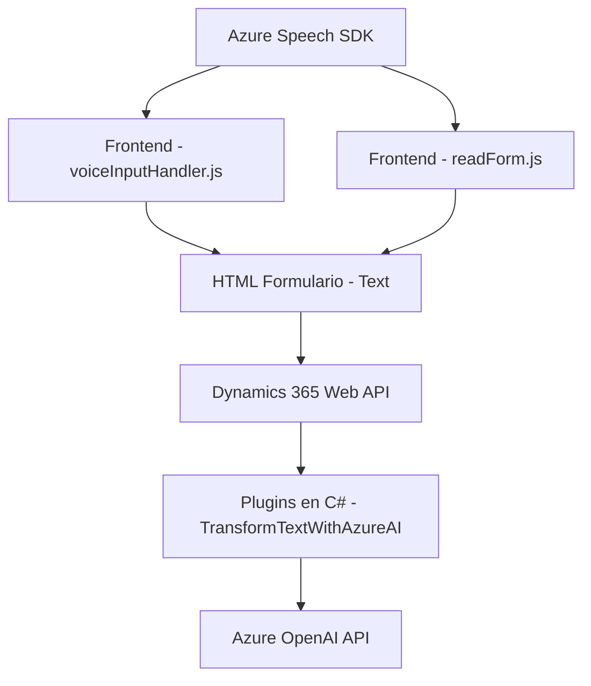

### Breve resumen técnico

La solución consiste en múltiples componentes con funcionalidad de entrada por voz, lectura de formularios y transformación de texto con inteligencia artificial. Se integra Azure Speech SDK para funciones de texto a voz, reconocimiento de voz, y una API de Azure OpenAI para estructurar texto dinámicamente. Los componentes están organizados para trabajar principalmente con Dynamics 365, facilitando accesibilidad y automatización en formularios y datos.

---

### Descripción de arquitectura

La arquitectura del sistema se basa en una combinación de diseño **modular** y **n-capas**, con fuerte dependencia de servicios externos. Los principales componentes son:

1. **Frontend (JavaScript)**: Responsable de la interacción con el usuario a través de entradas de texto y comandos auditivos. Utiliza Azure Speech SDK para reconocer y sintetizar información de formularios.
2. **Plugin Backend (C#)**: Está orientado a extender funcionalidad en Dynamics CRM, transformando texto con Azure OpenAI y delegando la lógica de procesamiento a servicios externos.
3. **Microservicios externos**: Usa endpoints como Azure Speech SDK y OpenAI API que extienden capacidades mediante integración con plataformas de IA.

### Arquitectura inferida:
- **Multi-capa**:
  - Capa de presentación: Frontend JavaScript.
  - Capa de lógica: Plugins en Dynamics CRM.
  - Capa de servicios externos: SDKs de Speech y OpenAI.
- **Event-driven**: El sistema responde a eventos internos de ejecución en Dynamics CRM y solicitudes de los usuarios.
- Uso de **integración con SDKs externos** y **promesas asincrónicas**.
- Escalable hacia un enfoque de **microservicios** gracias a su división funcional y dependencia de APIs externas.

---

### Tecnologías usadas:
1. **Frontend**: JavaScript y Web APIs para manipulación de DOM, consumo de SDKs, y carga dinámica.
2. **Azure Speech SDK**: Para reconocimiento y síntesis de voz, integrado tanto en frontend como backend.
3. **Dynamics 365 APIs**: Para interacción extensiva con datos y formularios.
4. **Azure OpenAI GPT-4**: En plugins para transformación avanzada de texto.
5. **Backend C#**: Uso de Dynamics CRM SDK y librerías como `Newtonsoft.Json` para manejo de JSON.
6. Frameworks específicos: Dynamics CRM Plugin Interface (`IPlugin`), manipulaciones asincrónicas con Promesas, y peticiones API basadas en HTTP.

---

### Diagrama **Mermaid** válido para GitHub

---

### Conclusión final

La solución es un híbrido entre un sistema de acceso basado en voz y un plugin extendido para Dynamics 365, diseñado para facilitar accesibilidad, procesamiento de datos mediante IA, y síntesis de voz. Combina patrones de integración de SDKs con una arquitectura de múltiples capas (frontend-backend-servicios). Por su diseño modular, capacidad de integración y enfoque en servicios externos, es un sistema escalable que utiliza tecnologías modernas como Azure OpenAI y Speech SDK para cubrir necesidades avanzadas de entrada por voz y transformación de datos estructurados.