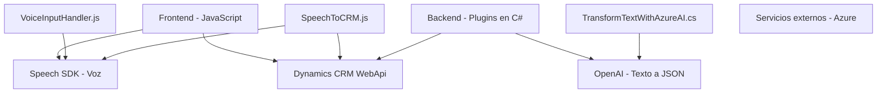

### Breve resumen técnico:
El repositorio contiene soluciones que integran servicios de voz y procesamiento de texto mediante **Azure SDK** y **Azure OpenAI** en un ecosistema de Dynamics CRM. Los archivos se dividen principalmente en módulos frontend (JavaScript) y extensiones en backend (Plugins en C#). Se observa un enfoque hacia la automatización en CRM mediante voz y procesamientos estructurados de texto.

---

### Descripción de arquitectura:
La arquitectura observada se divide en tres capas principales:
1. **Frontend:** Scripts en JavaScript integrados con el SDK de speech y CRM (navegador/cliente de Dynamics).
2. **Backend:** Plugins de Dynamics CRM en C#, que actúan como extensiones del sistema y utilizan Azure OpenAI para procesamiento avanzado.
3. **Servicios externos:** Alta dependencia de APIs de Microsoft Azure (Speech SDK y OpenAI).

El sistema podría clasificarse como una arquitectura **n-capas**, donde:
- Las capas frontend y backend interactúan dinámicamente con servicios externos.
- Existe integración directa a través de Dynamics CRM y servicios API.

---

### Tecnologías usadas:
1. **Frontend:**
   - Lenguaje: **JavaScript**
   - Frameworks/SDK: **Azure Speech SDK**
   - Servicios externos: **Azure Speech**, **API Dynamics CRM WebApi**
   - Funcionamiento: Procesamiento de voz, manipulación DOM, asincronismo.

2. **Backend:**
   - Lenguajes: **C#**
   - Frameworks/SDK:
     - **Microsoft Dynamics API** (management and integration)
     - **System.Net.Http** (HTTP-Requests Azure AI API)
   - Servicios externos: **Azure OpenAI**, Comunicación REST.
   - Funcionamiento: Transcripción e interpretación de voz/texto, generación JSON.

3. **Servicios externos:**
   - **Azure Speech SDK:** Synthesis y recognition.
   - **Azure OpenAI:** Procesamiento avanzado para generar información en JSON.

Patrones observados:
- Modularity: Funciones y responsabilidades separadas.
- Dependency Injection (en plugins, mediante `IServiceProvider` de Dynamics).

---

### Diagrama Mermaid válido para **GitHub Markdown**:

---

### Conclusión final:
El diseño del repositorio está centrado en la automatización y conversión de datos en un entorno CRM mediante tecnologías de Azure. La solución implementa arquitecturas robustas de **n-capas**, combinando frontend modular y backend extensible con servicios externos. La integración con Dynamics CRM mediante APIs asegura funcionalidades avanzadas de procesamiento de datos en tiempo real. Sin embargo, se pueden optimizar aspectos como manejo de errores y redundancias en dependencias.