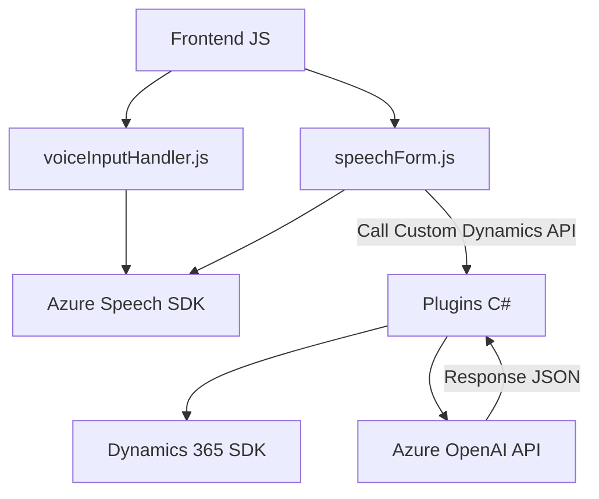

### Breve Resumen Técnico

Este repositorio contiene una solución híbrida que integra funcionalidades de procesamiento de voz y texto, principalmente enfocadas en la interacción entre **formularios de Dynamics 365** y servicios externos basados en **Azure Speech SDK** y **Azure OpenAI API**. Incluye un frontend (JavaScript) para manejar la interfaz y lógica del cliente, junto con un backend (C#) para ejecutar servicios y plugins dentro del ecosistema de **Dynamics 365**.

### Descripción de Arquitectura

1. **Tipo de solución:**  
   La solución está diseñada como una extensión de Dynamics 365, formada por componentes de frontend (JavaScript) y backend (plugins en C#). Implementa capacidades de reconocimiento de voz, síntesis de voz, e integración con procesamiento de texto vía Azure AI.

2. **Tecnologías utilizadas:**  
   - **Frontend (JavaScript):**
     - Azure Speech SDK para reconocimiento y síntesis de voz.
     - DOM y APIs de Dynamics 365 para manipulación de formularios.
   - **Backend (C#):**
     - Dynamics CRM SDK.
     - Azure OpenAI API para transformación de texto.
   - JSON para estructuración de datos entre APIs y procesos internos.

3. **Arquitectura:**  
   - **Frontend:** Diseño modular dividido por responsabilidad funcional y patrones de carga dinámica de dependencias.
   - **Backend:** Arquitectura basada en **plugins** de Dynamics CRM, que utiliza patrones como SRP (Single Responsibility Principle) y externalización a través de APIs.
   - **General:** Arquitectura de capas con separación entre presentación (frontend), lógica de negocio (backend), e integración externa (APIs).

### Componentes Externos y Dependencias

- **Azure Speech SDK:** Utilizado para la síntesis y reconocimiento de voz.
- **Azure OpenAI API:** Para realizar transformaciones avanzadas de texto con inteligencia artificial.
- **Dynamics 365 SDK:** Herramientas nativas de Microsoft para manejar formularios y gestionar datos organizacionales.
- **Librerías:** 
  - **Newtonsoft.Json** y **System.Text.Json**: Para manejo de datos JSON.
  - **HttpClient**: Elemento crítico para conexiones HTTP con Azure APIs.
  
### Diagrama Mermaid

### Conclusión Final

La solución es una extensión dinámica de **Dynamics 365**, cuyo objetivo es incorporar funcionalidades de accesibilidad y automatización basada en voz mediante la integración de dos servicios clave de Azure (Speech SDK y OpenAI API). La arquitectura modular y basada en eventos facilita el mantenimiento del código y su escalabilidad, permitiendo una interacción eficiente entre sistemas internos y externos. Esto la convierte en una solución ideal para entornos que exigen personalización y automatización avanzada en la captura y gestión de datos.