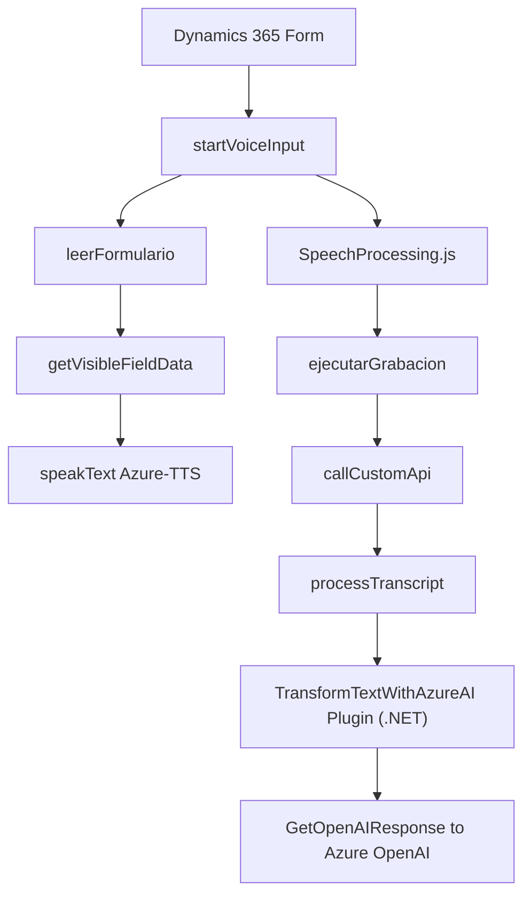

## Resumen técnico

Esta solución integra funcionalidades que combinan entrada y síntesis de voz, procesamiento avanzado de texto mediante IA, y manipulación de formularios en el contexto de Dynamics 365. Utiliza múltiples dependencias externas (Azure Speech SDK, APIs personalizadas, Azure OpenAI) y patrones de modularización y lazy loading.

---

## Descripción de arquitectura

La arquitectura es híbrida:
1. **Frontend:** Archivos JavaScript que manejan la interacción con el usuario, incluyendo entrada/salida de voz para formularios.
2. **Backend:** Un plugin de Dynamics CRM (.NET) que procesa texto mediante Azure OpenAI y devuelve JSON estructurado.
3. **Integración de servicios:** Uso del Azure Speech SDK para síntesis/reconocimiento de voz y Azure OpenAI para transformación avanzada del texto.
4. **Patrones aplicados:**
   - Modularización: Cada archivo organiza su lógica en funciones y clases independientes con objetivos concretos.
   - Lazy Loading: Código JavaScript que carga dinámicamente dependencias externas como el Speech SDK.
   - Plugin Architecture: En el backend se usa el modelo de plugins de Dynamics CRM.
   - Context-Aware Processing: Operaciones se realizan con base en el contexto actual de Dynamics 365.

---

## Tecnologías utilizadas

1. **Frontend:** JavaScript.
   - Frameworks/Librerías:
     - Azure Speech SDK.
     - APIs específicas de Dynamics CRM (proporcionadas por `executionContext` y el modelo Xrm).
2. **Backend:** .NET (código C#).
   - Frameworks/Librerías:
     - Azure OpenAI API.
     - Newtonsoft.Json y System.Text.Json para manejo de JSON.
3. **Plataformas de integración:**
   - Microsoft Dynamics 365.
   - Azure Cognitive Services (Speech y OpenAI).

---

## Dependencias/componentes externos detectados

1. **Azure Speech SDK:** Utilizado para síntesis y reconocimiento de voz.
   - URL: `https://aka.ms/csspeech/jsbrowserpackageraw`.
2. **Azure OpenAI API:** Procesa texto y genera JSON estructurado.
   - URL: `https://openai-netcore.openai.azure.com/`.
3. **APIs internas de Dynamics 365:** 
   - `executionContext.data.entity.attributes`, `Xrm.WebApi`, etc., para la manipulación de datos de formulario y las entidades definidas en CRM.
4. **Bibliotecas como Newtonsoft.Json:** Para la serialización y deserialización en el plugin de backend.
5. **System.Net.Http:** Simplifica solicitudes HTTP hacia Azure APIs.

---

## Diagrama **Mermaid**

---

## Conclusión

La solución es un **hybrid system** que combina frontend (JS), backend (C# en plugins de Dynamics 365), y servicios externos (Azure Cognitive Services, Azure OpenAI). La arquitectura puede clasificarse como **modular y n capas**, con un enfoque en la delegación de la lógica de negocio a servicios externos para tareas específicas de síntesis/reconocimiento de voz y procesamiento de texto.

### Ventajas:
1. Uso eficiente de servicios de IA y APIs en combinación con Dynamics 365.
2. Modularización que facilita pruebas unitarias y mantenimiento.
3. Lazy loading optimiza la carga y ejecución del JavaScript.

### Consideraciones:
1. Dependencia fuerte de Azure para Speech SDK y OpenAI.
2. Sensibilidad del sistema al contexto específico de Dynamics 365 (posibles desafíos de portabilidad y testing).

Esta solución es adecuada para entornos en los que la interacción personalizada con formularios y la automatización basada en IA son requeridas, como CRM avanzados.