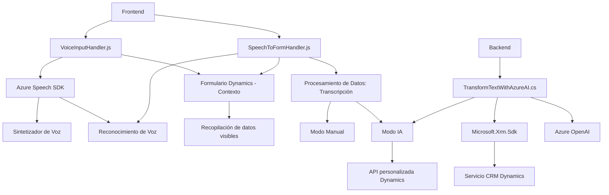

### Breve resumen técnico
El repositorio contiene una solución híbrida que combina integración de APIs, reconocimiento de voz y procesamiento mediante inteligencia artificial para un sistema CRM basado en Microsoft Dynamics. Aborda tres grandes funcionalidades:
1. Frontend: Interacción con formularios mediante reconocimiento de voz.
2. Backend: Plugins para procesar texto utilizando Azure OpenAI y mapear datos en el CRM.
3. Dependencias de servicios externos como Azure Speech SDK y Azure OpenAI.

### Descripción de arquitectura
La arquitectura general es una combinación de **arquitectura cliente-servidor** y funcionalidades orientadas a servicio:
- **Frontend**: Cada archivo relacionado con `JS` implementa una lógica modular para interactuar con elementos del formulario en Dynamics, manejar transcripciones y mapear datos.
- **Backend**: El archivo `TransformTextWithAzureAI.cs` utiliza un plugin basado en SOA para extender la funcionalidad del CRM con tareas específicas (procesamiento de texto).
- **Integración con APIs externas**: Utiliza servicios como Microsoft Azure Speech SDK y OpenAI para implementar reconocimiento y procesamiento avanzado.

La solución sigue una **n-capas**, donde:
1. **Capa de presentación**: Frontend que interactúa con formularios y manipula datos.
2. **Capa lógica de negocio**: Plugins y funciones en código JavaScript.
3. **Capa de servicio**: Integraciones con APIs de Azure.

### Tecnologías usadas
- **Frontend**:
  - **JavaScript** para lógica del cliente.
  - **Dynamic 365 Context** (`executionContext`) para recibir eventos de formularios.
  - **DOM Manipulation** para integración con Speech SDK.
  - **Azure Speech SDK** para reconocimiento y síntesis de voz.

- **Backend**:
  - **C#** como lenguaje principal.
  - **Microsoft.Xrm.Sdk**: Biblioteca para extender Microsoft Dynamics CRM con plugins.
  - **Azure OpenAI Service** para transformar texto mediante inteligencia artificial.
  - **Newtonsoft.Json** y **System.Text.Json** para manejo de JSON.
  - **System.Net.Http** para peticiones HTTP.

### Diagrama Mermaid válido para GitHub Markdown

### Conclusión final
La solución presenta una arquitectura bien estructurada organizada en capas (n-capas), que integra procesamiento de voz, IA y servicios personalizados dentro de Dynamics CRM. Destaca por su modularidad y enfoque hacia la extensibilidad mediante plugins y APIs externas. Sin embargo, algunos aspectos necesitan mejora en términos de seguridad, como la gestión de claves API. La fuerte dependencia en los servicios de Azure lo convierte en una solución dependiente del ecosistema Microsoft, lo que puede restringir su portabilidad hacia otras plataformas.