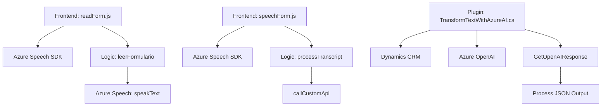

### Breve Resumen Técnico
El repositorio analiza una solución que engloba funcionalidades de manipulación de formularios mediante entrada de voz y una integración con APIs externas, incluyendo Azure Speech SDK y Azure OpenAI. Los archivos `readForm.js`, `speechForm.js`, y `TransformTextWithAzureAI.cs` están orientados hacia la interacción con un CRM (Dynamics CRM), procesamiento lógico modular, y consumo de servicios externos.

---

### Descripción de Arquitectura
La solución presenta una arquitectura híbrida que combina elementos de n-capas y microservicios. Los módulos JavaScript trabajan en la capa de presentación (frontend), interactuando con un SDK (Azure Speech SDK) y posibles APIs externas, mientras que la lógica en `TransformTextWithAzureAI.cs` actúa como un plugin, funcionando dentro de eventos de Dynamics CRM en una capa de lógica empresarial. La integración con APIs externas y la separación de responsabilidades en módulos claros sugiere un enfoque para desacoplar la solución, replicando patrones de microservicios.

---

### Tecnologías Usadas
1. **Frameworks y Servicios:**
   - **Azure Speech SDK:** Gestión de reconocimiento y síntesis de voz.
   - **Azure OpenAI Service:** Transformación de texto mediante modelos GPT.
   - **Dynamics CRM SDK:** Interacción directa con objetos del CRM.
   - **JavaScript:** Lenguaje base para las integraciones en el frontend.
   - **.NET Framework (.NET)**: Desarrollo del plugin para Dynamics CRM.
   - **HTTP Client (desde .NET)**: Llamadas API a servicios externos.

2. **Patrones Arquitectónicos:**
   - **Modularidad:** Los archivos frontend están organizados por funcionalidades.
   - **Plug-in Pattern:** Implementación de lógica de negocio mediante eventos plugin en Dynamics CRM.
   - **Uso de SDKs:** Acceso y gestión de servicios de voz/síntesis (Azure Speech) y procesamiento de texto avanzado (Azure OpenAI).
   - **Orientación a servicios:** Llamadas remotas asincrónicas mediante APIs REST.

---

### Dependencias o Componentes Externos
1. **Azure Speech SDK:** Para reconocimiento y síntesis de voz.
2. **Dynamics CRM SDK:** Para interactuar dinámicamente con la plataforma CRM.
3. **Azure OpenAI Service:** Para procesamiento de texto con modelos GPT.
4. **API personalizada:** Una posible API intermedia para enriquecer transcripciones de voz o conectarlas con otras aplicaciones empresariales.

---

### Diagrama Mermaid

---

### Conclusión Final
La solución combina dos principales objetivos: **procesamiento de voz en frontend** y **transformación de texto en backend**, integrándose perfectamente con plataformas externas como Azure Speech SDK y Azure OpenAI, además de interacción directa con Dynamics CRM. La arquitectura favorece módulos desacoplados que facilitan el escalado y mantenimiento de la aplicación. Esta estructura es ideal para aplicaciones empresariales basadas en formularios y entrada de datos dinámica, con un enfoque hacia la digitalización e inteligencia artificial.