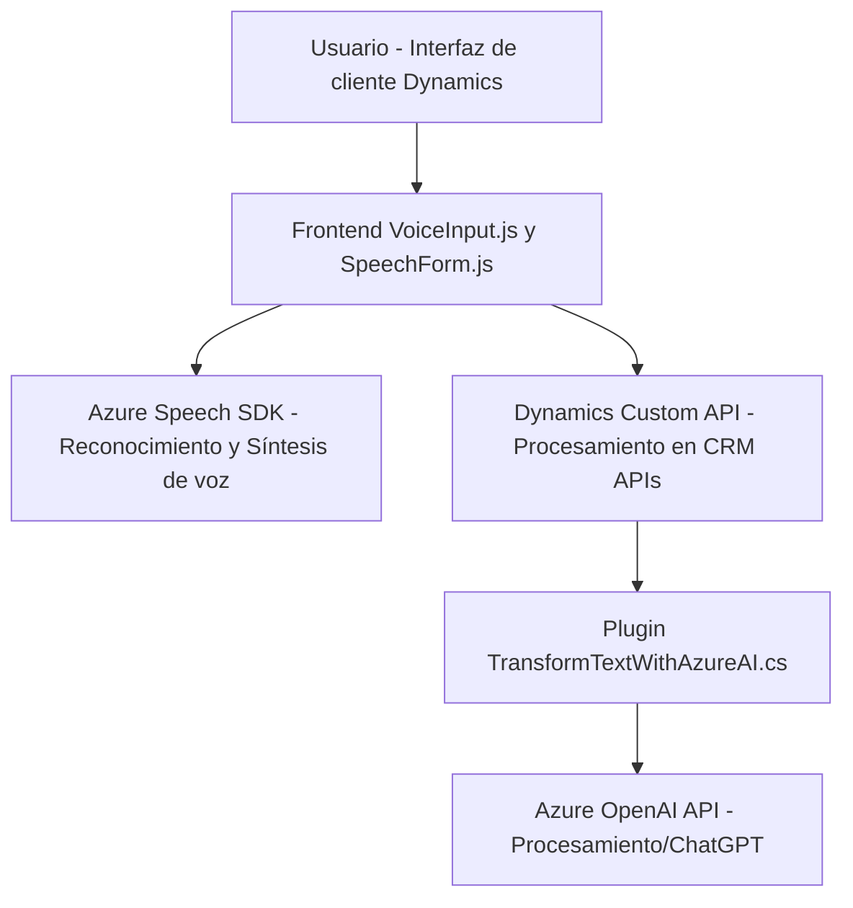

## Breve resumen técnico

Los archivos analizados en el repositorio forman parte de una solución que integra capacidades de reconocimiento y síntesis de voz usando **Azure Speech SDK** y funcionalidades de procesamiento de texto mediante **Azure OpenAI** dentro del ecosistema de **Microsoft Dynamics 365 CRM**. El objetivo principal es simular un asistente conversacional que puede interactuar con formularios de Dynamics, leer datos y realizar modificaciones basadas en comandos de voz o inteligencia artificial.

---

## Descripción de arquitectura

La solución implementa una arquitectura de **n capas** con una distribución lógica de responsabilidades entre el frontend basado en JavaScript y los plugins del lado del servidor implementados en C#. 

1. **Frontend/JS**:
   - Implementa la interacción inicial del usuario a través de la capa interfaz de usuario y acciones como reconocer comandos de voz, lectura de formularios y síntesis de texto.
   - Modularización de servicios con acceso dinámico al Azure Speech SDK para realizar síntesis de voz y reconocimiento de voz desde el navegador.

2. **Backend Plugin (Dynamics CRM)**:
   - Extiende la funcionalidad del sistema Dynamics CRM mediante un Plugin que convierte el texto ingresado en JSON estructurado utilizando **Azure OpenAI**.
   - Uso del patrón de plugins (Plugin Design Pattern) oficial de Dynamics CRM para integrar y transformar datos en tiempo de ejecución.

El repositorio sigue una separación clara entre capacidades del frontend y backend, alineado con características de **n capas**:
- **Capa de presentación**: Usada para interactuar con el usuario (formulario web).
- **Capa de lógica de negocio**: Proporcionada por los servicios en los **Plugins** y **Custom APIs**.
- **Capa de integración con terceros**: Uso de **Azure Speech SDK** y **Azure OpenAI API** para integración con servicios externos.

---

## Tecnologías usadas

### Lenguajes y Frameworks
1. **Frontend**:
   - Lenguaje: **JavaScript**.
   - Framework: Dynamics 365 Form Scripting / Xrm APIs.
   - SDK externo: **Azure Speech SDK**.
2. **Backend/Plugins**:
   - Lenguajes: **C#**.
   - Frameworks:
     - **Microsoft Dynamics CRM SDK**.
     - **Newtonsoft.Json**, **System.Net.Http**, **System.Text.Json** (librerías para manipulación de JSON y manejar solicitudes HTTP).

### Servicios en la nube y APIs
1. **Azure Speech SDK**: Interfaz dinámica con reconocimiento y síntesis de voz.
2. **Azure OpenAI Service**: Usado para procesar texto y convertirlo en JSON estructurado.
3. **Custom APIs de Dynamics 365 CRM**: APIs personalizadas para extender funcionalidad específica del sistema CRM.

### Patrones de diseño
1. **Plugin Design Pattern**: Implementación estándar de Microsoft para plugins en su ecosistema CRM.
2. **Abstracción a servicios externos** y **Integración de SDK**: Uso modular y delegación para interactuar con APIs como lo hace `ensureSpeechSDKLoaded`.
3. **Modularización funcional**: En el frontend, las funciones separan responsabilidades de interacción con SDK, manejo del DOM y síntesis de voz.
4. **Eventos**: Uso de eventos y callbacks para iniciar procesos del SDK o manipular resultados (Evento-driven Architecture).

---

## Posibles dependencias o componentes externos presentes

### Dependencias directas
1. **Azure Speech SDK**:
   - Conexión directa para habilitar capacidades de reconocimiento y síntesis de voz.
   - Cargado dinámicamente desde: `https://aka.ms/csspeech/jsbrowserpackageraw`.
2. **Azure OpenAI Service**:
   - Utilizado en el plugin backend para acceder al servicio **chat/completions** del modelo de lenguaje GPT.
   - Requiere una clave de acceso y configuración precisa de los endpoints.
3. **Dynamics 365 APIs**:
   - Manipulación de formularios mediante APIs como `Xrm.WebApi` y servicios estándar CRM.
4. **HTTP requests**:
   - Dependencias como `System.Net.Http` son utilizadas para interactuar con Azure OpenAI desde el plugin.

---

## Diagrama Mermaid válido para GitHub

---

## Conclusión final

Esta solución se centra en funciones avanzadas para interactuar con formularios de Dynamics CRM mediante comandos de voz y lógica de inteligencia artificial, integrando servicios en la nube como Azure Speech SDK y Azure OpenAI. La arquitectura está basada en un enfoque de **n capas**, distribuyendo responsabilidades entre el frontend y backend, con una clara modularidad y un fuerte acoplamiento con los servicios proporcionados por Azure y la plataforma Dynamics. 

El diseño modular y la integración eficiente con servicios externos hacen que la solución sea flexible y ampliable, adecuada para entornos corporativos que requieren capacidades avanzadas de procesamiento de voz y datos estructurados.