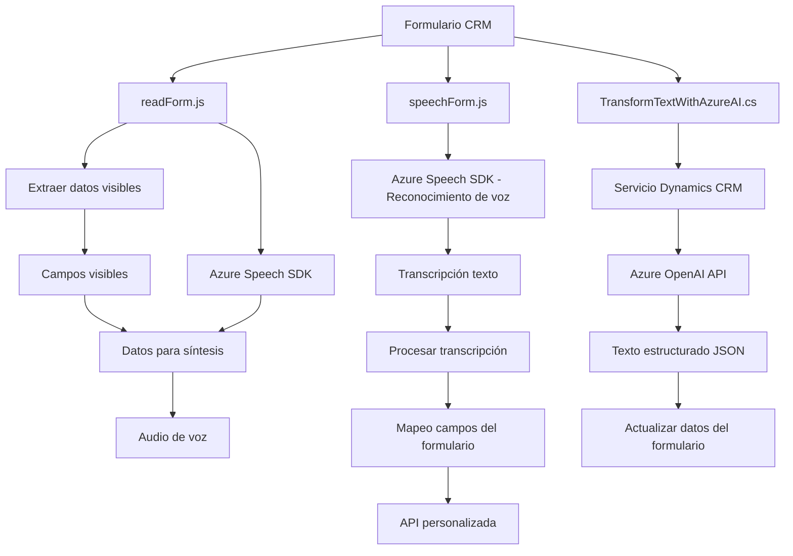

### Breve resumen técnico
El repositorio contiene archivos asociados a una solución que interactúa con Microsoft Dynamics CRM. Los archivos muestran funcionalidades para procesar datos de formularios mediante voz (Azure Speech SDK) y transformar texto en un formato estructurado (Azure OpenAI). Esto sugiere que el sistema integra múltiples tecnologías de Microsoft para proporcionar una interacción optimizada entre usuarios y formularios.

---

### Descripción de arquitectura
La arquitectura observada combina elementos de **n-capas** y **SOA (Service-Oriented Architecture)**:
- **N-capas**: Cada archivo cumple responsabilidades específicas:
  - Los archivos JavaScript (frontend): Capturan datos del formulario y los envían o procesan con servicios externos.
  - El archivo `.cs` (backend): Implementa un plugin en Dynamics CRM que utiliza Azure para transformar datos según reglas definidas.
- **SOA**: La integración con Azure Speech SDK y Azure OpenAI evidencia el uso de servicios externos para manejar tareas específicas de síntesis de voz, reconocimiento de texto e inteligencia artificial.
  
Además, existen patrones complementarios como el **Event-Driven Architecture** (callbacks en frontend para manejar eventos asincrónicos) y modularización que separa la lógica en funciones específicas.

---

### Tecnologías usadas
1. **Frontend**:
   - **Azure Speech SDK**: Para síntesis y reconocimiento de voz.
   - **JavaScript**: Manejo de lógica de interfaz y eventos.
   - **Dynamics CRM Web API (Xrm)**: Interacción con el formulario de Dynamics 365.
   
2. **Backend**:
   - **Azure OpenAI Service**: Transformación de texto basada en GPT.
   - **C# (Dynamics CRM Plugin SDK)**: Implementación del plugin para la lógica de transformación.
   - Librerías:
     - `Newtonsoft.Json` (para manejo avanzado de JSON).
     - `System.Net.Http` (para comunicación HTTP con la API externa).

---

### Diagrama Mermaid válido para GitHub

---

### Conclusión final
La solución implementada en el repositorio está diseñada para facilitar interacciones avanzadas con formularios Dynamics CRM mediante voz y texto. Utiliza tecnologías modernas como **Azure Speech SDK** y **Azure OpenAI**, lo que garantiza procesamiento eficiente de datos.

La arquitectura principal es una mezcla de **n-capas** (responsabilidades divididas por nivel: frontend y backend) y **SOA**, con componentes externos como APIs de Azure integrados a través de servicios REST. Los patrones observados enfatizan modularidad, reutilización de código y gestión asincrónica de eventos.

Este diseño es ideal para escenarios empresariales como sistemas CRM donde la interacción dinámica y personalizada del usuario es esencial. Sin embargo, es importante considerar aspectos como la seguridad en el manejo de APIs, escalabilidad de servicios y potenciales costos asociados al uso de Azure.