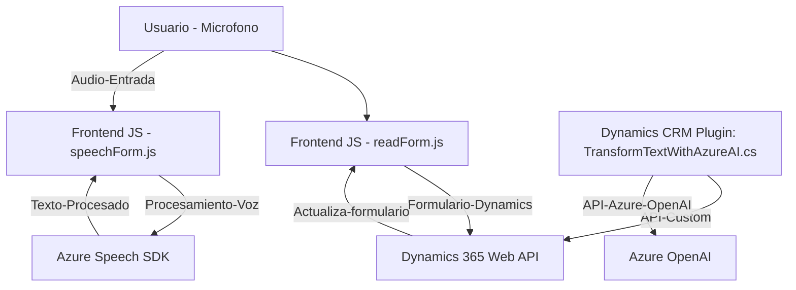

# Análisis técnico del repositorio

## Breve resumen técnico
El repositorio contiene tres archivos que son componentes clave en una solución orientada al procesamiento de voz y texto, integrados en Microsoft Dynamics 365. La solución incluye un **frontend** en JavaScript y un **plugin backend** desarrollado en C#. El diseño permite convertir texto en voz, capturar y procesar audio para interactuar con formularios de Dynamics CRM, además de transformar texto mediante un servicio de Inteligencia Artificial proporcionado por Azure.

---

## Descripción de arquitectura
La solución utiliza una **arquitectura de dos capas** que combina un frontend en **JavaScript** para la interfaz y la interacción directa con usuarios, y un backend basado en **plugins CRM** escrito en C#. La funcionalidad se divide principalmente en módulos que interactúan con un servicio externo de Azure (Azure Speech SDK y Azure OpenAI API). El plugin opera como una capa de procesamiento en Dynamics 365 utilizando la arquitectura **plugin** definida por Microsoft Dynamics CRM, mientras que el frontend utiliza patrones modulares y eventos para reaccionar en tiempo real ante la entrada y procesamiento de voz.

---

## Tecnologías usadas
1. **Frontend**:
   - JavaScript ES6.
   - Azure Speech SDK (para síntesis y reconocimiento de voz).
   - Dynamics CRM (`Xrm.WebApi`) para manipulación de formularios.

2. **Backend**:
   - **C# .NET Framework** (con Microsoft.Xrm.Sdk para crear plugins compatibles con Dynamics CRM).
   - **System.Net.Http** y **System.Text.Json** (para llamadas HTTP y manejo de JSON).
   - **Azure OpenAI Service** (procesamiento de texto avanzado).

---

## Dependencias o componentes externos
1. **Azure Speech SDK**: Capacidad de síntesis y reconocimiento de voz en tiempo real desde el frontend.
2. **Azure OpenAI Service**: Inteligencia artificial para transformar texto en formato estructurado, accesible desde el backend.
3. **Dynamics 365 Custom API**: Lógica adicional (trial_TransformTextWithAzureAI) para procesamiento de texto en Dynamics CRM.
4. **Newtonsoft.Json** o **System.Text.Json**: Para parsear datos JSON y realizar operaciones sobre el formato estructurado.

---

## Diagrama **Mermaid** válido para GitHub

---

## Conclusión final
Este repositorio define una solución modular destinada al manejo de entrada y salida de voz en Microsoft Dynamics CRM. Con la ayuda de servicios de Azure (Speech SDK y OpenAI API), el sistema permite a los usuarios interactuar con formularios llenando datos a partir de texto hablado, procesar texto o hacer síntesis de voz. Su arquitectura de 2 capas asegura una separación clara entre la lógica del frontend para interacción directa y del backend plugin para integración con lógica de negocio. Utiliza tecnologías modernas y herramientas adaptadas a un entorno de desarrollo empresarial.