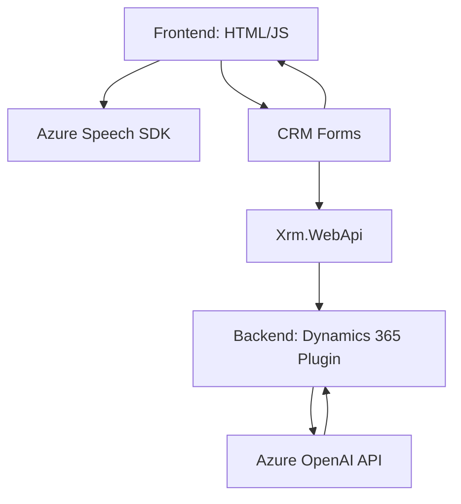

### Breve Resumen Técnico
El repositorio presenta componentes de una solución técnica enfocados en interacción usuario-sistema y contribución a una implementación extensible en **Dynamics 365**. Los componentes clave incluyen:
1. **Frontend (JavaScript)**: Realiza lectura y síntesis de voz utilizando el **Azure Speech SDK** y permite interacción mediante entrada de voz.
2. **Backend (C# plug-in)**: Extiende la lógica del CRM con las capacidades de **Azure OpenAI** para la transformación avanzada de texto en objetos estructurados.

---

### Descripción de la Arquitectura
La solución está basada en una arquitectura **n capas** con una clara separación de responsabilidades:
- **Frontend**: Impulsa la interacción del usuario utilizando tecnologías web y se conecta dinámicamente con el **SDK de Azure Speech** para interacción directa con formularios CRM.
- **Backend**: Utiliza patrones de **extensibilidad en Dynamics CRM** mediante plugins que ejecutan lógica externa y procesan solicitudes asincrónicas con **Azure OpenAI**. La comunicación se realiza vía API usando el protocolo HTTPS.

La integración de servicios externos (Azure Speech SDK y Azure OpenAI) configura una arquitectura dependiente de servicios de terceros en la nube.

---

### Tecnologías Usadas
1. **Frontend** (client-side):
   - **Lenguaje**: JavaScript.
   - **Frameworks/librerías**:
     - **Azure Speech SDK**: Para síntesis de voz y reconocimiento de audio.
   - **Patrones arquitectónicos**:
     - Modularización (Funciones para tareas unitarias).
     - SDK Loader (Carga condicional y dinámico del SDK de Azure).
     - API-driven Design.

2. **Backend** (server-side):
   - **Lenguaje**: C#.
   - **Frameworks/librerías**:
     - **Dynamics 365 SDK**: Implementación de plugins para estrategias de extensibilidad.
     - **Newtonsoft.Json.Linq** y **System.Text.Json** para manejo de JSON.
     - **HttpClient** para invocaciones RESTful (solicitudes a Azure OpenAI).
   - **Patrones arquitectónicos**:
     - Plugin Pattern (extendibilidad en Dynamics 365).
     - External API Integration.

---

### Dependencias
- **Azure Speech SDK**: Suministra capacidades de IA para síntesis y reconocimiento de voz.
- **Azure OpenAI API**: Proporciona transformación avanzada de texto en objetos JSON.
- **Xrm.WebApi (Dynamics 365)**: Extensión para consumir APIs personalizadas, interactuar con entidades y realizar operaciones CRUD.
- **HttpClient**: Invocación de APIs externas desde el backend.

---

### Diagrama Mermaid

---

### Conclusión Final
La solución combina un frontend orientado al cliente que se apoya en el SDK de Azure Speech para interacción con el usuario mediante voz. Por otro lado, el backend implementa lógica personalizada de negocio empleando Dynamics CRM con integración a la API de Azure OpenAI para procesamiento avanzado de texto. La arquitectura es **n capas**, separando con claridad presentaciones (frontend), negocio (backend) y servicios externos, manteniendo modularidad y escalabilidad.