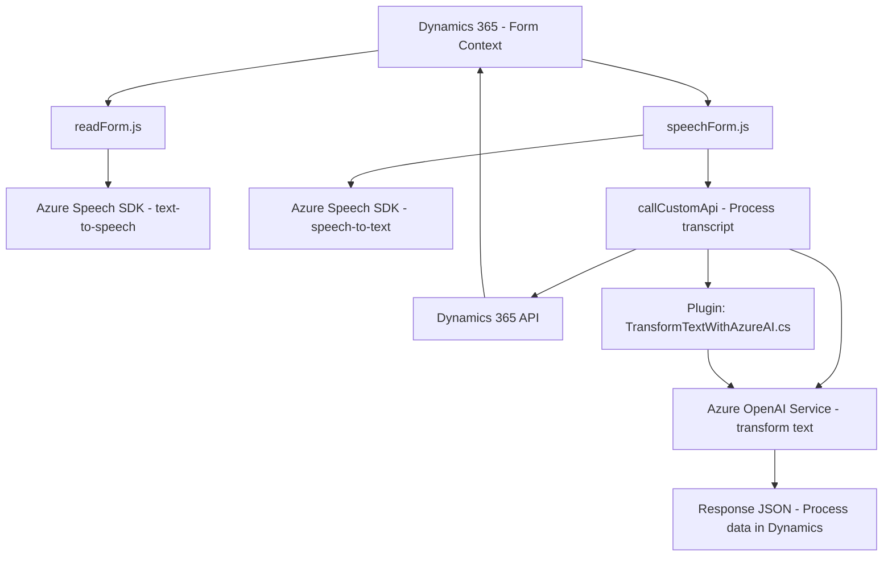

### Breve resumen técnico

El repositorio integra funcionalidades que emplean el **Azure Speech SDK** y **Azure OpenAI Service** en un entorno de **Microsoft Dynamics 365 CRM**. Los archivos contienen módulos y plugins que utilizan servicios de reconocimiento de voz, síntesis de texto y transformación de texto, con propósitos como completar automáticamente formularios y ejecutar operaciones basadas en inputs dinámicos.

---

### Descripción de arquitectura

La solución parece ser una **arquitectura de varias capas** adaptada al entorno de Dynamics 365 CRM. Los módulos de JavaScript actúan como una capa de presentación al asistir con la captura de datos en formularios y su manipulación, mientras los plugins en C# cumplen funciones empresariales intensivas ligadas a Azure OpenAI y la interacción con el backend de Dynamics CRM.

1. **Frontend (JS):** Representado por los archivos `readForm.js` y `speechForm.js`. Capturan datos de formularios en Dynamics 365, utilizan el **Azure Speech SDK** para convertir texto en voz o viceversa, y conectan formularios con servicios externos mediante API.
2. **Backend (Plugin - C#):** Incluye un plugin que funciona como bridge entre Dynamics CRM y **Azure OpenAI** para transformar texto en objetos estructurados JSON mediante GPT-4.

---

### Tecnologías usadas

1. **Microsoft Dynamics 365**
   - Contexto de ejecución `executionContext`.
   - APIs internas como `Xrm.WebApi`.

2. **Azure Speech SDK**
   - Reconocimiento de voz (speech-to-text).
   - Síntesis de voz (text-to-speech).

3. **Azure OpenAI Service**
   - GPT-4 para transformar textos en estructuras JSON.
   - Uso mediante solicitudes HTTP desde `TransformTextWithAzureAI.cs`.

4. **Frameworks/Librerías (backend):**
   - **Newtonsoft.Json** y **System.Text.Json** para manipulación de JSON en C#.
   - **System.Net.Http** para solicitudes HTTP.

5. **Lenguajes de programación:**
   - **JavaScript** en frontend.
   - **C#** para plugins y lógica empresarial en Dynamics.

6. **Patrones observados:**
   - **Facade:** Simplifica el uso de servicios complejos (Azure Speech/OpenAI).
   - **Plugin:** Estilo típico en Dynamics CRM para extender operaciones.
   - **Modularidad:** Separación de lógica relacionada con input/output.
   - **Encapsulación de dependencias externas:** SDKs y APIs cargados dinámicamente.

---

### Diagrama Mermaid

---

### Conclusión final

Esta solución muestra claramente una **arquitectura n-capas** adaptada a Dynamics 365. Se distribuyen las responsabilidades entre:
1. **Frontend modular** (JavaScript): Procesa interacciones en tiempo real utilizando Azure Speech SDK para entrada y salida de voz.
2. **Backend extensivo** (C#): Usa plugins para delegar funciones avanzadas como transformación de datos mediante Azure OpenAI.

La solución integra dinámicamente servicios externos como **Azure Speech SDK** y **Azure OpenAI**, siguiendo buenas prácticas de modularidad y encapsulación. Es ideal para entornos empresariales donde la interacción eficiente y automatizada con los datos del cliente es clave.