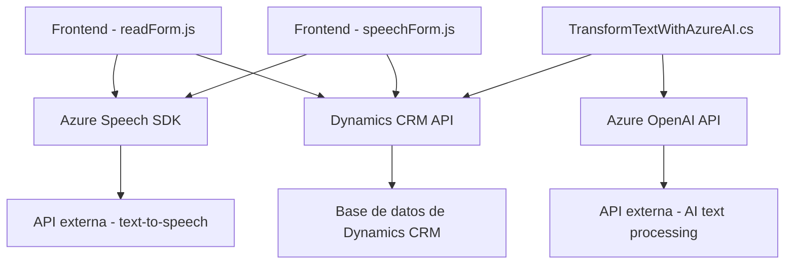

### Breve Resumen Técnico
Este repositorio describe tres elementos clave:
1. **Frontend (`readForm.js` y `speechForm.js`)**: Archivos JavaScript diseñados para el manejo de formularios e integración con Azure Speech SDK en aplicaciones web.
2. **Plugins (`TransformTextWithAzureAI.cs`)**: Plugin de Dynamics CRM que realiza transformación de texto utilizando Azure OpenAI.

El sistema combina:
- Reconocimiento y síntesis de voz (Azure Speech SDK).
- Manipulación de formularios dinámicos en Dynamics CRM.
- Integración con Azure OpenAI para procesamiento avanzado de texto.

---

### Descripción de Arquitectura
La arquitectura del sistema combina múltiples paradigmas:
1. **N capas**: La funcionalidad de frontend y plugins opera en diferentes capas:
   - **Capa de Presentación**: Los archivos JavaScript manejan la interacción del usuario con los formularios.
   - **Capa de Negocio**: Los plugins en .NET implementan lógica del negocio en Dynamics CRM.
2. **Integración de Servicios Externos**: Uso de Azure Speech SDK y Azure OpenAI API como servicios independientes.
3. **Modularización**: Cada archivo está diseñado con responsabilidades claras y separadas, alineado con principios de diseño modular.

Este enfoque facilita la interacción entre sistemas distintos (Dynamics CRM, APIs de Azure) manteniendo alta cohesión y bajo acoplamiento.

---

### Tecnologías Usadas
1. **Frontend**:
   - **JavaScript**: Manipulación de DOM y manejo de atributos.
   - **Azure Speech SDK**: Reconocimiento y síntesis de voz.
   - **Dynamics CRM Web API**: Integración con datos del sistema CRM.
2. **Backend**:
   - **C#**: Implementación del plugin en Dynamics CRM.
   - **Azure OpenAI API**: Procesamiento de texto con modelos avanzados.
   - **Newtonsoft.Json**: Manejo de JSON para convertir datos entre API y el sistema.
   - **Microsoft.Xrm.Sdk**: Framework para desarrollo de plugins en Dynamics CRM.
3. **Conectividad HTTP**:
   - **System.Net.Http**: Para comunicación directa con servicios externos.

---

### Diagrama Mermaid Válido para GitHub

---

### Conclusión Final
El repositorio describe una solución integrada que aprovecha plataformas avanzadas como Dynamics CRM y servicios de Azure (Speech SDK y OpenAI API). Está diseñado con arquitectura modular y patrones de integración de servicios, permitiendo extender formularios dinámicos con capacidades de voz e inteligencia artificial.

- **Fortalezas**: Modularidad, separación de responsabilidades, escalabilidad a través del uso de APIs externas.
- **Posibles mejoras**:
  - Evaluar uso de programación asincrónica en el plugin (`TransformTextWithAzureAI`) para optimizar rendimiento ante altas solicitudes hacia Azure OpenAI.
  - Documentar mecanismos para manejo de errores en servicios externos como Azure Speech SDK y OpenAI API.

Esta arquitectura es adecuada para entornos empresariales que requieran interacción por voz y automatización inteligente en plataformas CRM.