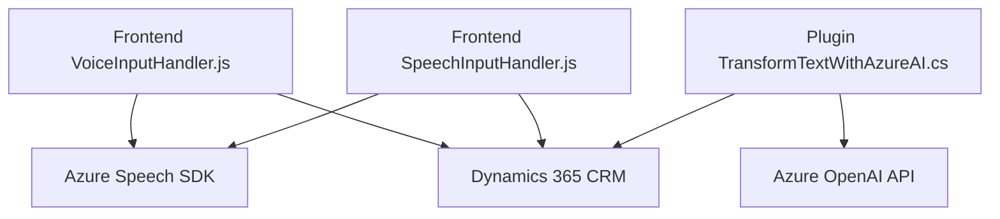

### Breve resumen técnico
El repositorio contiene una solución integrada que utiliza tecnologías de entrada y salida de voz, integración con API externas, y la plataforma Dynamics 365 CRM. Los principales componentes son:
1. **Frontend**: Implementa interacción de formularios mediante entrada y salida de voz aprovechando Azure Speech SDK.
2. **Backend/plugin**: Extiende Dynamics CRM mediante un plugin que llama a Azure OpenAI para procesar y estructurar datos en formato JSON.

---

### Descripción de arquitectura
La solución tiene una arquitectura híbrida, compuesta por un modelo cliente-servidor con integración en Dynamics CRM. Algunos aspectos clave:
1. **Frontend**: Modular y orientado a funciones. Asegura separación de responsabilidades (lectura, entrada por voz, síntesis de voz, y llamada a APIs).
2. **Plugin Backend**: Desarrollado como una extensión de Dynamics CRM usando un enfoque basado en plugins.
3. **Servicios externos (Azure Speech SDK y OpenAI)**: Realizan la síntesis de voz y la estructuración de datos procesados.
4. **Patrones inferidos**:
   - **Event-driven architecture**: Impulsada por eventos del SDK y la interacción del usuario.
   - **Bridge pattern**: El frontend actúa como puente entre datos en el formulario y los servicios de reconocimiento/síntesis de voz.
   - **Cliente-Servidor**: Plug-in que consume servicios Azure OpenAI mediante peticiones HTTP REST.

---

### Tecnologías usadas
1. **Azure Speech SDK**: Para interacción basada en voz.
2. **Dynamics 365 CRM APIs**: Procesamiento de datos dentro del ecosistema CRM.
3. **Azure OpenAI API (GPT)**: Procesamiento avanzado de texto ingresado mediante IA.
4. **JavaScript**: Utilizado en el frontend para control de formularios y carga dinámica del SDK.
5. **C# (.Net)**: Implementación de lógica del plugin en el backend.
6. **Patrones de diseño**:
   - Modularidad con separación de responsabilidades.
   - Uso de dependencias externas para optimizar funcionalidad (SDK y APIs).
   - Lógica asincrónica mediante callbacks y promesas (backend y frontend).

---

### Diagrama Mermaid válido para GitHub

### Conclusión final
Este repositorio implementa una solución para interacción de datos y voz en un entorno Dynamics 365 CRM. Utiliza una arquitectura basada en módulos independientes y servicios externos (Azure Speech SDK, OpenAI). La solución está bien diseñada, aprovechando patrones de diseño modernos para modularidad, procesamiento asincrónico y extensibilidad. Sin embargo, depende significativamente de la disponibilidad de los servicios externos como Azure Speech SDK y OpenAI, lo que implica considerar escenarios de resiliencia ante fallos de conectividad o disponibilidad.