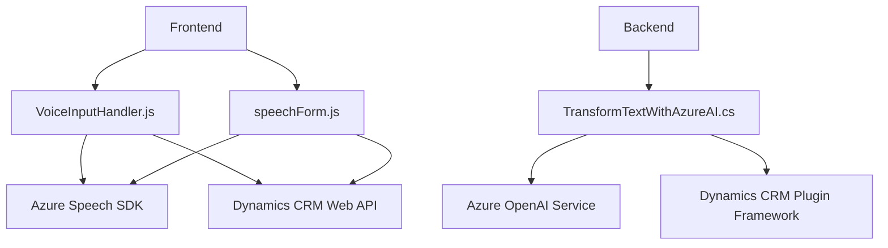

### Breve Resumen Técnico
Este repositorio implementa una solución compuesta por un frontend y un backend integrado con servicios de reconocimiento y síntesis de voz (Azure Speech SDK) y procesamiento de datos mediante IA (Azure OpenAI). Está diseñado como una extensión para entornos de CRM/Dynamics que facilita la interacción por voz en formularios. 

Consiste en dos módulos en el frontend (JavaScript para lectura y reconocimiento de voz) y un plugin backend (C# .NET) que actúa como intermediario entre Dynamics CRM y Azure OpenAI, utilizando un enfoque modular y orientado a servicios.

---

### Descripción de Arquitectura
La arquitectura sigue un diseño de capas con división funcional:

1. **Frontend (Capas de presentación y aplicación):**
   - Implementa las funcionalidades de síntesis y reconocimiento de voz interactuando directamente con Azure Speech SDK.
   - Procesa datos del formulario en Dynamics CRM y los transforma en voz o interpreta comandos hablados.

2. **Backend (Capa de negocio y servicio):**
   - Utiliza un plugin de Dynamics CRM escrito en C#. Este actúa como capa de negocio para manipular datos y aplicar reglas mediante una API de Azure OpenAI.
   - La arquitectura es extensible, modular y utiliza patrones orientados a servicios.

3. **Integración externa:**
   - Comunicación directa con los servicios de Azure, empleando patrones SOA (Service-Oriented Architecture) para interactuar con SDKs y APIs.

---

### Tecnologías Usadas
1. **Frontend:**
   - **Azure Speech SDK (JavaScript)**: Reconocimiento y síntesis de voz.
   - **Dynamics CRM Web API**: Manipulación del contexto del formulario.
   - **JavaScript**: Programación funcional y modular (separando tareas específicas por función).

2. **Backend:**
   - **Dynamics CRM Plugin Framework** (C#): Extensiones para lógica del negocio.
   - **REST APIs**:
     - Custom API en Dynamics
     - Llamadas a Azure OpenAI Service.
   - **SDKs y librerías auxiliares:** `Newtonsoft.Json`, `System.Net.Http`.

3. **Patrones Arquitectónicos:**
   - Modularidad: Cada función y clase tiene una responsabilidad clara.
   - Adapter Pattern: El plugin de C# traduce datos entre Dynamics CRM y Azure OpenAI.
   - SOA (Service-Oriented Architecture): Dependencia en servicios externos como Azure Speech y Azure OpenAI.

---

### Diagrama Mermaid (válido para GitHub Markdown)

---

### Conclusión Final
Este repositorio implementa una solución basada en una arquitectura orientada a servicios y capas, diseñada específicamente para entornos Dynamics CRM. Utiliza tecnologías avanzadas como Azure Speech SDK y Azure OpenAI para mejorar la interacción de los usuarios con el sistema mediante comandos de voz e interpretación. Se destaca por su modularidad, extensibilidad y uso de SDKs y APIs externas. Sin embargo, es importante optimizar la seguridad de las credenciales y mejorar la abstracción en el manejo de datos. Esto lo hace ideal para aplicaciones empresariales orientadas a la productividad y mejora de experiencia de usuario.