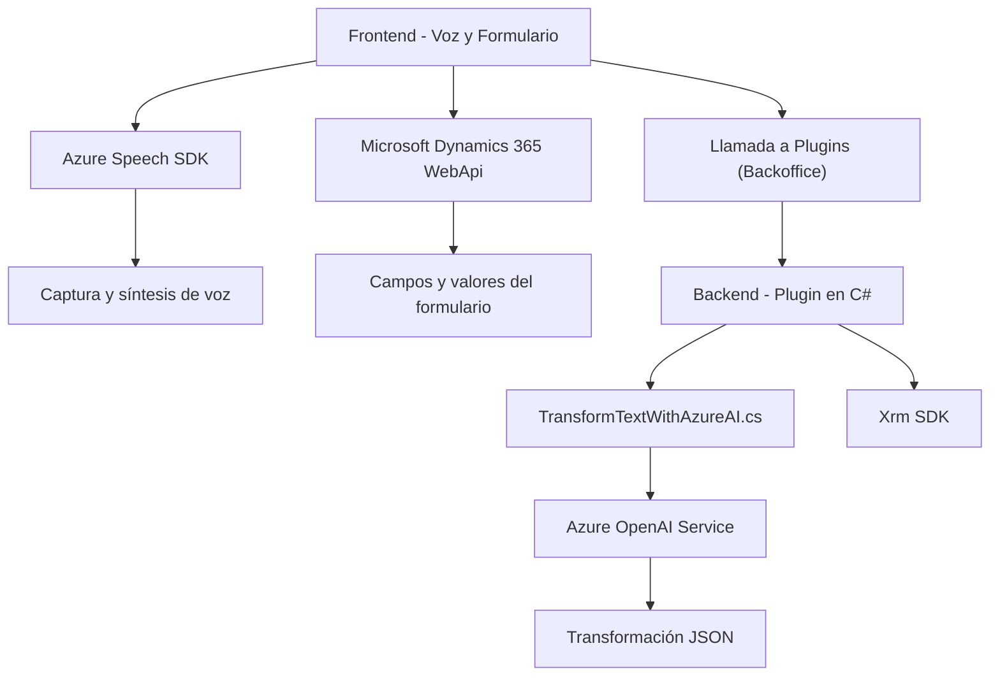

### Análisis técnico y explicaciones:

---

#### **Breve resumen técnico**
Este proyecto parece ser una solución dedicada a formularios dinámicos en **Microsoft Dynamics 365** que incorpora capacidades avanzadas de accesibilidad mediante entrada/salida de voz (Azure Speech SDK) y procesamiento de texto con inteligencia artificial (Azure OpenAI Service). Combina funcionalidades del frontend (JavaScript) y backend (Plugins en C#) para gestionar datos del sistema CRM mediante D365 APIs.

---

#### **1. Tipo de solución**
La solución es una **integración híbrida** entre frontend dinámico y backend en forma de plugin para la plataforma Microsoft Dynamics 365. Tiene características propias de:
- **Frontend/JS**: Scripts para captura de voz, síntesis y procesamiento en el navegador.
- **Microservicios dependientes**: Uso de APIs externas (Azure Speech SDK, Azure OpenAI) para delegar lógica avanzada.
- **Plugin Backend**: Implementación como complemento de Dynamics 365 para extender funcionalidades directamente en el CRM.

---

#### **2. Tecnologías, frameworks y patrones usados**
##### **Tecnologías utilizadas:**
1. **Frontend**:
   - **JavaScript** (ES6+): Manipulación del DOM y lógica asíncrona.
   - **Azure Speech SDK**: Para síntesis de voz y reconocimiento.
   - Dynamics 365 APIs (**Xrm.WebApi**): Para manipular datos CRM.

2. **Backend**:
   - **C# (.NET Framework)**: Implementación de plugins para Dynamics 365.
   - **Newtonsoft.Json**: Manejo de JSON.
   - **Azure OpenAI Service**: Transformación avanzada de datos textuales.
   - **HTTP**: Solicitudes de cliente hacia APIs externas.

---

##### **Patrones aplicados**:
1. **Event-Driven Architecture**:
   - Las acciones asíncronas (captura de voz, procesamiento en APIs externas) dependen de eventos específicos en el diseño del frontend/backend.

2. **Dependencia en Microservicios**:
   - Expone funcionalidades avanzadas (reconocimiento de voz, IA generativa) mediante servicios externos desacoplados.

3. **Modularidad**:
   - Cada componente (frontend o plugins) está diseñado para ser adaptable y separable.
   - Las funciones en frontend y la lógica backend (plugins) están desacopladas.

4. **Factory Pattern**:
   - Plugins usan organizaciones y servicios CRM mediante interfaces como `IOrganizationService`.

5. **Integración adaptativa**:
   - El frontend adapta de manera dinámica datos del contexto (atributos del formulario).

6. **Hexagonal Architecture (parcial)**:
   - Aunque el hexágono no está explícito, la solución combina servicios externos y capas CRM bajo interfaces y módulos reutilizables.

---

#### **3. Tipo de arquitectura**
La arquitectura es principalmente **n capas** con integración de microservicios:
1. **Frontend (JavaScript)**: Exposición de voz y manipulación visual usando Azure Speech SDK.
2. **Backend (Plugins - C#)**: Procesamiento lógico avanzado mediante Azure OpenAI y CRM APIs.
3. **Servicios externos**: Delegación de procesos complejos hacia Azure (Speech SDK, OpenAI).

---

#### **4. Dependencias o componentes externos**
1. **API externas**:
   - **Azure Speech SDK**: Para reconocimiento de voz y síntesis. Carga dinámica desde enlaces externos.
   - **Azure OpenAI Service**: Para procesamiento avanzado de texto.
2. **Microsoft Dynamics 365 APIs**:
   - Acceso a datos CRM mediante Xrm.WebApi y uso de entidades nativas.
   - Plugins se integran directamente como extensión CRM.
3. **Librerías externas**:
   - **Newtonsoft.Json** para manejo de estructuras JSON.
   - **DOM Manipulation**: Carga dinámica de scripts o elementos en frontend.

---

#### **5. Diagrama Mermaid (GitHub compatible)**

---

#### **Conclusión final**
La solución es una **integración avanzada para Microsoft Dynamics 365**, que utiliza **Azure Speech SDK** y **OpenAI** para facilitar accesibilidad y automatización de procesos CRM. Combina un diseño modular, con una arquitectura **escalable n capas**, y utiliza patrones adaptativos que permiten delegar procesos en microservicios externos. Lo hace ideal para entornos con formularios dinámicos, ricos en interacción voz-datos.

Sin embargo, requerirá consideraciones respecto a latencia, costos por consumo de Azure y manejo seguro de credenciales de acceso (clave y región) para los servicios utilizados. Integraciones como esta aportan valor significativo para mejorar accesibilidad y automatizar flujos basados en voz.