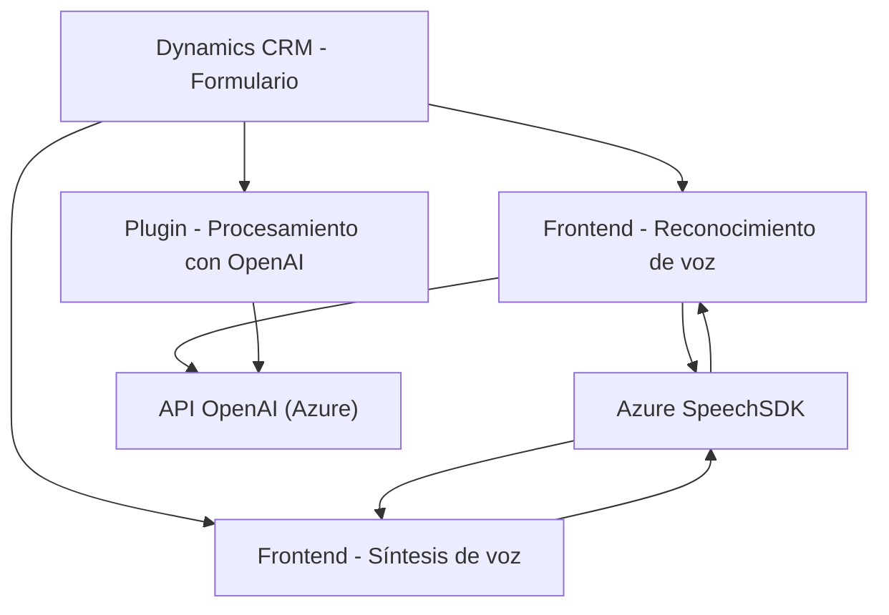

### Resumen técnico del análisis del repositorio

Este repositorio contiene múltiples componentes, todos centrados en la integración y extensión de funcionalidades dentro de **Microsoft Dynamics CRM**, aprovechando servicios externos de Microsoft Azure como **Speech SDK** y **Azure OpenAI API**. Los componentes principales proveen capacidades de síntesis y reconocimiento de voz, transformaciones de texto basadas en inteligencia artificial, y manipulación directa de datos dentro de formularios CRM. Esto indica que el repositorio está compuesto por módulos relacionados con una arquitectura orientada a servicios integrados en un ecosistema CRM.

---

### Descripción de arquitectura

La arquitectura del sistema está basada en la interacción entre un conjunto de **módulos frontend** para la manipulación de un formulario dinámico de CRM en el cliente, y un **backend basado en plugins** para extender la funcionalidad del Dynamics CRM mediante integración directa con API externas como **Azure OpenAI**. Los componentes son vinculados a servicios externos en una forma que sigue patrones de **Service-Oriented Architecture (SOA)**, lo que asegura una alta flexibilidad y escalabilidad al interactuar con servicios como Azure Speech y OpenAI. Además, el diseño de las funciones mantiene modularidad para facilitar su mantenimiento.

---

### Tecnologías, frameworks y patrones usados

#### Tecnologías:
1. **Frontend (JS):**
   - **Azure Speech SDK:** Funcionalidades de reconocimiento y síntesis de voz.
   - **Microsoft Dynamics CRM API:** Obtención y manipulación de datos dentro de formularios dinámicos.
   - **JavaScript:** Lenguaje base para todas las integraciones frontend.

2. **Backend (C#):**
   - **Microsoft Dynamics SDK:** Implementación de plugins en sistemas CRM.
   - **Azure OpenAI API:** Transformación de texto en JSON mediante generación de texto con modelos preentrenados (como GPT).
   - **.NET Framework:** Base para la ejecución y comunicación con servicios externos desde Dynamics CRM.

#### Patrones arquitectónicos:
1. **SOA (Service-Oriented Architecture):** Enfoque integrado en el uso de servicios externos.
2. **Plugin-based Architecture:** Extensión de funcionalidades de Dynamics CRM por medio de una arquitectura basada en plugins.
3. **Modularización:** Funciones atómicas, específicamente diseñadas para cumplir objetivos separados que simplifican el mantenimiento.
4. **Event-Driven Programming:** Uso de eventos en Dynamics CRM, como la invocación de funciones en el contexto del formulario.
5. **Integration with External APIs:** Comunicación con servicios externos (Speech SDK y OpenAI) mediante HTTP.

---

### Dependencias y componentes externos
1. **Azure Speech SDK:** Para funciones avanzadas de texto a voz y reconocimiento de voz.
2. **Azure OpenAI API:** Realiza procesamiento de texto basado en inteligencia artificial.
3. **Microsoft Dynamics CRM SDK:** Manejo de datos internos y reglas del sistema CRM.
4. **HTTP Client:** En los plugins C# para interactuar directamente con Azure OpenAI y agregar capacidades extendidas.
5. **System.Text.Json:** Procesamiento y estructuración de datos JSON.

---

### Diagrama Mermaid válido para GitHub Markdown

---

### Conclusión final

El repositorio es una solución tecnológica que extiende las capacidades estándar de **Microsoft Dynamics CRM** mediante la integración de servicios avanzados en la nube de Microsoft Azure, como **Speech SDK** y **OpenAI API**. La arquitectura combina módulos frontend con plugins backend en un modelo **Service-Oriented Architecture**, promoviendo modularidad y escalabilidad. Esta integración proporciona funcionalidades modernas como reconocimiento y síntesis de voz, así como procesamiento de texto mediante inteligencia artificial, adecuándose perfectamente a entornos empresariales que requieren automatización basada en IA.