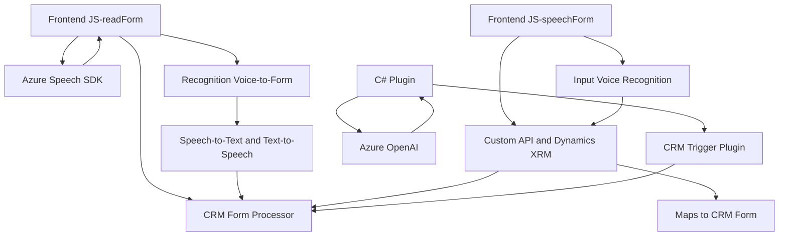

### Breve resumen técnico
El repositorio contiene tres archivos principales: dos archivos JavaScript (voiceInputHandler.js y speechForm.js) diseñados para la interacción con formularios a través de voz en aplicaciones frontales, y un archivo C# (TransformTextWithAzureAI.cs) representando un plugin para Dynamics CRM que realiza procesamientos con Azure OpenAI.

Estos componentes trabajan conjuntamente en el ámbito de una solución **CRM extendida** con funcionalidades de voz y procesamiento de lenguaje natural a través de APIs externas.

---

### Descripción de arquitectura
La solución combina una arquitectura **modular multicapas**:
1. **Frontend (Arquitectura Cliente):**
   - Implementa funciones para interacción con formularios mediante entrada de voz (speech-to-text) y síntesis de voz (text-to-speech).
   - Utiliza la integración con Azure Speech SDK para reconocimiento y generación de voz.
   - Contempla varios flujos de trabajo diferenciados, como procesamiento con IA y sincronización dinámica del formulario.

2. **Backend (Plugin para Dynamics CRM):**
   - Implementa un plugin como parte de Dynamics CRM basado en el patrón de diseño **plugin-driven architecture**.
   - Consume los servicios externos de **Azure OpenAI** para transformar y procesar textos.

### Tecnologías usadas
1. **Azure Speech SDK**: Para reconocimiento y síntesis de voz.
2. **Azure OpenAI**: Para transformar texto basado en reglas.
3. **Microsoft Dynamics SDK**: APIs estándar para operaciones con formularios y contexto de CRM.
4. **Frameworks/librerías en C# y JS:**
   - `Newtonsoft.Json`, `System.Text.Json`: Serialización de JSON.
   - `Xrm.WebApi`: Integración con Dynamics.
   - `HttpClient` para comunicaciones HTTP externas.

### Patrones y principios aplicados
1. **Modularidad y separación de responsabilidades:** Las funcionalidades están divididas en módulos enfocados en tareas específicas, como entrada de voz, síntesis, API personalizada, y transformación de texto.
2. **Servicio externo (interacción API):** Integración sólida con servicios en la nube (Azure Speech SDK y OpenAI).
3. **DTO (Data Transfer Object):** Creación de objetos JSON para transporte de datos.
4. **Plugin Architecture:** El archivo en C# sigue el patrón `IPlugin`, propio de Dynamics CRM.

---

### Dependencias o componentes externos presentes
1. **Speech SDK de Azure:** Necesario para las funcionalidades de entrada y salida de voz.
2. **Azure OpenAI services:** Empleado para inteligencia artificial en el plugin.
3. **Microsoft Dynamics 365 SDK:** Fundamental para el contexto de ejecución y operaciones del plugin.
4. **Backend REST/APIs propias:** Es probable que exista un backend adicional para comunicación definida por la función `callCustomApi`.

---

### Diagrama Mermaid compatible con GitHub Markdown

---

### Conclusión final
La solución descrita forma parte de un ecosistema para **interacciones avanzadas de usuario** en entornos **CRM extendidos**, utilizando **inteligencia artificial** y capacidades de voz como entrada y salida. Se basa en una arquitectura modular que combina **frontend interactivo**, **integración con APIs externas** y un **plugin backend** para extender funcionalidades del sistema CRM.

Si bien cumple con los principios como modularidad, integración y reutilización, se recomienda fortalecer el manejo de excepciones en las llamadas externas (por ejemplo, hacia Azure OpenAI y Speech SDK) y almacenar las claves API en un sistema seguro como **Azure Key Vault**.