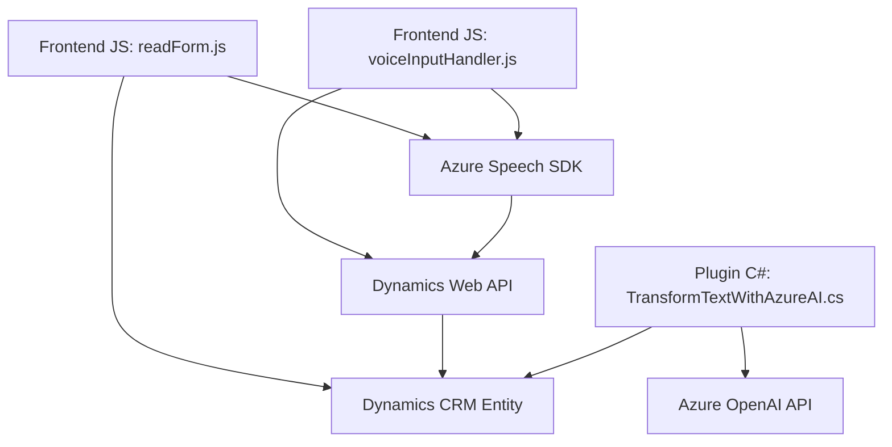

### Análisis y explicación detallada

#### Breve resumen técnico
El repositorio presenta una solución integrada con Dynamics 365 que utiliza tecnologías avanzadas para la gestión de formularios dinámicos mediante Azure Speech SDK (texto a voz y reconocimiento de voz) y Azure OpenAI (transformación de texto utilizando GPT). Los principales archivos cubren funcionalidades específicas: lectura y síntesis de texto en voz (JavaScript), reconocimiento de voz (JavaScript) y procesamiento avanzado de texto con OpenAI (C# plugin). 

---

### Descripción de arquitectura
1. **Tipo de solución**:  
   - Es una solución híbrida que integra procesamiento de voz, entrada dinámica de usuarios y llamadas a servicios de inteligencia artificial como OpenAI GPT.  
   - Incluye:
     - **Frontend**: Para la gestión de datos en formularios dinámicos.
     - **Backend/plugin**: Para transformar datos con Azure AI en el contexto de Dynamics.
  
2. **Arquitectura**:  
   - Sigue un modelo **n-capas** parcialmente orientado a eventos:  
     - **Frontend**: Capas de interacción con el usuario automático (voz a texto/texto a voz).  
     - **Integración vía API**: Comunicación con Dynamics 365 y servicios externos como Azure OpenAI.  
     - **Backend**: Patrón estándar de plugins en Dynamics CRM.  

3. **Patrones utilizados**:  
   - **Modularidad**: Las funcionalidades se dividen en clases y métodos autónomos altamente reutilizables.  
   - **SDK-centric**: Dependencia directa de Azure Speech SDK y Dynamics Web API.  
   - **Event-driven** y **Callback pattern**: Flujo de procesos para cargar SDKs y manejar eventos asíncronos.  
   - **Separación de responsabilidades**: Métodos especializados por contexto funcional.  

4. **Dependencias externas**:  
   - **Azure Speech SDK**: Para la conversión texto-voz y reconocimiento de voz.  
   - **Azure OpenAI GPT**: Para procesamiento avanzado en el plugin.  
   - **Microsoft.Xrm.Sdk** (en el backend): Interacción directa con Dynamics CRM.  
   - **Dynamics Web API**: Para actualizar campos y visualizar datos de formularios.  

---

### Tecnologías usadas
- **Frontend**:
  - **JavaScript**: Manejo de DOM y lógica para SDKs y formularios dinámicos.
  - **Azure Speech SDK**: Reconocimiento y síntesis de voz.
  
- **Backend**:
  - **C#**: Desarrollo del plugin para transformación de datos.
  - **Microsoft Dynamics SDK**: Para integración directa con CRM.
  - **Sistema de dependencias HTTP**: Llamadas a servicios basados en REST, como Azure OpenAI API.
  
- **APIs externas**:
  - Dynamics Web API (gestión de datos en CRM).
  - Azure Speech SDK (texto a voz y reconocimiento).

---

### Diagrama Mermaid válido para GitHub Markdown

---

### Conclusión final
La solución presentada está diseñada bajo principios de modularidad y escalabilidad, integrando múltiples tecnologías avanzadas (Azure Speech SDK, OpenAI GPT, Dynamics Web API) para automatizar la entrada y procesamiento de datos en un contexto empresarial. Su arquitectura n-capas y enfoque SDK-centric permiten una fluida interacción entre el frontend y el backend, optimizando procesos relacionados con formularios dinámicos y voz a texto.