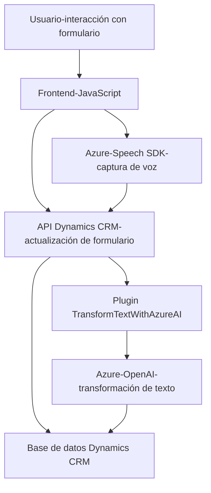

### Análisis técnico del repositorio

#### Breve resumen técnico
El repositorio contiene una implementación de un sistema interactivo basado en voz para formularios, además de una integración con el servicio de Azure OpenAI mediante un plugin de Dynamics CRM. La solución descrita combina reconocimiento de voz (Azure Speech SDK) con procesamiento de texto mediante modelos de IA (Azure OpenAI), con el objetivo de mejorar la accesibilidad y automatización en tareas de gestión de datos en formularios de Dynamics. Los archivos están altamente modulados y siguen patrones de diseño modernos.

---

#### Descripción de arquitectura
1. **Arquitectura identificada:**
   - **Frontend:** Sistema basado en JavaScript organizado en funciones y módulos para interacción en formularios y SDK evocado según eventos del usuario/entorno.
   - **Backend:** Arquitectura basada en microservicio asociado directamente con Dynamics CRM mediante un patrón de plugin (`TransformTextWithAzureAI`).
   - **Integración:** Uso de servicios externos como Azure Speech SDK y Azure OpenAI para reconocimiento de voz, síntesis de texto y transformación mediante IA.

2. **Estilo de patrón general:**
   - **N-capas:** La solución divide responsabilidades claramente entre el frontend, el servicios API (Dynamics y OpenAI) y la lógica plugin CRM.
   - **Hexagonal Architecture:** La conexión entre la lógica central, SDK y APIs externas señala un estilo hexagonal, adaptando servicios externos como dependencias encapsuladas.

---

#### Tecnologías usadas
**Frontend:**
   - HTML, CSS, JavaScript.
   - **Azure Speech SDK:** Para tareas de reconocimiento, síntesis y manejo de voz humana.
   - Dynamics Web API para lectura y escritura de datos en formularios de Dynamics.

**Backend (Microsoft CRM Plugin):**
   - Microsoft Dynamics SDK (para construir la lógica del plugin).
   - **Azure OpenAI:** Procesamiento de texto mediante modelos GPT.
   - `Newtonsoft.Json` y `System.Text.Json`: Manejo de datos JSON.
   - `System.Net.Http`: Solicitudes HTTP para consumir el API REST.

**Patrones observados:**
   - **Event-driven programming:** Callbacks para carga y configuración dinámica.
   - **Single Responsibility Principle:** Métodos separados según responsabilidades específicas.
   - **Modularización:** Código organizado en funciones autónomas.
   - **Integración de servicios:** Uso extendido de servicios externos con encapsulación.

---

#### Dependencias externas presentes
1. **Azure Speech SDK:**
   - Reconocimiento y síntesis de voz.
   - Se carga mediante un script remoto (`https://aka.ms/csspeech/jsbrowserpackageraw`).

2. **Dynamics Web API:**
   - Interacción con formularios del sistema CRM de Microsoft.

3. **Azure OpenAI:** 
   - Procesamiento de texto con GPT mediante llamadas a la API REST.

4. Bibliotecas estándar:  
   - `Newtonsoft.Json` y `System.Text.Json`.
   - `System.Net.Http` para integración remota.

---

#### Diagrama Mermaid

---

### Conclusión final

El repositorio analiza una solución avanzada de integración de voz y procesamiento de texto para mejorar experiencia de usuario y agregar inteligencia artificial en el contexto de formularios de Dynamics CRM. La arquitectura general es híbrida, empleando un frontend basado en JavaScript para gestionar la interacción usuario-aplicación y un plugin backend como microservicio en Dynamics. El uso de SDKs (Azure Speech y Azure OpenAI) destaca como una solución moderna basada en servicios en la nube. El diseño modular y orientado a eventos asegura una buena extensibilidad, escalabilidad y facilidad de mantenimiento.