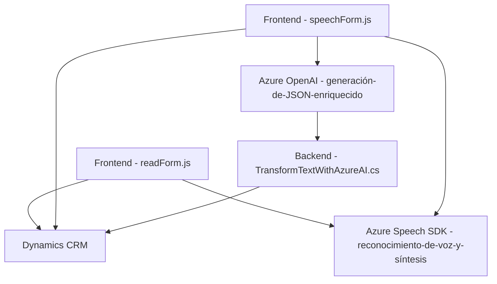

### Breve resumen técnico

El repositorio contiene componentes que integran entrada de voz y procesamiento de lenguaje natural (NLU) en una solución de CRM (Microsoft Dynamics). Los módulos frontend están desarrollados en JavaScript y orientados al manejo de interacción con formularios y entrada de voz mediante Azure Speech SDK. Por otro lado, un backend en C# implementa un plugin para transformar texto recibido mediante Azure OpenAI Service en formato JSON estructurado.

---

### Descripción de arquitectura

La arquitectura se describe como una combinación de enfoques:
- **Frontend modular**: Estructurado en funciones para manejar la entrada de voz, mapeo de datos con el formulario y eventualmente procesar texto mediante una IA.
- **Backend desacoplado con plugins**: Utiliza el patrón de Plugin para extender funcionalidades dentro de Dynamics CRM, delegando tareas complejas a servicios externos (Azure Speech y Azure OpenAI).
- **Dependencia en servicios cloud** (SaaS): Gran parte de la lógica depende de Azure Speech SDK y Azure OpenAI, integrados mediante APIs.

Por lo tanto, podríamos describirla como una arquitectura híbrida basada en *n capas con integración externa de servicios cloud*. La capa de presentación (frontend) interactúa directamente con Dynamics CRM y el usuario, mientras la capa de procesamiento en el backend opera sobre Azure para generar decisiones o transformar datos.

---

### Tecnologías usadas

#### Frontend:
1. **JavaScript**: Lenguaje de programación usado.
2. **Azure Speech SDK**: SDK que permite interactuar con APIs de reconocimiento de voz y síntesis.
3. **Dynamics CRM API**: Framework integrado desde el contexto del CRM.

#### Backend:
4. **C# (.NET Framework)**: Lenguaje para el desarrollo de plugins en Dynamics CRM.
5. **Azure OpenAI Service**: Utilizado para transformar texto en JSON estructurado.
6. **Newtonsoft.Json.Linq**: Librería popular para manipulación y manejo de objetos JSON en .NET.
7. **Microsoft Dynamics SDK**: Framework muy presente en aplicaciones corporativas para configurar extensiones en el CRM.

#### Patrones usados:
1. **Plugin Pattern (backend)**: Extiende la ejecución de Dynamics CRM en eventos predeterminados.
2. **Single Responsibility Principle**: Tanto el frontend como el backend dividen las tareas en funciones que se centran en tareas específicas.
3. **SOA (Service-Oriented Architecture)**: Dependencia explícita de los servicios de Azure (Speech SDK y OpenAI).

---

### Diagrama Mermaid válido para GitHub

---

### Conclusión final

La solución presentada es una integración avanzada centrada en combinar tecnologías de frontend y backend con servicios en la nube de Azure. El sistema enfatiza la automatización de tareas complejas, como la entrada de voz y la transformación de texto, con el objetivo de mejorar la accesibilidad y la eficiencia en plataformas como Dynamics CRM.

**Ventajas arquitectónicas:**  
- Modularidad: Aborda cada responsabilidad en componentes específicos (módulos frontend y backend).  
- Escalabilidad: La integración con servicios cloud permite que la solución se adapte fácilmente a mayores demandas de usuarios.  
- Basada en estándares: Uso del SDK de Azure y el patrón Plugin dentro de CRM facilita la extensibilidad del sistema.  

Sin embargo, la alta dependencia de servicios externos puede limitarse en entornos sin acceso robusto a internet, lo cual es un riesgo común en arquitecturas SaaS.