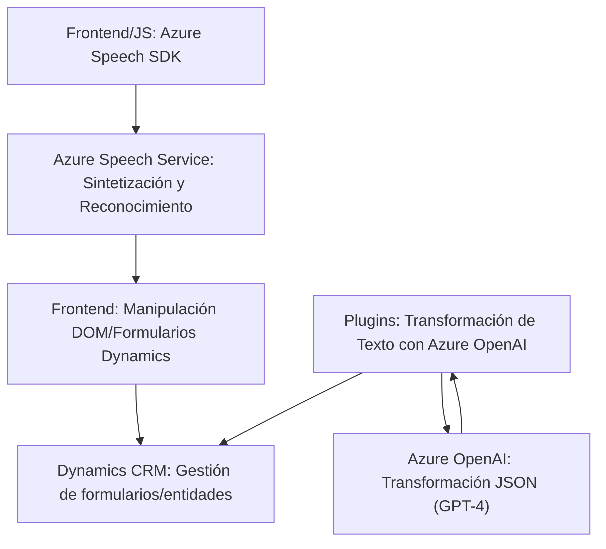

### Resumen técnico

El repositorio está compuesto por tres componentes principales:

1. **Frontend/JS**:
   - Archivos relacionados con la interacción por voz y lectura automática integrados con la capacidad del SDK de Azure Speech.
   - Se exploran conceptos de reconocimiento de voz, síntesis de voz y manipulación dinámica de formularios.

2. **Plugins**:
   - Contienen lógica backend que utiliza Azure OpenAI para realizar transformaciones en texto como parte de un plugin CRM de Dynamics.

### Descripción de arquitectura

La arquitectura es híbrida: combina un **Frontend con capacidades de reconocimiento y síntesis de voz** basado en **Azure Speech SDK**, además de un **plugin backend** que implementa lógica en el servidor para Dynamics CRM y utiliza **Azure OpenAI** para procesamiento de texto. El diseño muestra aspectos de arquitectura de **n capas** con dos enfoques:

- **Frontend**: Con interacción de voz, lectura de datos y uso del framework de Dynamics 365 para manipulación de formularios y datos.
- **Backend**: Repositorio basado en microservicios que ejecuta lógicas específicas y delega la responsabilidad de procesamiento complejo a servicios externos (Azure OpenAI).

### Tecnologías usadas

1. **Frontend**:
   - **Azure Speech SDK**:
     - Procesos de reconocimiento y síntesis de voz.
   - **Navegador + JavaScript puro**:
     - Manipulación del DOM y carga dinámica de servicios.
   - **Dynamics 365 API**: Operaciones de datos dentro de formularios de Dynamics CRM.

2. **Plugin (Backend)**:
   - Framework de plugins **Microsoft Dynamics 365 CRM**.
   - **Azure OpenAI**: Gestión de transformación textual optimizada con GPT-4.
   - Bibliotecas .NET como:
     - `Newtonsoft.Json` para JSON.
     - `System.Net.Http` para comunicación con servicios externos.
     - `Microsoft.Xrm.Sdk` para servicios CRM.

### Diagrama Mermaid (GitHub Markdown compatible)

### Conclusión final

La solución muestra una conexión entre dos capas funcionales: el frontend que interactúa con los usuarios para procesamiento vocal (reconocimiento y síntesis de voz), y el backend que realiza cálculos más complejos como transformaciones de texto vía **Azure OpenAI**. La arquitectura es modular y se apoya en servicios externos como Speech SDK y OpenAI, proporcionando escalabilidad y extensibilidad.

El diseño presenta buena separación de responsabilidades, optimizando cada capa para tareas específicas. Sin embargo, podría enriquecer la seguridad, especialmente la gestión de claves API de Azure OpenAI y Speech SDK en entornos dedicados. Es adecuada para escenarios donde el procesamiento vocal y gestión de datos CRM son necesarios en sistemas complejos.