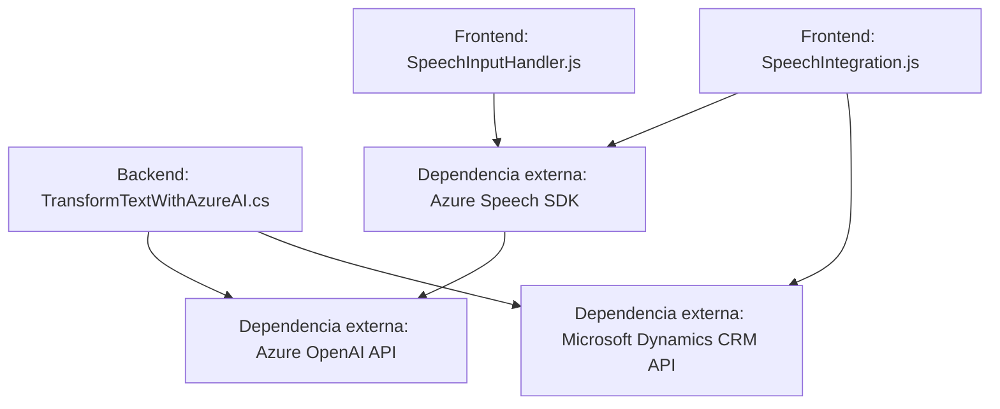

### Breve resumen técnico:

El repositorio contiene un sistema diseñado para interactuar con formularios web y procesar datos mediante reconocimiento de voz y procesamiento de lenguaje natural usando servicios de Azure, incluida su API de OpenAI GPT y Azure Speech SDK. Además, incorpora un plugin para Dynamics CRM que realiza transformación de texto en un formato JSON estructurado, integrándose en una arquitectura orientada a servicios.

---

### Descripción de la arquitectura:

La estructura general del sistema sugiere un enfoque híbrido que combina componentes de:

1. **Arquitectura de capa (n-capas):**
   - Implementada por la separación entre el Frontend (interacción con el usuario y formularios) y el Backend (conteniendo plugins y lógica de negocio).
   - Realiza una comunicación entre capas mediante API (Dynamics CRM y Azure APIs).

2. **Orientación a servicios externos:**
   - Utilizando Azure Speech SDK y Azure OpenAI para proporcionar capacidades avanzadas mediante endpoints externos.

3. **Modular y basada en eventos:**
   - La implementación de funciones y plugins que reaccionan a eventos (ejemplo: procesamiento de datos al completar una transcripción o evento de Dynamics CRM).

---

### Tecnologías, frameworks y patrones usados:

#### **Frontend:**
- **Lenguaje:** JavaScript.
- **Frameworks/SDK:**
  - Azure Speech SDK (`https://aka.ms/csspeech/jsbrowserpackageraw`) para procesado de voz en texto y síntesis de voz.
- **Patrones:**
  - Modularización: Funciones separadas según tareas específicas (`ensureSpeechSDKLoaded`, `getFieldMap`, etc.)
  - API-Driven Development: Uso de servicios web de Azure Speech para procesamiento de voz.
  - Adapter: Traducción de etiquetas visibles a claves internas del formulario (`getFieldMap`).

#### **Backend:**
- **Lenguaje:** C# (para el plugin `TransformTextWithAzureAI.cs`).
- **Frameworks/SDK:**
  - Microsoft Dynamics CRM API (`Microsoft.Xrm.Sdk`) para integración directa con datos y eventos.
  - Azure OpenAI API: Interacción con modelos GPT para procesamiento de texto avanzado.
  - NewtonSoft Json: Manipulación de JSON.
- **Patrones:**
  - Plugin-Based Architecture: Interfaz `IPlugin` con lógica de reacción a eventos.
  - Wrapper para servicios externos: Encapsulación de llamadas HTTP con `GetOpenAIResponse`.

---

### Dependencias o componentes externos presentes:

1. **Azure Speech SDK**:
   - URL: `https://aka.ms/csspeech/jsbrowserpackageraw`.
   - Dependencia para manejo de voz y síntesis.

2. **Azure OpenAI API**:
   - Endpoint específico para GPT-4: `"https://openai-netcore.openai.azure.com/"`.
   - API que procesa texto y genera JSON estructurado.

3. **Microsoft Dynamics CRM API**:
   - Usada en el plugin `TransformTextWithAzureAI.cs`.

4. **Librerías comunes en C#:**
   - `System.Net.Http` para llamadas REST.
   - `Newtonsoft.Json.Linq` para procesamiento JSON.

---

### Diagrama Mermaid válido para GitHub:

Diagrama basado en las interacciones de los componentes y flujo general de la solución.

---

### Conclusión final:

El sistema está diseñado para facilitar la interacción natural entre usuarios y formularios web mediante reconocimiento de voz y procesamiento de lenguaje natural, usando servicios avanzados de Azure. Por su estructura, integra componentes externos y sigue un enfoque modularizado con uso de plugins y procesos basados en eventos. La arquitectura híbrida cubre funcionalidades típicas de n-capas (por la separación frontend/backend) mientras se aprovecha una orientación a servicios por las dependencias de APIs externas. Este diseño sugiere una alta extensibilidad y escalabilidad, especialmente en entornos donde Dynamics CRM y Azure están integrados.