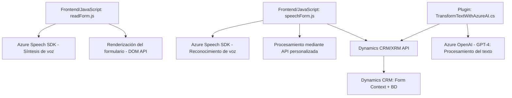

### **Breve resumen técnico**
El repositorio describe una solución que integra servicios cloud (Azure) con una plataforma de gestión empresarial (Microsoft Dynamics CRM). Su objetivo principal es implementar funcionalidades de interacción por voz y procesamiento de lenguaje natural (NLP), vinculando datos de formularios dinámicos con el reconocimiento de voz y respuestas generadas por inteligencia artificial (Azure OpenAI).

---

### **Descripción de arquitectura**
La solución sigue una **arquitectura n-capas**:
1. **Presentación (Frontend)**: Implementa funcionalidades basadas en JavaScript que interactúan con el DOM, servicios en la nube (Azure Speech SDK), y el formulario de Dynamics en el navegador del cliente.
2. **Lógica de Negocio (Backend)**: Proporciona capacidades de procesamiento con un plugin .NET que actúa dentro del contexto del CRM. Este módulo realiza transformaciones a través del servicio de inteligencia artificial Azure OpenAI.
3. **Servicios Externos**: Consumo de APIs en la nube, incluyendo Azure Speech SDK y Azure OpenAI para reconocimiento de voz, síntesis y procesamiento de textos.
4. **Persistencia y Contexto Empresarial**: Uso de Dynamics CRM como base de datos y contexto empresarial para formularios y atributos.

---

### **Tecnologías usadas**
#### **Frontend (JavaScript)**
- **Azure Speech SDK**: Implementa reconocimiento y síntesis de voz.
- **HTML/DOM API**: Para manipulación dinámica en el navegador.
- **Asynchronous programming (Promise/async-await)**: Para manejar dependencias externas.

#### **Backend (C# Plugin)**
- **Microsoft Dynamics SDK**: Utilización de clases y servicios para integrar funcionalidades dentro del entorno Dynamics CRM.
- **Azure OpenAI**: Utilización de un modelo de lenguaje (GPT-4) para transformación de texto. Se realiza a través de llamadas HTTP.
- **Newtonsoft.Json y System.Text.Json**: Para convertir entradas y salidas API de texto JSON a objetos manejables por el sistema.

---

### **Patrones de diseño**
1. **Modularidad**:
   - Cada archivo, función, y clase presenta una **única responsabilidad** relacionada con la síntesis, el reconocimiento o el procesamiento de datos.
2. **Gateway a servicios externos**:
   - Integración con Azure mediante el SDK (Frontend).
   - Consumo de la API de Azure OpenAI desde el plugin de Dynamics.
3. **Repositorio para manejo de formularios (Backend)**:
   - Se utiliza un patrón similar al Repository para analizar, buscar, y actualizar atributos de formularios basados en el contexto de Dynamics.
4. **Carga bajo demanda**:
   - El SDK de Azure Speech solo se carga en el navegador cuando es necesario.
5. **Aspectos de diseño basado en eventos (Event-driven)**:
   - Los métodos principales reaccionan a eventos de ejecución en Dynamics CRM, conectando el plugin con procesos específicos del ciclo de vida de las operaciones CRM.

---

### **Diagrama Mermaid**

---

### **Conclusión final**
La solución incluye un conjunto de archivos bien separados por funcionalidad, orientados al uso de servicios de Microsoft Azure y Dynamics CRM para implementación de capacidades avanzadas de voz y procesamiento de texto. Adopta una arquitectura **n-capas**, donde el frontend captura y presenta los datos del usuario en el navegador, mientras que el backend (en forma de un plugin) realiza las transformaciones más complejas delegando la lógica al servicio en la nube Azure OpenAI. El diseño demuestra buenas prácticas como modularización, programación asíncrona y carga dinámica de dependencias. Sin embargo, puede ser optimizado en cuanto a seguridad y gestión de excepciones.