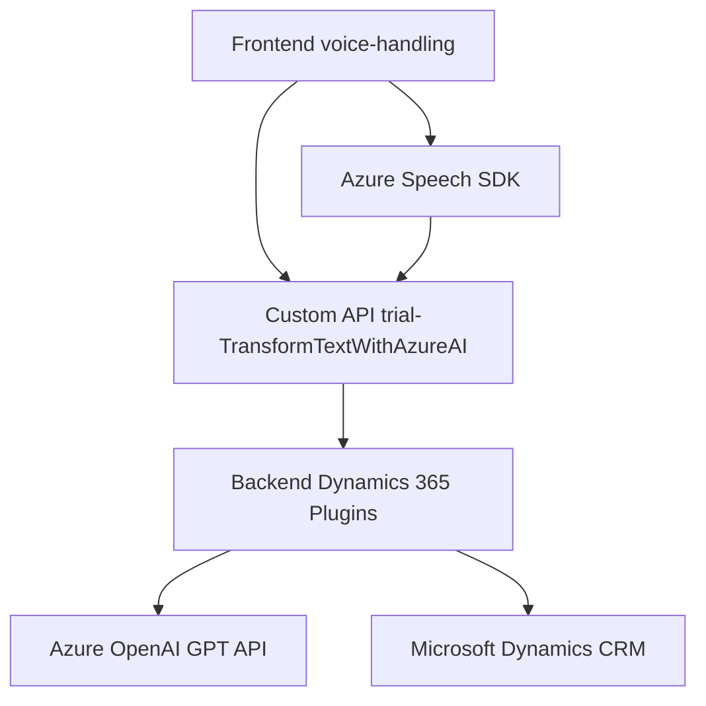

### Breve resumen técnico
El repositorio analiza una solución implementada para la creación de un sistema de entrada y salida de voz en un contexto de formularios dinámicos, como Microsoft Dynamics CRM. Este sistema utiliza el **Azure Speech SDK** y está diseñado para sintetizar voz, convertir texto en datos utilizables y transformar texto mediante Azure OpenAI.

---

### Descripción de arquitectura
La arquitectura es principalmente modular y orientada a servicios. Presenta tres bloques principales:
1. **Frontend (JavaScript):** Arquitectura basada en eventos, diseñada para gestionar el reconocimiento de voz, datos del formulario e integración con Azure Speech SDK y APIs personalizadas.
2. **Backend (Plugins en C#):** Desarrollado como `Plugins` de Dynamics CRM, con un enfoque Plugin Pattern y con integración indirecta a una arquitectura de microservicios (Azure OpenAI).
3. **Servicios Externos (Azure):** Tanto el SDK para síntesis/reconocimiento de voz como la API OpenAI para transformación de texto indican un ecosistema basado en el modelo de servicios en la nube.

La solución tiene **n-capas**, donde cada capa tiene roles específicos:
- Capa de presentación: Voz y datos visibles.
- Capa de negocio: Transformación con lógica específica.
- Capa de integración: Comunicación con APIs externas y Azure OpenAI.

---

### Tecnologías usadas
1. **Frontend:**
   - **Azure Speech SDK:** Para activar síntesis y reconocimiento de voz.
   - **JavaScript:** Código modular para eventos, extracción y manipulación de datos.

2. **Backend:**
   - **Microsoft Dynamics CRM SDK:** Integración nativa como plugin.
   - **.NET Framework (C#):** Desarrollo de lógica basada en eventos.
   - **System.Net.Http:** Consumo de REST APIs.
   - **Azure OpenAI API:** Conversión inteligente de texto en JSON.

3. **Patrones:**
   - **Plugin Pattern** en el backend.
   - **Event-Driven** y **Command Pattern** en el frontend.
   - **Service-Oriented Architecture** para la integración de servicios externos.

---

### Diagrama Mermaid válido para GitHub:

---

### Conclusión final
El repositorio implementa una solución de reconocimiento y síntesis de voz, transformando datos dinámicos de formularios en un flujo compatible con lógica avanzada basada en inteligencia artificial. La utilización de herramientas como Azure Speech SDK, APIs personalizadas y plugins orientados a CRM refuerza su enfoque moderno y modular. Aunque los componentes del backend están dentro de Dynamics CRM, la integración con Azure OpenAI demuestra una aproximación hacia microservicios nativos en la nube. La arquitectura es robusta y versátil, adaptable a entornos empresariales tecnológicos.