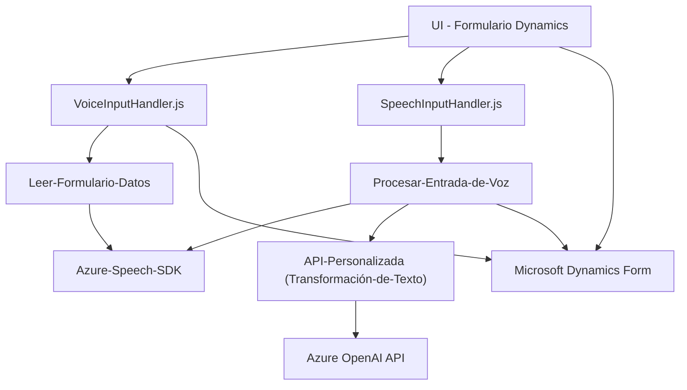

### Breve Resumen Técnico

El repositorio parece implementar una solución que integra funcionalidades de síntesis y reconocimiento de voz con formularios en una aplicación de cliente de Microsoft Dynamics CRM. Además, expone un plugin que utiliza el servicio de OpenAI de Azure para transformar texto según reglas específicas y devolver datos estructurados en formato JSON.

---

### Descripción de la Arquitectura

La solución presentada se puede considerar una arquitectura **n-capas** combinada con integración de servicios externos. Por un lado, tiene una capa de presentación que interactúa con los formularios de Dynamics CRM (proporcionando inputs de voz y descripción de campos visibles), así como una capa de lógica en forma de un plugin que actúa en el backend del CRM. 

El uso de servicios externos, como el **Azure Speech SDK** y **Azure OpenAI**, sugiere un enfoque hacia una arquitectura híbrida, donde la solución está diseñada para aprovechar capacidades de IA y procesamiento remoto. Es una solución parcialmente acoplada, donde el frontend se comunica con servicios y componentes backend dentro y fuera del sistema CRM.

Además, los aspectos como carga dinámica de SDKs, abstracción directa de datos del modelo de entidades y contexto muestran una separación clara de responsabilidades, con cierto uso de principios asociados a la arquitectura **hexagonal** (aunque no totalmente). También se observa el uso de patrones como repositorio para gestionar datos y event-driven programming para captar y responder a la entrada de voz en tiempo real.

---

### Tecnologías Usadas

1. **Frontend:**
   - **Azure Speech SDK (vía `window.SpeechSDK`)**: Para reconocimiento y síntesis de voz.
   - **JavaScript/ES6** para la lógica de presentación en los formularios en Dynamics CRM.

2. **Backend (Plugins):**
   - **Microsoft Dynamics SDK (`IPlugin`)**
   - **Azure OpenAI API**: Para procesamiento avanzado de texto y generación de JSON estructurado.
   - **NewtonSoft.Json**: Para parseo y manipulación de JSON en conexiones con la API.
   - **HttpClient** para enviar solicitudes a servicios API externos.

3. **Patrones usados:**
   - **N-capas:** División clara entre presentación (formularios), lógica de negocio (en el plugin) y servicios integrados (Azure Speech/OpenAI).
   - **Delegation Pattern:** Uso de *callbacks* para cargar y gestionar el SDK dinámicamente.
   - **Repository Pattern:** Métodos dedicados que abstraen el acceso al contexto de datos de los formularios y entidades de CRM.
   - **Event-driven Architecture:** Procesamiento basado en eventos como grabación y síntesis de voz.
   - **Facade Pattern:** Plugins que unifican la integración con Azure APIs y Dynamics SDK.

---

### Diagrama Mermaid

---

### Conclusión Final

La solución presentada está orientada a providing functionalities of voice-to-text processing and text-to-voice synthesis tightly integrated into Microsoft Dynamics CRM forms and backed by Azure Cognitive Services. The overall architecture is hybrid, combining behaviors from n-layer design and microservices-based integration with external APIs such as Azure Speech SDK and OpenAI. The use of plugins for backend operations provides a clean and modular approach for extending CRM functionality and enabling more AI-driven features.