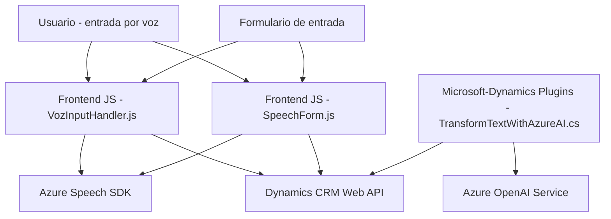

### Resumen Técnico

La solución consiste en varios componentes que interactúan entre sí para procesar formularios, convertir texto en voz (frontend) y conectar con APIs de inteligencia artificial (backend) utilizando servicios de Azure. Tiene capacidades de entrada por voz, síntesis de texto a voz, y tratamiento de datos con inteligencia artificial.

---

### Descripción de Arquitectura

La arquitectura combina componentes de **frontend** y **backend**, con interacción hacia servicios externos como Azure Speech SDK y Azure OpenAI. El **frontend** utiliza JavaScript, ejecuta la lógica en formularios interactivos, y sintetiza voz. El **backend** implementa un **plugin de Dynamics CRM** (escrito en C#) que se comunica con Azure OpenAI para transformar texto estructurado.

Esta solución tiene características de una arquitectura **n-capas**:
1. **Capa de presentación (frontend):**
   - Procesa formularios mediante entradas de voz.
   - Utiliza el SDK para sintetizar y transcribir voz.
2. **Capa de lógica de negocio (plugins):**
   - Utiliza patrones SOA (Service-Oriented Architecture) para interactuar con servicios de Azure.
3. **Capa de integración (servicios externos):**
   - Se conecta al SDK de Azure Speech y Azure OpenAI para tareas de IA.

Aunque se observa modularidad en la lógica, no parece implementar una arquitectura puramente hexagonal ni microservicios.

---

### Tecnologías Usadas

1. **Frontend (JavaScript):**
   - **Azure Speech SDK**: Entrada y salida de voz (carga dinámica, síntesis y reconocimiento).
   - **Dynamics 365 Web API**: Mapeo de atributos de formularios para aplicar como valores.

2. **Backend (C#):**
   - **Microsoft Dynamics CRM SDK**: Ejecuta lógica mediante plugins (como `TransformTextWithAzureAI`) dentro del contexto CRM.
   - **Azure OpenAI Service (GPT-4)**: Transformación de texto en JSON estructurado.
   - **System.Net.Http & Newtonsoft.Json.Linq**: Lógica de comunicación con APIs externas y manipulación de JSON.

---

### Dependencias o Componentes Externos Potenciales

- **Azure Speech SDK**: Integrado en el frontend, cargado dinámicamente.
- **Azure OpenAI Service**: Usado por plugins del backend para procesamiento de IA.
- **Dynamics CRM Web API**: Facilitador para la interacción entre formularios y plugins.
- **Newtonsoft.Json y System.Text.Json**: Para parseo y manipulación de JSON en backend.

Además, un riesgo de la solución es la dependencia de claves estáticas para las APIs de Azure, algo que puede mejorarse con servicios como **Azure Key Vault**.

---

### Diagrama **Mermaid**

---

### Conclusión Final

Esta solución aborda de forma efectiva la interacción entre el usuario, formularios, entrada y salida por voz, y transformación de datos con inteligencia artificial. Su principal fuerza radica en la integración con los servicios de Azure, mostrando capacidades tanto en el frontend como en el backend. Sin embargo, su arquitectura queda limitada a una estructura **n-capas** y no implementa microservicios ni hexagonal architecture. Se sugiere reforzar la seguridad en el manejo de claves API y garantizar que las dependencias externas sean resilientes frente a fallos.