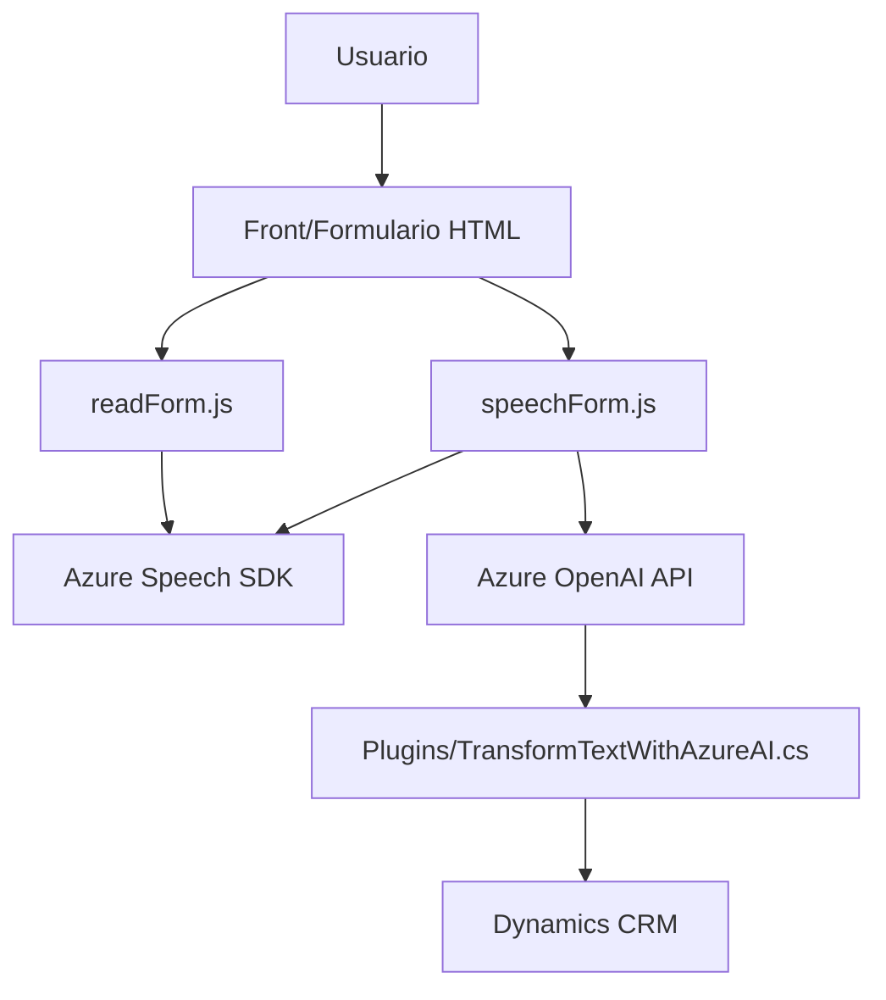

### Breve resumen técnico
La solución presentada parece ser una aplicación con componentes frontend y backend relacionada con la voz y su integración con servicios de Azure. Incluye módulos que:
1. Capturan entrada de voz, procesan texto hablado y lo aplican en formularios (frontend).
2. Transforman texto estructurado en JSON mediante IA de Azure OpenAI (backend plugin).

---

### Descripción de arquitectura
1. **Tipo de solución:** 
   - Principalmente una aplicación de integración para Microsoft Dynamics CRM. Incluye módulos frontend (manipulación de formularios y voz) y un plugin backend para transformaciones de datos mediante IA.
   - Podría clasificarse como una aplicación híbrida donde el frontend ofrece un control interactivo para usuarios y el backend actúa como funcionalidad extensible.

2. **Arquitectura identificada:** 
   - **Frontend:** Modular, con funciones que implementan pipeline de datos desde formularios hacia SDK externos (Azure Speech).
   - **Backend Plugin:** Monolítico en estructura, encapsulado para funcionar como un servicio dentro de Dynamics CRM.
   - En conjunto, la solución tiende hacia una arquitectura de **n-capas**, con separación de lógica de presentación (frontend) y lógica de negocio (backend).

---

### Tecnologías usadas
1. **Frontend:** 
   - **JavaScript:** Para manejo de DOM y lógica de obtención/aplicación de datos.
   - **Azure Speech SDK:** Para reconocimiento de voz, texto a voz, y síntesis.
   - **Xrm.WebApi:** Acceso a APIs de Dynamics CRM.
   - **HTTP API personalizada:** Para transformar texto mediante Azure IA.

2. **Backend Plugin:**
   - **C#:** Lenguaje del plugin, estructurado bajo el estándar de Dynamics CRM.
   - **Azure OpenAI:** Para el procesamiento avanzado de texto, generando JSON estructurado.
   - **Microsoft Dynamics API:** Manejo de contexto y servicios de CRM (dependencias como `Microsoft.Xrm.Sdk`).

3. **Patrones principales:**
   - **Modularización:** Código dividido en piezas funcionales. Cada método tiene un propósito único.
   - **SRP (Single Responsibility Principle):** Las funciones y métodos son responsables de tareas específicas.
   - **Facade Pattern:** En el frontend, funciones como `startVoiceInput` o `ejecutarGrabacion` se comportan como puntos centrales que encapsulan complejidad.

---

### Diagrama Mermaid válido para GitHub Markdown

---

### Conclusión final
Esta solución implementa un flujo de trabajo completo para interacción entre el usuario y los servicios de Azure, utilizando métodos modernos de integración y modularización. Su arquitectura es una combinación de capas entre frontend y backend sobre Dynamics CRM. 

#### Pros:
- Modular y con separación clara de responsabilidades, lo que facilita el mantenimiento.
- Uso de tecnologías avanzadas como Azure Speech SDK y OpenAI para manejo de voz y texto.

#### Contras:
- Falta de seguridad en el manejo del API Key de Azure OpenAI.
- Implementación directa de SDK y endpoints sin middleware o abstracción para desacoplar dependencias externas.

Para futuras mejoras, recomendaría introducir un sistema centralizado y seguro de gestión de configuración para claves y endpoints externos, junto con arquitectura más flexible (como capas adicionales que desacoplen servicios de terceros, p.ej., una fachada interna para Azure Speech SDK).