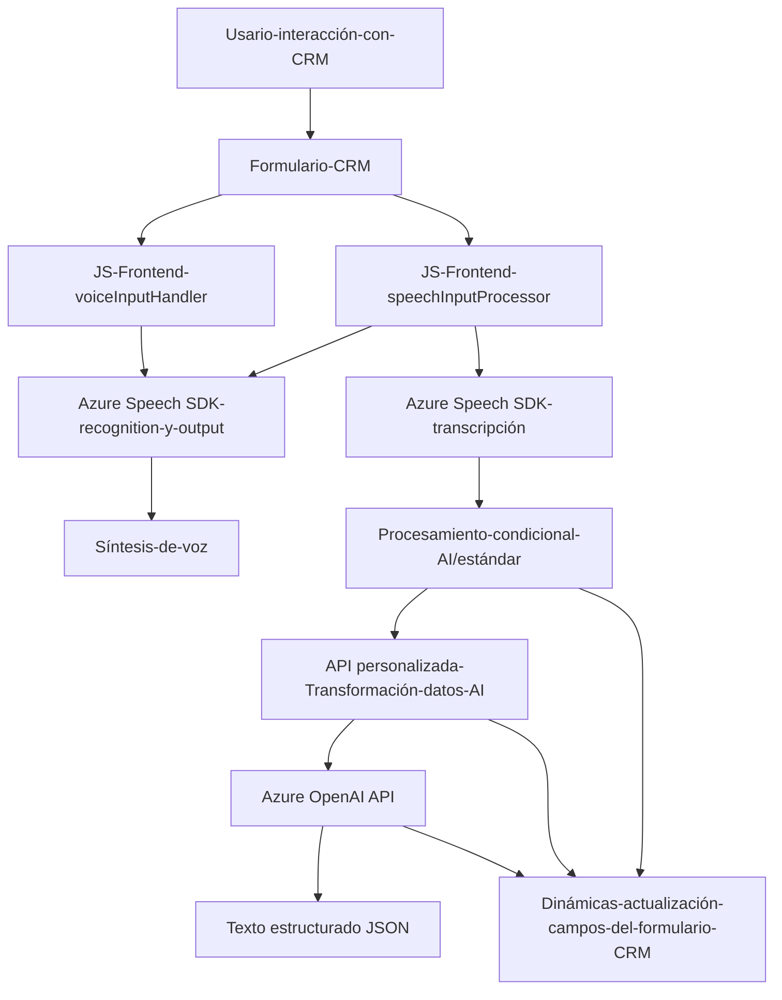

### Análisis técnico

#### 1. Breve resumen técnico:
Este repositorio implementa una solución híbrida que incluye componentes de frontend (JS en Dynamics CRM) y un plugin de backend (C#). Su propósito principal se centra en **procesar datos de formularios mediante entrada/salida de voz** y realizar transformaciones empleando **Azure Speech SDK** y **Azure OpenAI API**. La funcionalidad se integra directamente con **Microsoft Dynamics CRM**, lo que sugiere que la solución está orientada a simplificar tareas en sistemas CRM mediante operaciones de reconocimiento de voz, síntesis de audio y transformación de texto.

---

#### 2. Descripción de arquitectura:
La solución utiliza una arquitectura **n-capas híbrida**:
- **Capa de presentación (Frontend)**: Archivos JavaScript en la carpeta `FRONTEND` que manejan las interacciones con el usuario, capturan y procesan datos mediante el Azure Speech SDK, y actualizan dinámicamente los campos de formularios en Dynamics CRM.
- **Capa de negocio (Plugins)**: El archivo `TransformTextWithAzureAI.cs` implementa lógica específica que convierte entradas de texto en datos estructurados utilizando la API de Azure OpenAI.
- **Capa de acceso a datos**: Mediante el uso de `IOrganizationService`, interactúa de manera directa con los modelos de datos de `Microsoft Dynamics CRM`.

La arquitectura también se alinea con los principios de **servicios desacoplados**, utilizando SDKs y APIs dinámicas como componentes secundarios.

---

#### 3. Tecnologías usadas:
1. **Frontend (JS)**:
   - **Azure Speech SDK**: Para reconocimiento y síntesis de voz.
   - **JavaScript**: Para manipulación del DOM y ejecución dentro del contexto del formulario CRM.
   - **Xrm.WebApi**: Para interactuar directamente con datos del formulario CRM y API personalizadas.

2. **Backend (C#)**:
   - **Microsoft Dynamics CRM SDK (`IPlugin`)**: Para la ejecución de lógica personalizada como parte de eventos del sistema CRM.
   - **Azure OpenAI API**: Para transformar texto utilizando un modelo AI avanzado como ChatGPT.
   - **Newtonsoft.Json** y `System.Text.Json`: Para manejo de datos JSON (serialización/deserialización).
   - **System.Net.Http`: Para enviar solicitudes HTTP al servicio de Azure OpenAI.

---

#### 4. Dependencias y componentes externos:
1. **Azure Speech SDK** (`https://aka.ms/csspeech/jsbrowserpackageraw`): Usado dinámicamente en el frontend para reconocimiento y síntesis de voz.
2. **Azure OpenAI API**: Usada en el backend para transformación avanzada de texto.
3. **Microsoft Dynamics CRM SDK**: Integración nativa con las APIs y eventos de Dynamics CRM.
4. **SDK Internos de Dynamics CRM**:
   - `IOrganizationService`: Interactuar con registros CRM.
   - `Xrm.WebApi`: Visibilidad y operaciones del formulario CRM.

---

#### 5. Diagrama Mermaid 100% compatible con GitHub Markdown:

---

### Conclusión final:
La solución está diseñada para integrarse perfectamente con **Microsoft Dynamics CRM** mediante una arquitectura **n-capas híbrida**, utilizando potentes herramientas de procesamiento de voz y AI de Microsoft Azure. Aunque es altamente funcional, existen mejoras posibles, como la externalización de claves API para mayor seguridad y modularización del código para facilitar el mantenimiento.

El diagrama illustrates cómo la solución conecta al usuario con tecnologías avanzadas como Azure Speech SDK y OpenAI, mientras interactúa dinámicamente con los formularios del CRM en tiempo real, optimizando su operatividad.