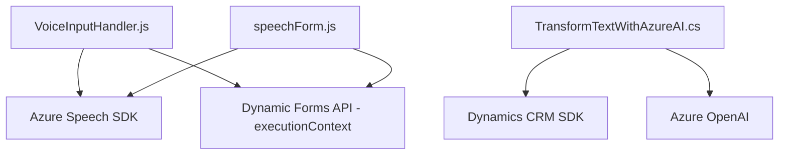

### Breve resumen técnico

El repositorio analiza y contiene diversos archivos que implementan diferentes funcionalidades. Los principales objetivos de los archivos están enfocados en la integración de servicios y tecnologías externas, como Microsoft Azure Speech SDK y Azure OpenAI, para la recogida y síntesis de voz, el reconocimiento de texto, la transformación de datos y el procesamiento de formularios dentro de una aplicación de CRM Dynamics.

---

### Descripción de arquitectura

- **Tipo de solución**:
    - Principalmente se trata de un **integrador de servicios en una aplicación CRM**, con énfasis en la interacción del usuario mediante voz y en la transformación dinámica de datos con servicios en la nube como Azure Speech SDK y Azure OpenAI.
    - Incluye tanto funcionalidad para la interfaz **frontend** orientada al usuario (integración de voz y reconocimiento), como **backend** para la extensión de funcionalidad del CRM mediante un plugin de Dynamics.

- **Arquitectura**:
    - Modular con principios de separación de responsabilidades. Las diferentes partes del código están segmentadas por áreas de aplicación: procesamiento de voz (frontend) y transformaciones de datos con servicios externos (backend plugin).
    - **Hexagonal Architecture**: La integración de servicios externos (Azure Speech SDK, Azure OpenAI, Dynamics SDK) y plugins que actúan como puertos para interactuar con el sistema core apuntan hacia una arquitectura hexagonal. 
    - **Event-driven Design**: Utiliza eventos y callbacks para activar procesos específicos basados en acciones de usuarios, como la inicialización o finalización de grabaciones de voz.
    - **Service-Oriented Model**: El sistema consume múltiples servicios externos de Azure, y está diseñado para interactuar principalmente con Microsoft Dynamics CRM mediante APIs y plugins.

---

### Tecnologías usadas

1. **Frontend**:
    - **JavaScript**: Desarrollo de scripts para integrar funcionalidad directamente en la interfaz del formulario.
    - **Azure Speech SDK**: Usado para la síntesis de voz y reconocimiento de comandos de voz.
    - **Dynamic Forms API (executionContext)**: Interactúa con un contexto específico de formularios dentro de Dynamics CRM.

2. **Backend plugin**:
    - **C#/.NET Framework**: Lenguaje utilizado en el desarrollo de los plugins CRM.
    - **Microsoft Dynamics CRM SDK (IPlugin, IOrganizationService)**: Herramienta principal para desarrollar extensiones funcionales asociadas a procesos dentro del CRM.
    - **Azure OpenAI API**: Utilizada para realizar transformaciones inteligentes de texto en estructuras predefinidas, aplicando reglas específicas.
    - **System.Net.Http y System.Text.Json**: Para realizar integraciones con REST APIs y recibir/parsear JSON.

3. **Patrones de diseño**:
    - **Modular Design**: Funciones divididas para realizar tareas específicas que son reutilizables y mantenibles.
    - **Plug-in Pattern**: Arquitectura específica de Microsoft Dynamics para integrar funcionalidades mediante eventos y extensiones.
    - **Callback + Service-Oriented Integration**: Uso de callbacks para garantizar la ejecución de servicios dependientes y comunicación externa con APIs de Azure.

---

### Diagrama Mermaid válido para GitHub

---

### Conclusión final

El repositorio implementa una solución orientada al reconocimiento de voz, síntesis de datos, procesamiento de comandos y transformación de información en una arquitectura modular que combina backend y frontend en Microsoft Dynamics CRM.

En la **interfaz frontend**, destacan las integraciones con Azure Speech SDK para capturar comandos de voz y generar audio, junto con la utilización de APIs contextuales (Dynamic Forms API) para interactuar con formularios dinámicos.

En el **backend**, el plugin desarrollado conecta el CRM con Azure OpenAI para transformar el texto utilizando reglas predefinidas, lo que permite ejecutar flujos inteligentes basados en los datos capturados.

Por tanto, el enfoque arquitectónico puede clasificarse como híbrido, con características de integración modular, interacción en capas, y patrones de diseño orientados a servicios y eventos. El uso extensivo de servicios externos como Azure aboga por un diseño altamente escalable y de fácil extensibilidad.