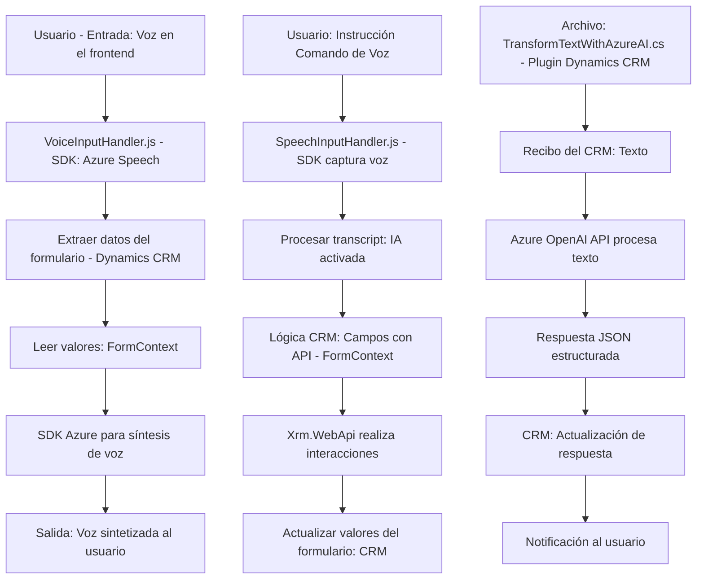

### Breve resumen técnico
El repositorio descrito contiene componentes bien diferenciados enfocados en interacción con formularios y servicios externos mediante reconocimiento de voz y procesamiento de texto. Está diseñado para integrarse con Microsoft Dynamics CRM y varios servicios de Azure. La solución comprende funcionalidad modular para capturar voz, sintetizar texto en voz usando Azure Speech SDK, interpretar comandos y transformar texto mediante Azure OpenAI.

---

### Descripción de arquitectura
La solución tiene las siguientes características:
1. **Tipo de solución**: 
   - Es una arquitectura híbrida entre un frontend de interacción (JavaScript) y un backend basado en plugins (.NET) para Dynamics CRM.
   - Se enfoca en mejorar accesibilidad y automatización en formularios usando voz y procesamiento IA.
2. **Arquitectura**:
   - **Frontend**: Modularidad basada en la funcionalidad de servicios (captura de audio, síntesis de voz, lógica de procesamiento con SDK).
   - **Backend** (.NET Plugin): Implementación de un microservicio interno que comunica el CRM con Azure OpenAI.
   - **Patrón n capas**: La interacción entre frontend, CRM, y servicios Azure sigue la idea de capas (presentación, negocio, acceso a datos).
   - Uso de patrones en plugins (`SRP`, servicio REST ajeno).
   - Integración de SDK y APIs: Azure Speech y Azure OpenAI actúan como microservicios externos.

---

### Tecnologías usadas
1. **Frontend (JavaScript)**:
   - Azure Speech SDK para síntesis y reconocimiento de voz.
   - Métodos nativos de Dynamics CRM (`formContext`, `Xrm.WebApi`).
   - APIs REST para comunicación externa.
2. **Backend (.NET Plugin)**:
   - NET Framework.
   - Microsoft.Xrm.Sdk para extender la funcionalidad del CRM.
   - Newtonsoft.Json para manipulación de datos estructurados (JSON).
   - System.Net.Http para comunicación REST con Azure OpenAI.
3. **Servicios externos (dependencias)**:
   - Azure Speech SDK (sintetización/reconocimiento de voz).
   - Azure OpenAI (procesamiento avanzado de texto con IA).

---

### Diagrama Mermaid

---

### Conclusión final
Este repositorio representa una solución híbrida que integra sistemas avanzados de reconocimiento y síntesis de voz, interacción vía comandos de voz y procesamiento de texto mediante inteligencia artificial. La arquitectura destaca por su modularidad y capacidad de integración directa con APIs externas como Azure Speech y OpenAI, y con Dynamics CRM para la gestión de datos empresariales. Las funciones y patrones utilizados aseguran alta extensibilidad y facilidad de mantenimiento.