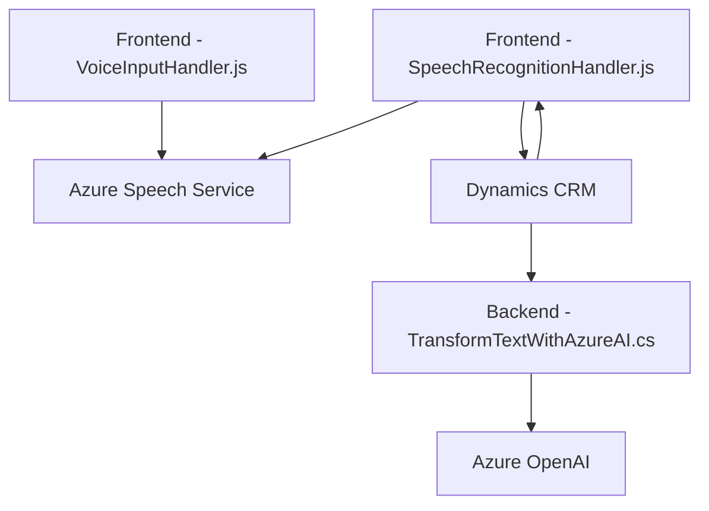

### Breve resumen técnico
El repositorio combina funcionalidad de frontend (JavaScript), lógica intermedia con plugins para Dynamics CRM (.NET), y servicios externos como Azure Speech SDK y Azure OpenAI API. Los componentes interactúan para ofrecer procesamiento avanzado de datos mediante entrada/salida de voz y transformación de texto en sistemas empresariales de Dynamics CRM.

---

### Descripción de arquitectura
La arquitectura implementada sigue un patrón de **arquitectura en capas**, con módulos bien definidos que separan las responsabilidades. La interacción entre componentes se realiza a través de una mezcla de llamadas API externas (Azure Speech Services y OpenAI) y extensibilidad interna mediante plugins para Dynamics 365 CRM. Es un **híbrido entre monolito extendido y basado en servicios**, ya que ciertas funciones dependen del SDK de Azure y plugins dinámicos.

Cada capa cumple un rol específico:
1. **Frontend (Cliente)**:
   - Interactúa con el usuario.
   - Implementa funcionalidades de reconocimiento y síntesis de voz.
2. **Backend (Plugins)**:
   - Aloja lógica y se comunica con APIs externas como Azure OpenAI.
   - Procesa datos para el CRM y actualiza los valores de forma dinámica.

---

### Tecnologías usadas
1. **Frontend**:
   - **JavaScript**: Usado para lógica de cliente en el navegador.
   - **Azure Speech SDK**: Para reconocimiento de voz y síntesis de texto.
   - **Dynamics CRM Web API**: Para integrar formularios y datos del sistema CRM.
2. **Backend**:
   - **.NET**: Plugins hechos en C# para Dynamics CRM (`IPlugin`).
   - **Azure OpenAI GPT-4**: Procesamiento de texto avanzado.
   - **System.Net.Http**: Para realizar llamadas REST.
   - **Microsoft.Xrm.Sdk**: Para interactuar con entidades del CRM.
   - **JSON Libraries**: `System.Text.Json` y `Newtonsoft.Json` para procesamiento de datos estructurados.
3. **APIs y Servicios Externos**:
   - Azure Cloud (Speech y OpenAI).

---

### Diagrama Mermaid válido para GitHub

---

### Conclusión final
Este repositorio implementa una solución para la interacción entre usuarios y formularios empresariales, enriquecida mediante el uso de servicios de voz y AI en la nube. La arquitectura, aunque modular y en capas, depende de APIs externas como Azure Speech SDK y OpenAI para funciones clave. Además, el uso de plugins en Dynamics CRM refuerza la extensibilidad del sistema central. Este diseño es apropiado para entornos empresariales, pero presenta críticas de seguridad en el manejo de claves y acceso a servicios cloud.