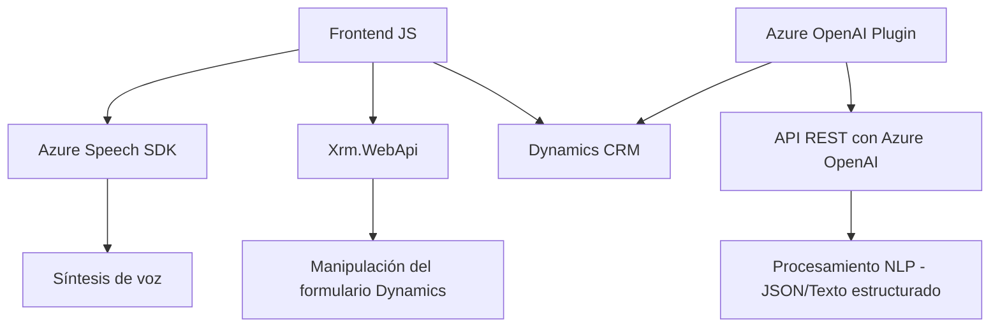

### Breve resumen técnico:
Este repositorio implementa funcionalidades relacionadas con procesamiento de voz y texto tanto en frontend como en backend, integrándose con servicios de Microsoft Azure y Dynamics CRM. A continuación, se analiza su estructura y se documentan sus características.

---

### Descripción de arquitectura:
1. **Tipo de solución**:  
   - Este repositorio contiene tanto elementos de **frontend** (archivos JavaScript para procesamiento de voz) como un **backend** (plugin de Dynamics CRM).  
   - La solución funciona como una aplicación híbrida, donde el **frontend** permite la interacción entre el usuario y Azure Speech SDK, mientras que el **backend** usa **Azure OpenAI** y Dynamics CRM plugins para realizar transformaciones avanzadas sobre los datos ingresados en los formularios CRM.
   
2. **Arquitectura**:
   - **Frontend**:
     - Puede clasificarse como una **capacidad modular de UI**, pero estructurada como **n capas**. Interactúa con interfaces de Dynamics CRM y usa el patrón delegado al cargar el SDK dinámicamente y procesar datos de los formularios.
   - **Backend**:
     - Plugin basado en el patrón **Plugin de Dynamics CRM**, integrando externalizaciones a servicios Azure y manejando eventos dentro del contexto de CRM. Es un diseño orientado a procesos, con una arquitectura ligera y de integración directa con servicios externos tipo REST API.

---

### Tecnologías usadas:
1. **Frontend**:
   - **JavaScript**:  
     Lenguaje principal para implementar la lógica de interacción del usuario.
   - **Microsoft Azure Speech SDK**:  
     Servicio externo para procesamiento, reconocimiento y síntesis de voz.  
   - **Xrm.WebApi**: Utilizado para interactuar con la API de Dynamics CRM y manipular datos en formularios.
   - **Microsoft Dynamics 365 CRM**: Plataforma dinámica para gestión de clientes, donde se realizan todas las operaciones frontend y backend.
   
2. **Backend**:
   - **C# y Dynamics CRM SDK**: Lenguaje y framework utilizados para desarrollar plugins personalizados que interactúan con los datos del CRM. 
   - **Azure OpenAI**: Servicio de inteligencia artificial usado para el procesamiento y transformación de lenguaje natural. Accedido mediante llamadas REST API.
   - **Newtonsoft.Json**: Librería para manejar datos JSON.
   - **System.Net.Http**: Librería estándar de C# para realizar solicitudes HTTP.

---

### Dependencias o componentes externos:
1. **Azure Speech SDK**:
   - Utilizado en el frontend para procesamiento de entrada/salida de voz.
   - Carga dinámica desde una URL (`https://aka.ms/csspeech/jsbrowserpackageraw`).
   
2. **Azure OpenAI Service**:
   - Servicios de procesamiento de lenguaje natural (NLP) usados en el backend.
   - Integración vía API REST para manipular texto según reglas específicas.
   
3. **Dynamics CRM SDK**:
   - Backend desarrollado como plugins que extienden la funcionalidad de Dynamics CRM y habilitan la integración de datos procesados.
   
4. **JavaScript ES6+**:
   - Incluye callbacks y delegaciones dinámicas para manejar datos visibles en formularios CRM.
   
5. **Xrm.WebApi**:
   - Operaciones específicas de CRUD mediante la API de Dynamics CRM en frontend.

---

### Diagrama Mermaid:

---

### Conclusión final:
Esta solución combina capacidades de frontend y backend con una integración fuerte hacia servicios de Microsoft Azure y Dynamics CRM, creando un entorno capaz de procesar entrada de voz, transformar datos y actualizar formularios en tiempo real. El uso de Azure como proveedor principal asegura escalabilidad, mientras que la arquitectura basada en plugins para Dynamics CRM estructura los procesos de backend en módulos reutilizables. El diseño sigue principios de modularidad y conveniencia para adaptarse a CRM corporativos.