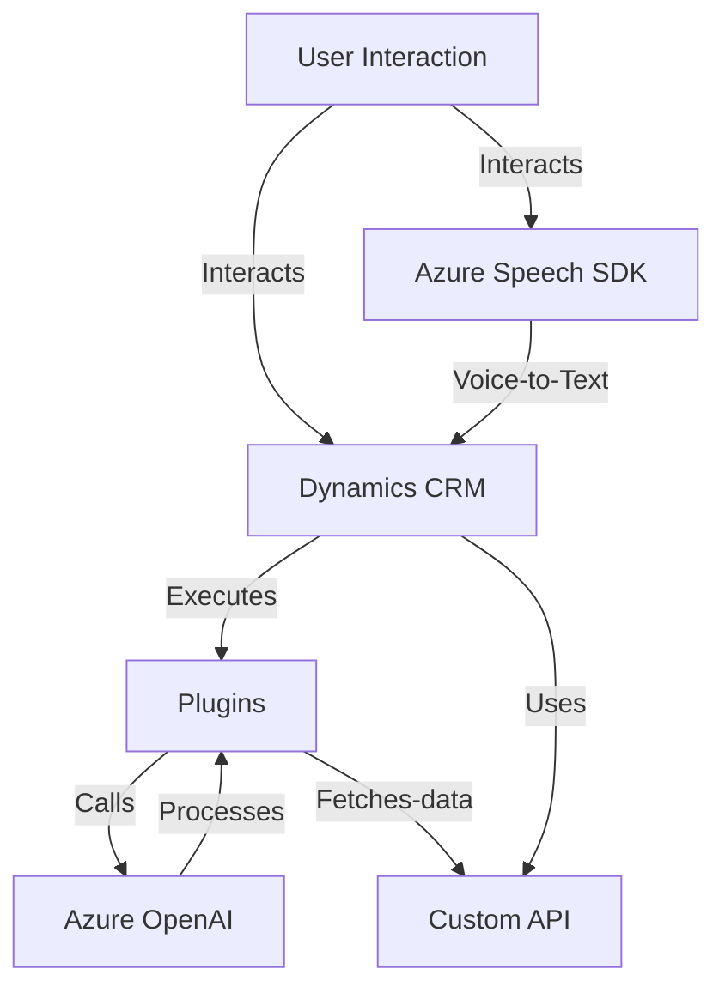

### Breve resumen técnico
El repositorio contiene múltiples archivos organizados principalmente en dos carpetas: `FRONTEND/JS` y `Plugins`. Estos archivos implementan funcionalidades relacionadas con procesamiento de voz y texto utilizando servicios en la nube de **Azure**, principalmente el **Azure Speech SDK** y **Azure OpenAI API**. Además, interactúan con formularios y registros de **Dynamics CRM**, destacando una arquitectura orientada a integraciones y extensibilidad.

---

### Descripción de arquitectura
La solución sigue una **arquitectura de múltiples capas** con una clara separación de responsabilidades:

1. **Frontend**:
   - Implementación JavaScript para manejo de voz (transcripción y síntesis) basada en el cliente.
   - Uso de SDK externos (Azure Speech SDK) y dependencias propias relacionadas con Dynamics CRM.
   - Modularidad del código, con funciones encapsuladas por contexto y propósito.

2. **Backend**:
   - Implementación de un plugin en .NET para integración con **Dynamics CRM**.
   - Comunicación con servicios externos (Azure OpenAI) para el procesamiento de texto.
   - Responsabilidades bien delimitadas: interacción con el contexto del CRM y transformación de datos mediante APIs externas.

La arquitectura general presenta:
- **Patrones de capas (n capas)**:
   - Separación entre frontend y backend.
   - El backend cumple funciones de negocio y procesamiento, mientras el frontend maneja la interfaz de usuario y la interacción directa con APIs.
- **Integración basada en APIs externas**:
   - Azure Speech y Azure OpenAI para capacidades avanzadas como reconocimiento de voz y procesamiento de texto.
- **Cliente/Servidor clásico**:
   - El frontend interactúa directamente con el backend del CRM mediante APIs.
- **Event-driven programming**:
   - Uso de callbacks y eventos para gestionar la carga del SDK y la ejecución de procesos en el frontend.

---

### Tecnologías utilizadas
- **Frontend**:
  - **JavaScript**: Lenguaje principal para manejar lógica en cliente, con código modular y funciones utilitarias.
  - **Azure Speech SDK**: Para síntesis y reconocimiento de voz.
  - **Dynamics CRM**: Para operar sobre formularios, registros y workflow, usando `executionContext`, `formContext` y métodos de la API `Xrm`.

- **Backend (Plugins)**:
  - **Microsoft Dynamics CRM SDK** (`Microsoft.Xrm.Sdk`): Para extender la funcionalidad de Dynamics CRM con plugins.
  - **Azure OpenAI API**: Para invocar servicios de IA que transforman texto y generan respuestas.
  - **Newtonsoft.Json**: Para serialización y deserialización de estructuras JSON.
  - **System.Net.Http**: Para realizar llamadas a APIs externas.
  - **Azure Key Vault (recomendado)**: Aunque no implementado actualmente, sería idóneo para gestionar claves de acceso a servicios de Azure.

---

### Diagrama Mermaid

---

### Conclusión final
La solución presenta una **n capas** con una robusta integración hacia sistemas externos como **Azure Speech SDK** y **Azure OpenAI**. Los elementos del sistema están acoplados a Dynamics CRM, lo que permite una extensión modular bien estructurada mediante el uso de plugins. Sin embargo, el diseño se podría mejorar implementando mejores prácticas como el uso de **Azure Key Vault** para gestionar credenciales y una arquitectura más orientada a **hexagonal** para reducir el acoplamiento al entorno CRM y aumentar la flexibilidad para futuros cambios en los proveedores de servicios. En general, la solución está adecuada para su propósito, con énfasis en accesibilidad y procesamiento de datos dinámicos en formularios.