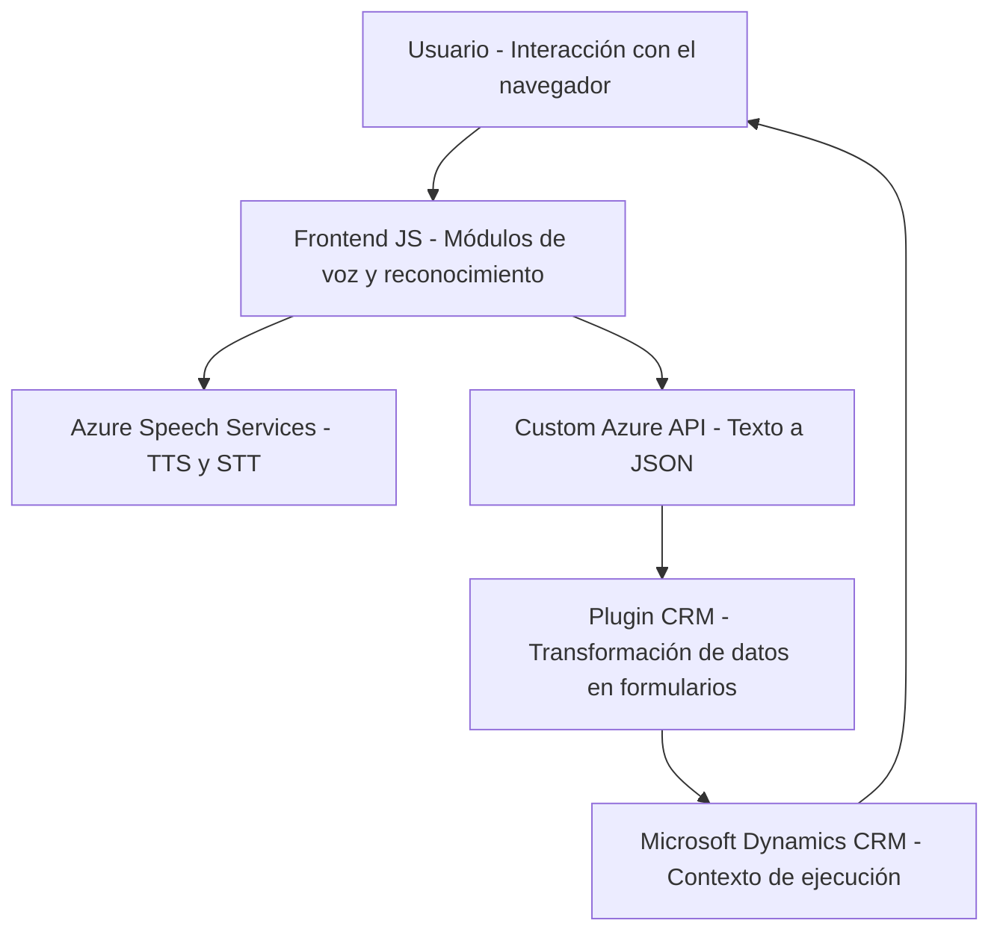

### Breve resumen técnico
El repositorio contiene tres componentes principales:
1. **Frontend/JS**: Implementa funcionalidades interactivas relacionadas con voz (lectura/síntesis de texto, reconocimiento de voz) utilizando el Azure Speech SDK en un contexto de formularios web (CRM Dynamics).
2. **Plugins/TransformTextWithAzureAI.cs**: Define un plugin que trabaja dentro del entorno de Microsoft Dynamics CRM, utilizando la API de Azure OpenAI para transformar texto en JSON estructurado.

La solución combina una interfaz de frontend dinámica con una integración de servicios externos (Azure Speech y Azure OpenAI API), junto con un backend basado en CRM Plugins.

---

### Descripción de arquitectura

Se utiliza una arquitectura **n-capas** donde los componentes están separados según responsabilidades:
1. **Capa de presentación**:
   - Archivos JavaScript que implementan la interacción con el usuario (lectura de textos y reconocimiento de voz).
   - Uso del navegador y servicios web externos, como el SDK de reconocimiento de voz y síntesis de texto de Azure.
   
2. **Capa de negocio/procesamiento**:
   - Plugins en C# que trabajan con el contexto del CRM para procesar datos y realizar transformaciones mediante APIs externas como Azure OpenAI.

3. **Dependencia de servicios externos**: Tanto el frontend como los plugins dependen de servicios de Azure (Speech SDK y OpenAI).

---

### Tecnologías usadas

1. **Frontend**:
   - **JavaScript**: Implementación de lógica de voz y manipulación DOM.
   - **Azure Speech SDK**: Para síntesis de voz y reconocimiento de comandos.
   - **Azure Custom API** (posiblemente para comandos personalizados).

2. **Backend**:
   - **C# en Plugins**:
     - **Microsoft Dynamics CRM SDK** (`Microsoft.Xrm.Sdk`) para extender lógica dentro de formularios CRM.
     - **Azure OpenAI API**: Procesamiento de texto avanzado.

3. **Frameworks y patrones**:
   - Modularización: Separación en funciones y métodos por responsabilidad.
   - Lazy Loading: Carga dinámica del Speech SDK solo cuando se necesita.
   - Event-driven: Flujo de eventos como el reconocimiento de voz.
   - Servicio externo REST: Comunicación con APIs (Azure Speech y Azure OpenAI).

---

### Diagrama Mermaid válido para GitHub

---

### Conclusión final
La solución combina múltiples capas para desarrollar una funcionalidad avanzada en un entorno empresarial de CRM:
1. La lógica interactiva de voz en el frontend, basada en el **Azure Speech SDK**, permite manipular datos en formularios dinámicos mediante comandos hablados.
2. El backend extiende la funcionalidad de Microsoft Dynamics CRM utilizando un plugin en C# con interacción directa hacia una API externa como **Azure OpenAI**.
3. La arquitectura está orientada a servicios n-capas, integrando dependencias externas para voz y procesamiento avanzado.

Esta es una solución robusta y extensible, ideal para mejorar experiencias de usuario en entornos de trabajo colaborativos y automatización textual.