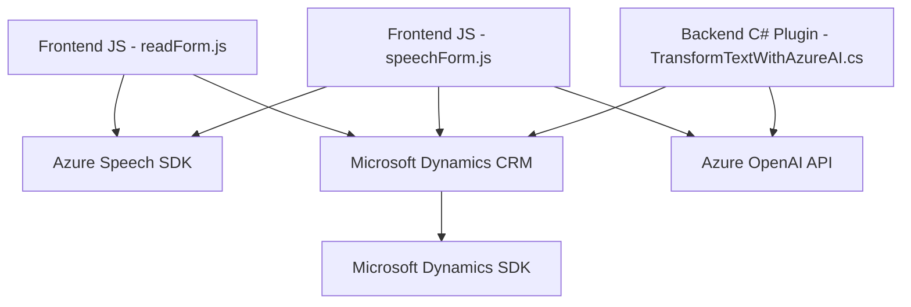

### Resumen técnico

El repositorio contiene una solución para la integración de servicios relacionados con la síntesis de voz, reconocimiento de voz y procesamiento de texto mediante APIs y SDKs, vinculados principalmente a Microsoft Azure y Dynamics 365. Los componentes principales incluyen:

1. **Frontend (JS):**
   - Manejo de formularios mediante síntesis de voz y reconocimiento de comandos hablados.
   - Interacción con servicios externos como Azure Speech SDK y Custom APIs.

2. **Backend (C# Plugin):**
   - Uso de **Azure OpenAI** para la transformación de texto como servicio extendido dentro de Dynamics 365.
   - Implementación de plugins (`IPlugin`) como extensiones para la plataforma Dynamics.

---

### Descripción de la arquitectura

1. **Tipo de solución:**
   - **Híbrido:** La solución tiene tanto componentes **frontend** como **backend**, y utiliza servicios externos como Azure Speech SDK y Azure OpenAI API. No se trata de una arquitectura de microservicios completa, sino más bien una integración modular de servicios.

2. **Arquitectura general:**
   - **Arquitectura n-capas**:
     - **Frontend:** Encapsula las funciones JS para interacción directa en el DOM/Formularios.
     - **Middleware en Dynamics:** Plugins dentro de Dynamics 365 que interactúan con sistemas externos.
     - **Servicios externos:** Utiliza APIs de Azure para síntesis de voz, reconocimiento de comandos, y procesamiento de texto.

   La arquitectura está orientada al uso de **servicios externos** modulados y delegación funcional suave.

3. **Patrones usados:**
   - Modularización en funciones específicas en JS para roles y responsabilidades claras.
   - Callback-style programming (JS): Garantiza la ejecución de tareas asíncronas en la carga del SDK.
   - Integration patterns: Comunicación HTTP/JSON entre Dynamics y Azure OpenAI API.

4. **Dependencias y tecnologías:**
   - **Frontend (JS):** 
     - **Azure Speech SDK** (integrado dinámicamente para reconocimiento y síntesis de voz).
     - **Dynamics Form Context:** Utilizado para interactuar con formularios y estructuras en Dynamics CRM.
   - **Backend (C#):**
     - **Microsoft Dynamics SDK** (`Xrm` para integración de plugins).
     - **Azure OpenAI API** (endpoint para transformación textual utilizando GPT models).
     - Otras librerías:
       - `Newtonsoft.Json` (líder en manejo de JSON).
       - `System.Net.Http` y `System.Text.Json` para operaciones HTTP y manipulaciones de JSON.
   - **Integración API:** Custom API en Dynamics 365 utilizando `Xrm.WebApi.online`.

---

### Diagrama Mermaid válido para GitHub Markdown

---

### Conclusión final

El proyecto representa un solución híbrida de tipo **cliente-servidor** con funcionalidades avanzadas que utilizan una arquitectura de **n-capas con integración de servicios Cloud**. El uso de tecnologías modernas como Azure APIs, Speech SDK, y OpenAI para voz y texto, junto con el framework Dynamics CRM, resalta un diseño bien estructurado con **modularidad**, bajo acoplamiento y reutilización de componentes. Esta solución es ideal para casos de uso que requieran interacción avanzada con el usuario, utilizando capacidades de voz y AI en un entorno corporativo.