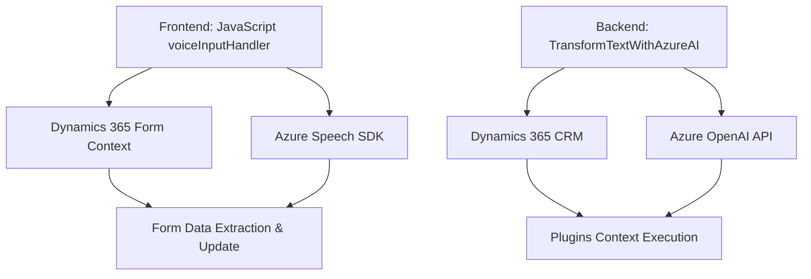

### Breve resumen técnico

El repositorio parece ser parte de un sistema complejo que integra varias tecnologías. En particular, los archivos mencionados están enfocados en dos aspectos principales:

1. **Frontend**: Procesamiento de formularios y entrada-salida de voz mediante Azure Speech SDK.
2. **Backend Plugin**: Extensión de funcionalidades de Dynamics 365 mediante un plugin encargado de la interacción con la API de Azure OpenAI.

La solución combina integración con APIs externas como Azure Speech SDK y Azure OpenAI API para realizar traducción de voz, síntesis de texto, y procesamiento de información en un contexto CRM (Dynamics 365).

---

### Descripción de arquitectura

La arquitectura del sistema está diseñada para una integración entre una **frontend de interacción con el usuario**, un **backend basado en plugins para Dynamics 365**, y **servicios externos basados en nube (Azure Speech y OpenAI)**. Esta arquitectura se puede clasificar como una **arquitectura n-capas**:

1. **Capa de presentación (Frontend)**: Implementada en JavaScript, dedicada a la interacción con el usuario en Dynamics 365. Se encarga de presentar información y aceptar entrada de voz mediante Azure Speech SDK.
   
2. **Capa de lógica de negocio (Plugin en backend)**:
   - Implementación de plugins en C# para facilitar la transformación de datos con Azure OpenAI.
   - Encargada de procesar datos del CRM y comunicarse con APIs externas.
   
3. **Capa de servicios externos**:
   - Azure Speech SDK: Soporte de reconocimiento y síntesis de voz.
   - Azure OpenAI: Transformación avanzada de texto según instrucciones específicas.
   - Dynamics 365 CRM: Orquestador principal del sistema.

---

### Tecnologías usadas

- **Frontend**:
  - **JavaScript**: Lenguaje principal para la gestión de formularios y entrada de voz.
  - **Azure Speech SDK**: Biblioteca dinámica para reconocimiento y síntesis de voz basado en inteligencia artificial.
  - **Dynamics 365 Form Context API**: Interacción directa con los formularios de Dynamics 365.

- **Backend**:
  - **C#**: Lenguaje principal del plugin.
  - **Microsoft.Xrm.Sdk**: Framework para desarrollar plugins en Dynamics 365.
  - **Azure OpenAI API**: Interacción con servicios de Transformación de Lenguaje Natural.
  - **Newtonsoft.Json**: Procesamiento de datos en formato JSON.
  - **System.Net.Http**: Manejo de solicitudes API HTTP en C#.

- **Patrones de diseño y arquitectura**:
  - **Loader dinámico**: Carga externa del SDK de Azure Speech desde `window.SpeechSDK`.
  - **Data Mapping**: Mapeo entre etiquetas visibles y atributos internos del formulario CRM.
  - **Plugin Pattern**: Modularización para ampliación de funcionalidades del CRM.
  - **Promesas y manejo asincrónico**: Uso de `async/await` y promesas en JavaScript y C# para integración con APIs externas.

---

### Diagrama Mermaid válido para GitHub

---

### Conclusión final

El repositorio representa un proyecto que integra la interacción con Dynamics 365 CRM utilizando un método híbrido de procesamiento de voz (entrada y salida) junto con inteligencia artificial para el análisis y transformación de texto. A nivel arquitectónico, el sistema está diseñado como una solución de **integración de n capas**, con una fuerte dependencia de servicios en la nube (Azure Speech SDK, Azure OpenAI API). Las tecnologías y patrones utilizados son modernos y alineados con el propósito de extender y enriquecer las capacidades del sistema CRM a través de herramientas avanzadas de IA y reconocimiento de voz.

La estructura de código muestra que se sigue una **arquitectura modular**, y los componentes son altamente cohesivos con dependencia controlada entre las capas. Este diseño modular facilita actualizaciones y mantenimiento futuros, además de la integración con nuevos servicios o tecnologías.