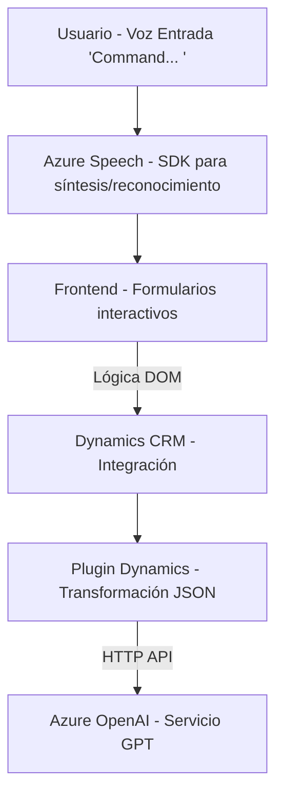

### Breve resumen técnico

Este repositorio implementa una solución completa que integra reconocimiento de voz, síntesis de voz y procesamiento de entrada mediante IA (Azure Speech SDK y Azure OpenAI). La estructura revela una combinación de frontend interactivo y plugins de backend para Dynamics CRM, que procesan datos con APIs externas, transforman texto y aplican lógica basada en IA.

---

### Descripción de arquitectura

**Tipo de solución:**  
La solución es una integración personalizada orientada a interacción por voz en un sistema CRM (Dynamics 365). Combina componentes del frontend (reconocimiento de voz, síntesis de voz) y backend (plugins en .NET) para analizar y transformar datos.

**Arquitectura observada:**  
La arquitectura es **event-driven** en el backend mediante plugins y servicios REST para eventos especificados en Dynamics CRM. La arquitectura del frontend utiliza **patrones desacoplados**, con funciones organizadas para tareas específicas y dependencias externas dinámicas. La distribución de los archivos sugiere una arquitectura de **n capas**, con separación entre UI, lógica de procesamiento (frontend) y lógica de negocio (backend).

---

### Tecnologías usadas

1. **Frontend**:
   - Lenguaje: JavaScript.
   - Frameworks/librerías: Azure Speech SDK para síntesis/reconocimiento de voz.
   - Dinámico: Carga de scripts desde URLs externos en tiempo de ejecución.
   - API interacciones: Funciones DOM para manipular formularios de Dynamics CRM.

2. **Backend**:
   - Lenguaje: C# (.NET Framework).
   - Integración: Plugins para Dynamics 365.
   - API externa: Azure OpenAI REST API.
   - Serialización: `System.Text.Json` y `Newtonsoft.Json.Linq`.

3. **Plataformas externas**:
   - **Azure Speech SDK**: Reconocimiento y síntesis de voz.
   - **Azure OpenAI GPT**: Procesamiento y transformación de datos en JSON.
   - **Microsoft Dynamics CRM SDK**: Gestión de eventos y formularios.

---

### Dependencias y componentes externos

1. **Dependencias tecnológicas**:
   - SDK de Azure Speech para reconocimiento y síntesis de voz.  
   - Azure OpenAI (GPT) para procesamiento avanzado del lenguaje natural.
   - Dynamics CRM SDK para ejecución de eventos plugin.

2. **Componentes externos**:
   - API personalizada (`trial_TransformTextWithAzureAI`).
   - Servicios REST (Speech API, OpenAI).

---

### Diagrama Mermaid válido para GitHub

---

### Conclusión final

La solución combina funcionalidades avanzadas de IA (Azure Speech SDK y Azure OpenAI) con integración directa con Microsoft Dynamics CRM. Su arquitectura es mixta y modular, aprovechando una distribución en capas para el frontend y una lógica event-driven para el backend. Es idónea para sistemas empresariales donde la automatización por voz y el procesamiento dinámico de formularios agregan eficiencia.