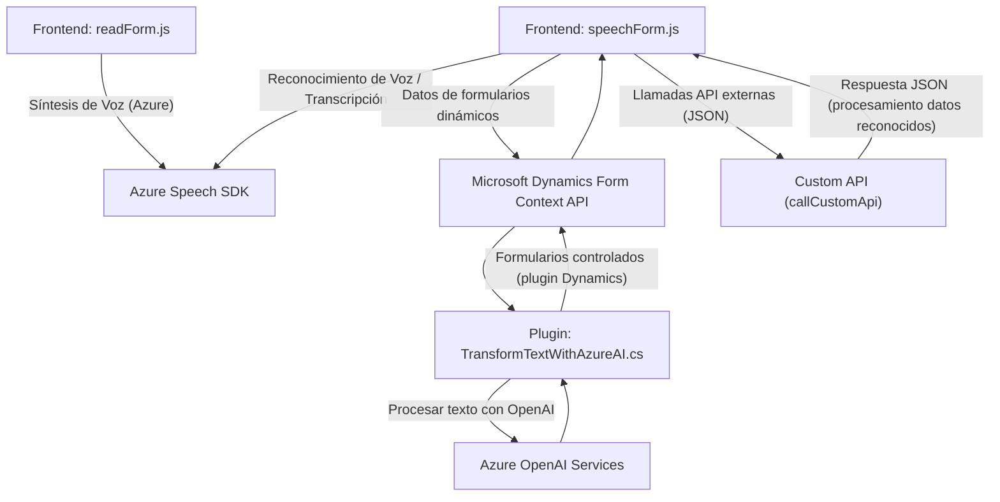

### Breve Resumen Técnico

El repositorio forma parte de una solución para formularios web dinámicos, que utiliza reconocimiento de voz, síntesis de texto a voz y transformación de texto mediante IA. La integración principal es con servicios de Azure (Speech SDK y OpenAI). La funcionalidad cubre desde el manejo de formularios hasta la interacción con APIs dinámicas y Microsoft Dynamics CRM.

---

### Descripción de la Arquitectura

El repositorio exhibe una **arquitectura modular** basada en una separación clara de responsabilidades entre los archivos:
1. **Frontend (JavaScript)**: Procesa datos del formulario y los utiliza para síntesis de voz. También convierte audio en texto utilizando el Azure Speech SDK para interactuar con formularios (reconocimiento de voz).
2. **Plugin Backend (C#)**: Proporciona transformación de texto basado en reglas utilizando Azure OpenAI. Este componente interactúa con el entorno de Dynamics CRM y retorna JSON estructurado.

Este diseño apunta a una **arquitectura de n capas**, con una separación definida entre UX/frontend, lógica empresarial y servicios/backend.

---

### Tecnologías Usadas

#### Frontend:
- **JavaScript** (ES6+): Lógica dominante en los archivos de frontend.
- **Azure Speech SDK**: Utilizado para reconocimiento de voz y síntesis de texto.
- **Microsoft Dynamics Web API**: Para operaciones relacionadas con los formularios dinámicos.

#### Backend:
- **C# + .NET Framework:** En el Plugin para Dynamics CRM.
- **Azure OpenAI Services**: Utilizado para APIs de texto basado en GPT.
- **Newtonsoft.Json**: Manejo avanzado de datos JSON desde las respuestas del API.
- **System.Net.Http**: Comunicación HTTP con servicios externos.

#### Arquitectura:
- **Patrones**:
  - Modularización para separación de responsabilidades.
  - Integración de SDKs y servicios externos (ej. Azure Speech SDK y OpenAI).
  - Plugin architecture en la capa de backend (Dynamics CRM).

---

### Diagrama Mermaid

---

### Conclusión Final

El repositorio presenta una solución compuesta de múltiples capas y módulos que interactúan eficientemente entre sí. Es principalmente una integración de servicios para formularios dinámicos en Dynamics CRM mediante reconocimiento de voz y generación de texto en json procesado por IA.

#### Aspectos destacados:
1. Es una combinación de funcionalidad de **frontend dinámico** basada en JavaScript y un plugin de **backend** basado en C# que integra Azure.
2. Las dependencias externas son críticas, incluyendo Azure Speech SDK y OpenAI API.
3. Ideal para aplicaciones empresariales donde el manejo de datos dinámicos y automatización de procesos sean necesarios.

Este diseño asegura la escalabilidad y la interoperabilidad entre múltiples servicios, mostrando un enfoque moderno y eficiente en su implementación arquitectónica.