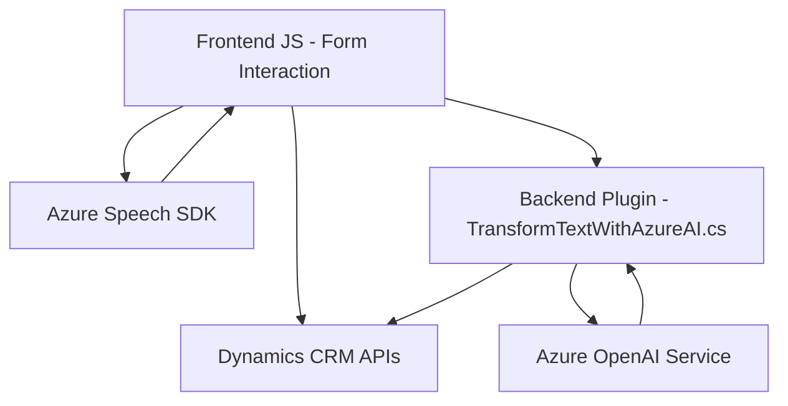

**Resumen Técnico:**

Este repositorio contiene una solución integrada que combina frontend en JavaScript, integraciones con servicios en la nube (Azure Speech SDK y Dynamics 365 API), y plugins en C# para interacción con Dynamics CRM y el servicio Azure OpenAI. Está diseñado para mejorar la accesibilidad mediante síntesis de voz y entrada de voz, además de la automatización de procesos con inteligencia artificial.

---

**Descripción de Arquitectura:**

1. **Tipo de Solución:**  
   La solución es un **sistema híbrido** que mezcla componentes frontend para accesibilidad y plugins backend para procesamiento de datos. Más específicamente:  
   - Un frontend basado en JavaScript que emplea Azure Speech SDK para habilitar accesibilidad vocal (síntesis y entrada de voz).  
   - Un backend en C# que actúa como plugin de Dynamics CRM, procesando texto mediante API de Azure OpenAI y facilitando su uso en sistemas empresariales como Dynamics 365.

2. **Modelo de Arquitectura:**  
   - **Arquitectura de niveles:** El sistema sigue el patrón de **N capas**. Esto incluye:  
     - **Frontend:** Captura de datos en formularios y síntesis de voz.  
     - **Backend (Plugins):** Procesamiento especializado de texto y lógica de negocio.  
     - **Servicios externos:** Integración con Azure Speech SDK y Azure OpenAI Service.  
   - Dependencias internas son acopladas por configuraciones específicas de Dynamics CRM.

3. **Patrones utilizados:**  
   - **Uso de SDK:** El frontend se basa en el SDK de Azure Speech para servicios de voz.  
   - **Event-driven Architecture:** Los plugins responden eventos específicos dentro de Dynamics CRM.  
   - **External API Consumption:** El backend se comunica con el servicio Azure OpenAI para procesamiento y transformación avanzada de texto.  

---

**Tecnologías Usadas:**  

1. **Frontend:**  
   - **JavaScript:** Manejo de datos en formularios, interacción DOM, y reconocimiento de voz.  
   - **Azure Speech SDK:** Interacciones con síntesis de voz y reconocimiento de texto.  

2. **Backend:**  
   - **C#:** Implementación del plugin con patrón `IPlugin`.  
   - **Dynamics 365 CRM APIs:** Manipulación de datos en formularios dinámicos.  
   - **Azure OpenAI:** Uso de presentación de texto enriquecido (GPT-4).  
   - **HTTP Client:** Para realizar peticiones al servicio Azure.  
   - **Newtonsoft.Json / System.Text.Json:** Para serialización y deserialización de datos JSON.  

3. **Servicios Externos:**  
   - **Azure Speech SDK**  
   - **Azure OpenAI Service**  
   - **Dynamics CRM APIs**

---

**Diagrama Mermaid:**

---

**Conclusión Final:**

El repositorio muestra una arquitectura bien organizada que mezcla frontend dinámico, procesamiento backend orientado a servicios, y conectividad con APIs externas. Su diseño es flexible, basado en patrones modernos como SDK, consumo de APIs, y eventos. Aunque cumple con objetivos funcionales claros, podría mejorarse mediante la implementación de almacenamiento seguro de claves API (por ejemplo, Azure Key Vault) y mayor desacoplamiento entre dependencias externas e internas. La solución es adecuada para aplicaciones empresariales que necesiten accesibilidad avanzada y soporte de inteligencia artificial.