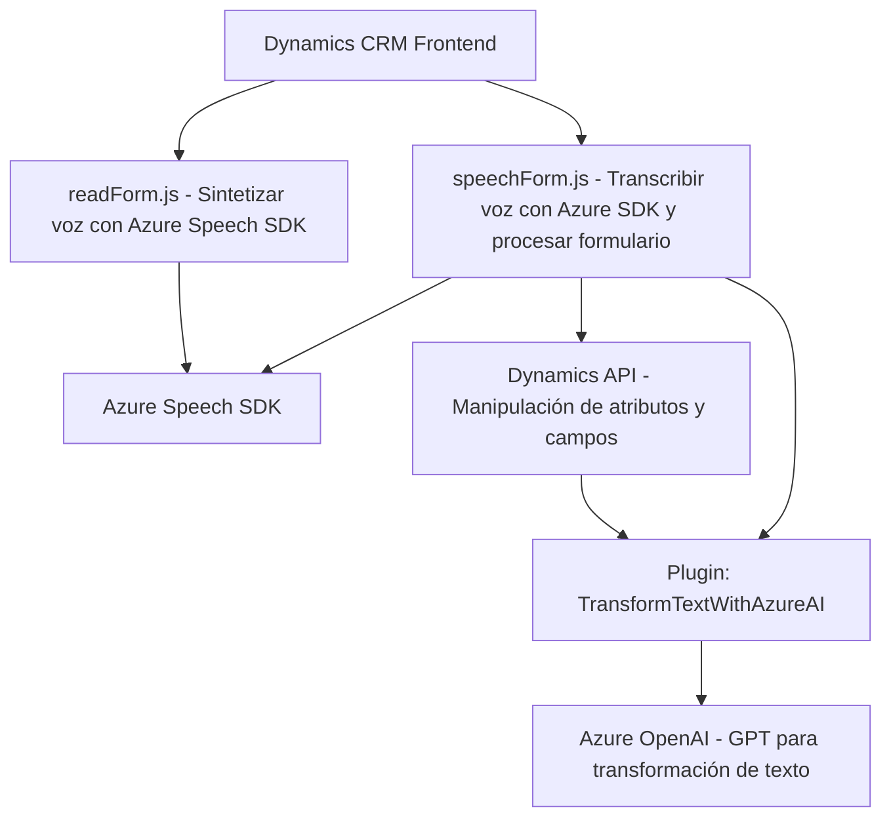

### Resumen Técnico
El repositorio contiene tres módulos principales con un enfoque claro en la interacción humano-computadora, síntesis de voz, transcripción de entrada por voz, y procesamiento textual mediante servicios de Azure, especialmente Azure Speech SDK y Azure OpenAI. Su propósito principal parece ser integrar funcionalidades de inteligencia artificial con Dynamics 365 utilizando componentes tanto en frontend como backend.

---

### Descripción de la Arquitectura
1. **Solución**: La solución combina múltiples elementos fundamentales:
   - **Frontend**: Scripts en JavaScript para interactuar con formularios de Dynamics 365, gestionar datos visibles y habilitar síntesis/transcripción de voz.
   - **Backend (Plugin)**: .NET plugin para Dynamics CRM que utiliza Azure OpenAI para manipulación avanzada de texto con un formato de API de microservicio.
   - **Integración API**: Uso de APIs externas (Azure Speech SDK y Azure OpenAI) para transcripción y transformación de datos.

2. **Patrón Arquitectónico**:
   - La solución se basa en **arquitectura n capas** para la segmentación lógica. El frontend (capa de presentación) comunica directamente con APIs y plugins en Dynamics 365 (capa de lógica/servicios).
   - Además, en ciertas partes (como el plugin), se ve implementado un enfoque **microservicio** al delegar tareas específicas a servicios externos como Azure OpenAI.

---

### Tecnologías Usadas
- **Frontend**:
  - **JavaScript**.
  - **Azure Speech SDK**: Para síntesis y transcripción de voz.
  - API de **Dynamics CRM** para manipulación directa de formularios (`getAttribute`, `setValue`, etc.).
  
- **Backend**:
  - **Microsoft Dynamics CRM SDK** (`Microsoft.Xrm.Sdk`): Para implementaciones dentro del ecosistema Dynamics 365.
  - **.NET Framework/Core**: Específicamente para el plugin de procesamiento.
  - **Azure OpenAI**: Para transformación textual avanzada con GPT.

- **Dependencias Clave**:
  - **Externa**:
    - Servicios Azure (Azure Speech y OpenAI) vía solicitudes HTTP.
    - `Newtonsoft.Json` y `System.Text.Json` para gestión de JSON.
  - **Interna**:
    - Dynamics CRM APIs para interacción directa con datos y entidades.

---

### Diagrama **Mermaid**

---

### Conclusión Final
La estructura presentada combina elementos de un frontend interactivo con funcionalidades de inteligencia artificial y síntesis/transcripción de voz, complementado por un backend que implementa un plugin especializado para interacción en Dynamics CRM. La solución muestra una arquitectura híbrida basada tanto en **n capas** como en **microservicios**, lo que permite delegar tareas complejas (como procesamiento textual) a servicios externos altamente eficaces como Azure Speech y Azure OpenAI. Esto establece una integración poderosa y flexible, ideal para aplicaciones empresariales interactivas.